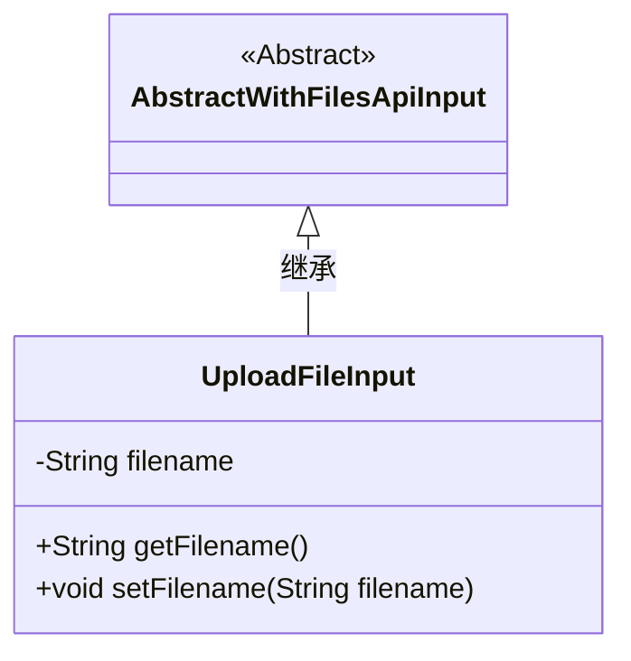
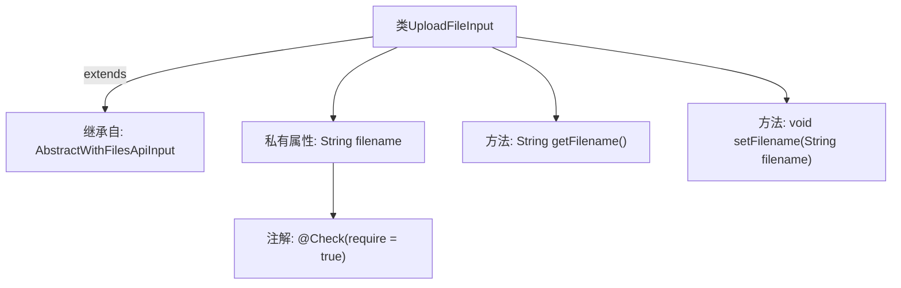

# 基础信息

|      |      |
|------|------|
| 名称 | UploadFileInput |
| 编码语言 | .java |
| 代码路径 | WeFe/manager/manager-service/src/main/java/com/welab/wefe/manager/service/dto/common/UploadFileInput.java |
| 包名 | com.welab.wefe.manager.service.dto.common |
| 依赖项 | ['com.welab.wefe.common.fieldvalidate.annotation.Check', 'com.welab.wefe.common.web.dto.AbstractWithFilesApiInput'] |
| 概述说明 | 上传文件输入类，继承自带文件API的抽象类，包含必填文件名属性及其getter和setter方法。 |

# 说明

这是一个名为UploadFileInput的Java类，继承自AbstractWithFilesApiInput。类中包含一个私有字符串属性filename，该属性通过@Check注解标记为必填项。提供了getFilename和setFilename两个公共方法用于获取和设置filename属性的值。这个类主要用于处理文件上传的输入参数。

# 类列表 Class Summary

| 名称   | 类型  | 说明 |
|-------|------|-------------|
| UploadFileInput | class | 上传文件输入类，继承自带文件的API输入基类，包含必填文件名属性及对应getter和setter方法。 |

## 类 UploadFileInput

|      |      |
|------|------|
| 访问范围 | public |
| 类型 | class |
| 名称 | UploadFileInput |
| 说明 | 上传文件输入类，继承自带文件的API输入基类，包含必填文件名属性及对应getter和setter方法。 |

### UML类图

这段类图展示了UploadFileInput继承自抽象类AbstractWithFilesApiInput的关系。UploadFileInput包含一个私有字段filename和对应的getter/setter方法。通过<|--箭头明确表示了继承关系，其中AbstractWithFilesApiInput被标记为抽象类。类图清晰地呈现了类的层级结构和成员方法，符合面向对象设计中继承的基本特征。

### 内部方法调用关系图

这段流程图展示了UploadFileInput类的结构，该类继承自AbstractWithFilesApiInput，包含一个带有@Check注解的私有属性filename，以及对应的getter和setter方法。类图清晰地呈现了继承关系、属性修饰和方法定义，其中注解标注了必填约束，方法则实现了对私有属性的访问控制。整个设计符合JavaBean规范，适用于文件上传场景的参数封装。

### 字段列表 Field List

| 名称  | 类型  | 说明 |
|-------|-------|------|
| filename | String | 代码片段定义了一个私有字符串变量filename，并使用了@Check注解标记为必填项。 |

### 方法列表

| 名称  | 类型  | 说明 |
|-------|-------|------|
| getFilename | String | 获取文件名的公共方法，返回字符串类型的filename变量值。 |
| setFilename | void | 设置文件名的公共方法，将输入字符串赋值给类的filename属性。 |

