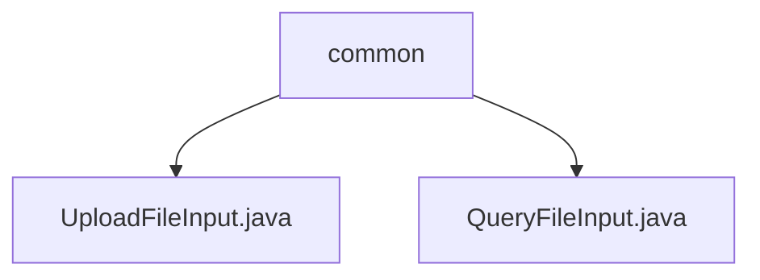

# 基础信息

|      |      |
|------|------|
| 名称 | common |
| 编码语言 | .java |
| 代码路径 | WeFe/manager/manager-service/src/main/java/com/welab/wefe/manager/service/dto/common |
| 包名 | docs.manager.manager-service.src.main.java.com.welab.wefe.manager.service.dto.common |
| 概述说明 | UploadFileInput类继承AbstractWithFilesApiInput，含必填filename属性及get/set方法，用于文件上传输入。QueryFileInput类继承AbstractApiInput，含必填fileId属性及get/set方法，用于文件查询输入。 |

# 说明

## 概述  
该模块核心职责是处理文件相关操作的输入参数，包括文件上传和查询功能。接口规范统一采用Java类封装输入参数，通过@Check注解标记必填项，并提供标准的Getter/Setter方法。关键数据结构包含filename（文件名）和fileId（文件唯一标识）两个字符串属性。外部依赖仅为Java基础库和自定义注解@Check。例如UploadFileInput处理上传文件名，QueryFileInput处理文件ID查询。

## 主要业务场景  
模块支持文件上传和查询两类典型场景，类似资源管理系统的入口层。业务流程中，客户端通过设置filename上传文件，或通过fileId查询文件元数据。交互模式均采用POJO参数封装，例如上传需校验filename非空，查询需验证fileId有效性。整体功能完整覆盖文件基础操作的输入验证需求，API类型属于标准DTO层设计。

### 包内部结构视图

该流程图展示了manager-service项目中common目录下的两个DTO文件结构。顶层节点为common目录，包含两个Java文件：UploadFileInput.java和QueryFileInput.java，这两个文件都直接隶属于common目录层级，没有更深层的嵌套关系。

# 文件列表

| 名称   | 类型  | 说明 |
|-------|------|-------------|
| [UploadFileInput.java](UploadFileInput.md) | file | 上传文件输入类，继承自带文件API的抽象类，包含必填文件名属性及其getter和setter方法。 |
| [QueryFileInput.java](QueryFileInput.md) | file | QueryFileInput类继承AbstractApiInput，包含必须的fileId字段及其getter和setter方法。 |

