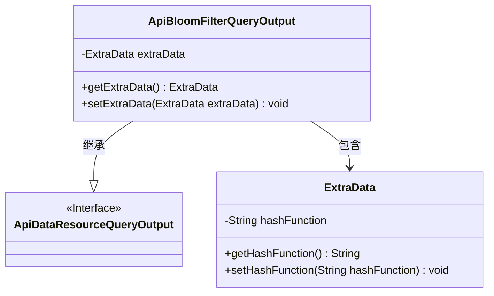
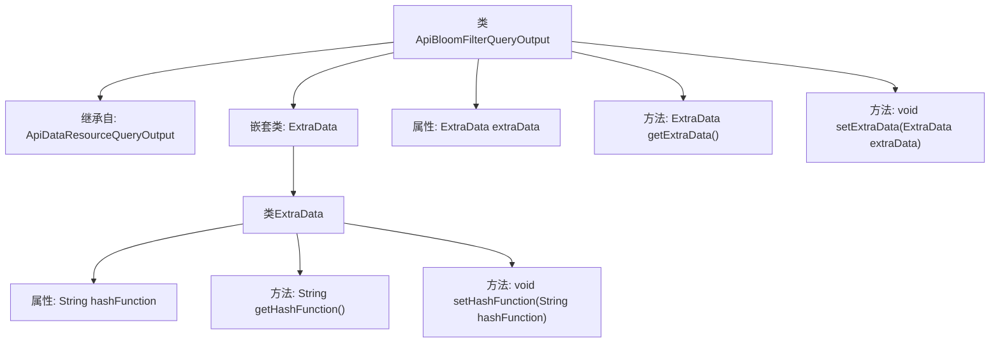

# 基础信息

|      |      |
|------|------|
| 名称 | ApiBloomFilterQueryOutput |
| 编码语言 | .java |
| 代码路径 | WeFe/manager/manager-service/src/main/java/com/welab/wefe/manager/service/dto/dataresource/ApiBloomFilterQueryOutput.java |
| 包名 | com.welab.wefe.manager.service.dto.dataresource |
| 依赖项 | [] |
| 概述说明 | ApiBloomFilterQueryOutput继承ApiDataResourceQueryOutput，包含ExtraData内部类，提供hashFunction的getter/setter方法。 |

# 说明

ApiBloomFilterQueryOutput类继承自ApiDataResourceQueryOutput，包含一个名为extraData的私有成员变量，其类型为嵌套类ExtraData。ExtraData类具有一个字符串类型的hashFunction属性和对应的getter和setter方法。ApiBloomFilterQueryOutput类也提供了对extraData的getter和setter方法。

# 类列表 Class Summary

| 名称   | 类型  | 说明 |
|-------|------|-------------|
| ApiBloomFilterQueryOutput | class | ApiBloomFilterQueryOutput继承ApiDataResourceQueryOutput，包含ExtraData内部类，提供hashFunction的getter和setter方法。 |

## 类 ApiBloomFilterQueryOutput

|      |      |
|------|------|
| 访问范围 | public |
| 类型 | class |
| 名称 | ApiBloomFilterQueryOutput |
| 说明 | ApiBloomFilterQueryOutput继承ApiDataResourceQueryOutput，包含ExtraData内部类，提供hashFunction的getter和setter方法。 |

### UML类图

这段类图展示了ApiBloomFilterQueryOutput继承自接口ApiDataResourceQueryOutput，并包含一个嵌套类ExtraData的结构。ExtraData类封装了hashFunction属性及其访问方法，而主类通过getter/setter管理ExtraData实例。该设计实现了布隆过滤器查询结果的扩展数据存储功能，体现了组合优于继承的原则。

### 内部方法调用关系图

这段代码定义了一个ApiBloomFilterQueryOutput类，继承自ApiDataResourceQueryOutput，包含一个嵌套类ExtraData。主类提供对ExtraData对象的存取方法，嵌套类则封装了hashFunction属性和其对应的getter/setter方法。流程图清晰展示了类继承关系、嵌套结构以及方法调用层级，适用于布隆过滤器查询结果的扩展数据封装场景。

### 字段列表 Field List

| 名称  | 类型  | 说明 |
|-------|-------|------|
| extraData | ExtraData | 私有成员变量extraData，类型为ExtraData。 |

### 方法列表

| 名称  | 类型  | 说明 |
|-------|-------|------|
| getExtraData | ExtraData | 获取额外数据的方法，返回extraData对象。 |
| setExtraData | void | 方法setExtraData用于设置extraData属性，参数为ExtraData类型对象。 |

