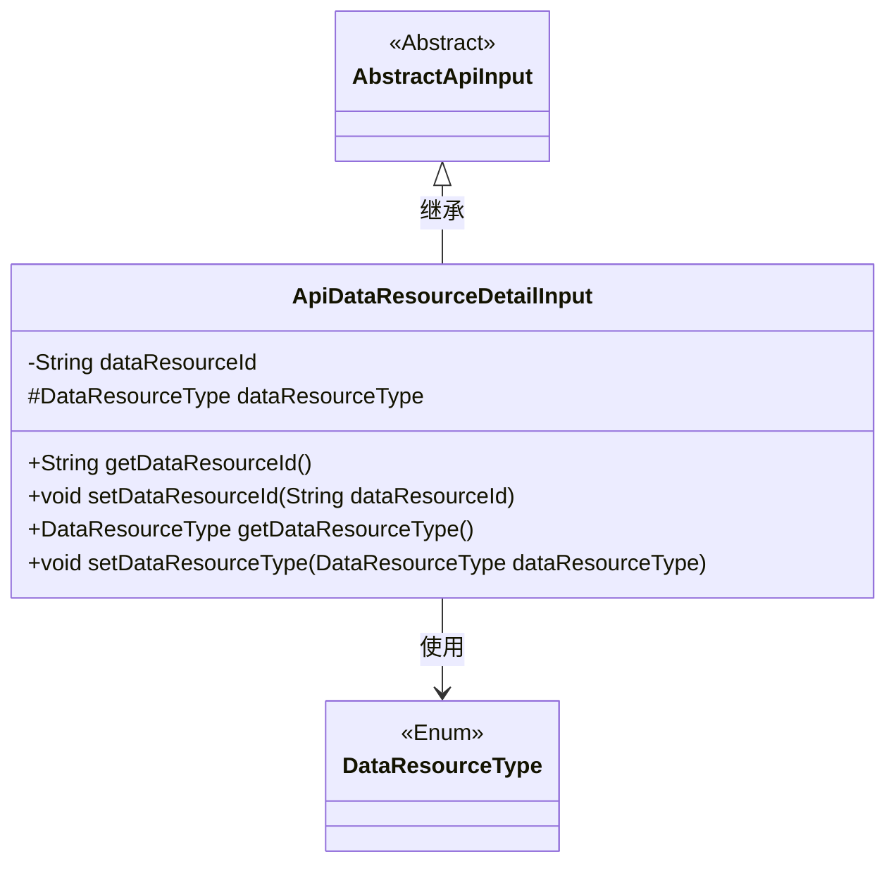
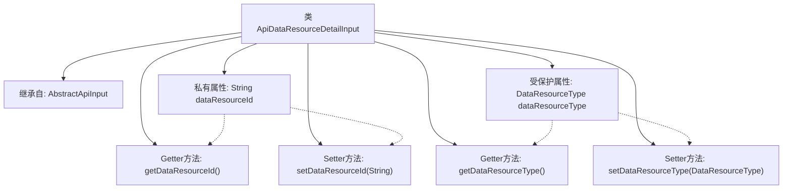

# 基础信息

|      |      |
|------|------|
| 名称 | ApiDataResourceDetailInput |
| 编码语言 | .java |
| 代码路径 | WeFe/manager/manager-service/src/main/java/com/welab/wefe/manager/service/dto/dataresource/ApiDataResourceDetailInput.java |
| 包名 | com.welab.wefe.manager.service.dto.dataresource |
| 依赖项 | ['com.welab.wefe.common.fieldvalidate.annotation.Check', 'com.welab.wefe.common.web.dto.AbstractApiInput', 'com.welab.wefe.common.wefe.enums.DataResourceType'] |
| 概述说明 | ApiDataResourceDetailInput类继承AbstractApiInput，包含必填字段dataResourceId和dataResourceType，提供getter和setter方法。 |

# 说明

ApiDataResourceDetailInput类继承自AbstractApiInput，包含两个必填字段：dataResourceId（字符串类型）和dataResourceType（DataResourceType类型）。类中提供了这两个字段的getter和setter方法，用于获取和设置字段值。dataResourceId字段通过@Check注解标记为必填，dataResourceType字段同样被标记为必填且为protected访问权限。

# 类列表 Class Summary

| 名称   | 类型  | 说明 |
|-------|------|-------------|
| ApiDataResourceDetailInput | class | ApiDataResourceDetailInput类继承AbstractApiInput，包含必填字段dataResourceId和dataResourceType，提供getter和setter方法。 |

## 类 ApiDataResourceDetailInput

|      |      |
|------|------|
| 访问范围 | public |
| 类型 | class |
| 名称 | ApiDataResourceDetailInput |
| 说明 | ApiDataResourceDetailInput类继承AbstractApiInput，包含必填字段dataResourceId和dataResourceType，提供getter和setter方法。 |

### UML类图

这段代码展示了一个API数据资源详情输入类`ApiDataResourceDetailInput`，它继承自抽象类`AbstractApiInput`。该类包含两个主要属性：`dataResourceId`（私有字符串类型）和`dataResourceType`（受保护的枚举类型），并提供了相应的getter和setter方法。通过`@Check`注解标记这两个字段为必填项。类图中清晰地体现了继承关系和使用关系，其中`DataResourceType`是一个枚举类型。

### 内部方法调用关系图

这段代码定义了一个名为ApiDataResourceDetailInput的类，它继承自AbstractApiInput。该类包含两个主要属性：dataResourceId（字符串类型）和dataResourceType（DataResourceType类型），分别带有@Check注解标记为必填字段。代码提供了标准的getter和setter方法来访问和修改这两个属性。流程图清晰地展示了类的继承关系、属性定义以及方法之间的关联，体现了Java Bean的标准设计模式。

### 字段列表 Field List

| 名称  | 类型  | 说明 |
|-------|-------|------|
| dataResourceType | DataResourceType | 代码片段定义了一个受保护的DataResourceType类型变量dataResourceType，并使用@Check注解标记该字段为必填项。 |
| dataResourceId | String | 必填字段dataResourceId，需通过校验。 |

### 方法列表

| 名称  | 类型  | 说明 |
|-------|-------|------|
| getDataResourceId | String | 获取数据资源ID的方法，返回字符串类型值dataResourceId。 |
| getDataResourceType | DataResourceType | 这是一个Java方法，返回名为dataResourceType的成员变量，类型为DataResourceType。 |
| setDataResourceId | void | 设置数据资源ID的方法，将输入参数赋值给类的成员变量dataResourceId。 |
| setDataResourceType | void | 设置数据资源类型的方法，参数为DataResourceType类型，赋值给当前对象的dataResourceType属性。 |

