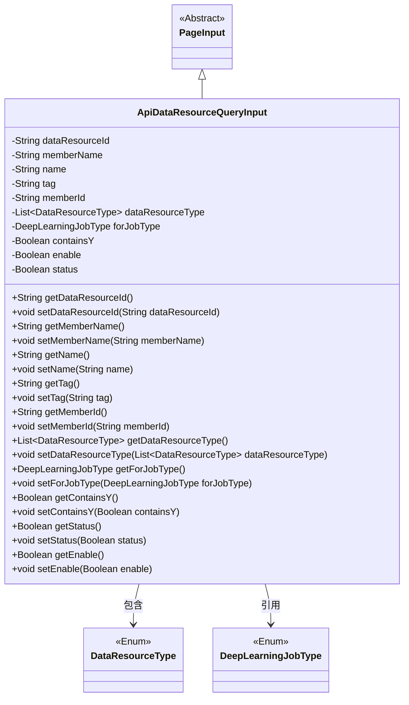
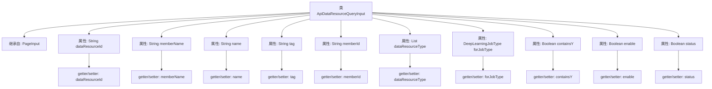

# 基础信息

|      |      |
|------|------|
| 名称 | ApiDataResourceQueryInput |
| 编码语言 | .java |
| 代码路径 | WeFe/manager/manager-service/src/main/java/com/welab/wefe/manager/service/dto/dataresource/ApiDataResourceQueryInput.java |
| 包名 | com.welab.wefe.manager.service.dto.dataresource |
| 依赖项 | ['com.welab.wefe.common.wefe.enums.DataResourceType', 'com.welab.wefe.common.wefe.enums.DeepLearningJobType', 'com.welab.wefe.manager.service.dto.base.PageInput', 'java.util.List'] |
| 概述说明 | ApiDataResourceQueryInput类继承PageInput，包含数据资源ID、成员名、名称、标签、成员ID等字段，支持数据类型列表、深度学习任务类型及状态控制。 |

# 说明

ApiDataResourceQueryInput类继承自PageInput，包含多个查询参数字段：dataResourceId、memberName、name、tag、memberId用于标识和筛选数据资源；dataResourceType列表和forJobType枚举指定资源类型和关联任务类型；containsY、enable、status三个布尔值控制查询条件。所有字段均通过getter和setter方法进行访问和修改。

# 类列表 Class Summary

| 名称   | 类型  | 说明 |
|-------|------|-------------|
| ApiDataResourceQueryInput | class | ApiDataResourceQueryInput类继承PageInput，包含数据资源ID、成员名、名称、标签、成员ID、资源类型列表、作业类型、是否含Y、启用状态和状态等字段及其getter/setter方法。 |

## 类 ApiDataResourceQueryInput

|      |      |
|------|------|
| 访问范围 | public |
| 类型 | class |
| 名称 | ApiDataResourceQueryInput |
| 说明 | ApiDataResourceQueryInput类继承PageInput，包含数据资源ID、成员名、名称、标签、成员ID、资源类型列表、作业类型、是否含Y、启用状态和状态等字段及其getter/setter方法。 |

### UML类图

该代码展示了一个API数据资源查询输入类`ApiDataResourceQueryInput`，它继承自抽象类`PageInput`。该类包含多个字段用于存储查询条件，如资源ID、成员名称、标签等，并提供了相应的getter和setter方法。其中`dataResourceType`和`forJobType`字段分别引用了`DataResourceType`枚举和`DeepLearningJobType`枚举类型。这个类主要用于封装数据资源查询时的各种过滤条件参数。

### 内部方法调用关系图

这段代码展示了一个名为ApiDataResourceQueryInput的Java类，该类继承自PageInput类。它包含多个属性，如dataResourceId、memberName、name等，以及对应的getter和setter方法。这些属性涵盖了字符串类型、列表类型和枚举类型等，用于存储和操作API数据资源查询的输入参数。每个属性都有相应的访问方法，确保数据的封装性和可维护性。

### 字段列表 Field List

| 名称  | 类型  | 说明 |
|-------|-------|------|
| dataResourceType | List<DataResourceType> | 私有数据资源类型列表变量。 |
| enable | Boolean | 私有布尔类型变量enable，用于控制功能开关状态。 |
| memberName | String | 声明一个受保护的字符串类型成员变量memberName。 |
| name | String | 声明一个受保护的字符串类型变量name。 |
| containsY | Boolean | 布尔变量，标识是否包含Y。 |
| dataResourceId | String | 声明受保护的字符串类型变量dataResourceId。 |
| memberId | String | 成员ID字符串保护字段 |
| tag | String | 声明一个受保护的字符串变量tag。 |
| status | Boolean | 布尔类型状态变量 |
| forJobType | DeepLearningJobType | 私有深度学习任务类型变量forJobType。 |

### 方法列表

| 名称  | 类型  | 说明 |
|-------|-------|------|
| setMemberName | void | 设置成员名称的方法，将输入参数赋值给类的成员变量。 |
| getForJobType | DeepLearningJobType | 获取当前深度学习任务类型的方法，返回值为DeepLearningJobType对象。 |
| setDataResourceId | void | 设置数据资源ID的方法，将输入参数赋值给类的成员变量dataResourceId。 |
| setMemberId | void | 设置成员ID的方法，将输入参数赋值给类的成员变量memberId。 |
| setContainsY | void | 这是一个Java方法，用于设置布尔类型成员变量containsY的值。 |
| getName | String | 这是一个Java方法，返回字符串类型的name变量值。 |
| getDataResourceId | String | 获取数据资源ID的方法，返回字符串类型值dataResourceId。 |
| getMemberId | String | 获取成员ID的方法，返回字符串类型的memberId。 |
| getStatus | Boolean | 这是一个Java方法，返回布尔类型的状态值status。 |
| getTag | String | 获取标签字符串的方法，返回成员变量tag的值。 |
| setForJobType | void | 设置深度学习任务类型的方法，将参数forJobType赋值给类的对应成员变量。 |
| getMemberName | String | 这是一个Java方法，返回成员变量memberName的值。 |
| getContainsY | Boolean | Java方法：返回布尔值containsY。 |
| setStatus | void | 这是一个Java方法，用于设置布尔类型的status属性值。方法接收一个布尔参数，并将其赋值给类的成员变量status。 |
| getEnable | Boolean | 获取布尔类型enable值的公共方法。 |
| setEnable | void | 这是一个Java方法，用于设置布尔类型的enable属性值。方法接受一个Boolean参数，并将其赋值给类的成员变量enable。 |
| getDataResourceType | List<DataResourceType> | 获取数据资源类型列表的方法，返回dataResourceType字段值。 |
| setTag | void | 设置对象标签的方法，将输入字符串赋值给成员变量tag。 |
| setName | void | 这是一个Java方法，用于设置对象的name属性，将传入的字符串参数赋值给当前对象的name字段。 |
| setDataResourceType | void | 设置数据资源类型的方法，接收一个DataResourceType列表参数并赋值给当前对象的dataResourceType属性。 |

