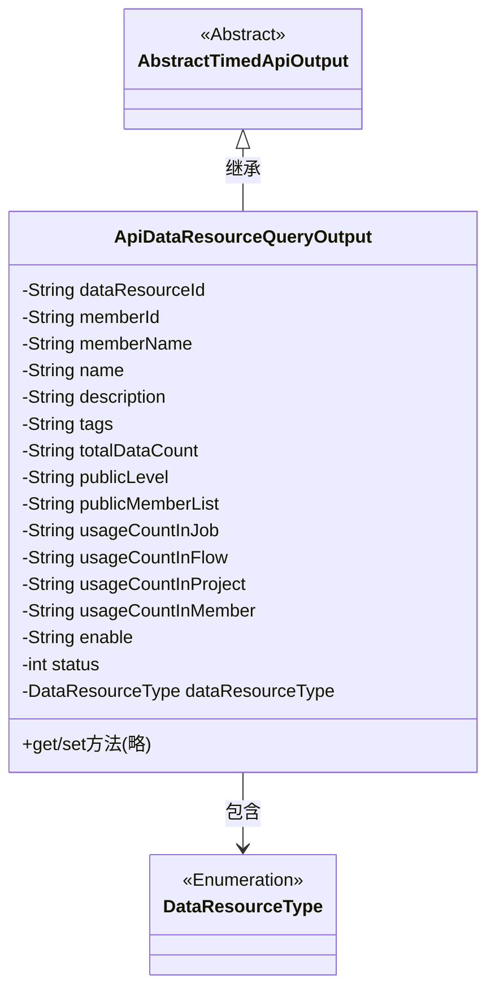

# 基础信息

|      |      |
|------|------|
| 名称 | ApiDataResourceQueryOutput |
| 编码语言 | .java |
| 代码路径 | WeFe/manager/manager-service/src/main/java/com/welab/wefe/manager/service/dto/dataresource/ApiDataResourceQueryOutput.java |
| 包名 | com.welab.wefe.manager.service.dto.dataresource |
| 依赖项 | ['com.welab.wefe.common.web.dto.AbstractTimedApiOutput', 'com.welab.wefe.common.wefe.enums.DataResourceType'] |
| 概述说明 | ApiDataResourceQueryOutput类继承AbstractTimedApiOutput，包含数据资源ID、成员信息、名称、描述、标签、数据量、公开级别、使用统计及状态等属性。 |

# 说明

ApiDataResourceQueryOutput类继承自AbstractTimedApiOutput，包含数据资源ID、成员ID、成员名称、名称、描述、标签、总数据量、公开级别、公开成员列表、在作业/流程/项目/成员中的使用次数、启用状态、状态码以及数据资源类型等属性。所有属性均提供对应的getter和setter方法。

# 类列表 Class Summary

| 名称   | 类型  | 说明 |
|-------|------|-------------|
| ApiDataResourceQueryOutput | class | ApiDataResourceQueryOutput类继承AbstractTimedApiOutput，包含数据资源ID、成员信息、名称、描述、标签、数据量、公开级别、使用统计等属性及其getter/setter方法。 |

## 类 ApiDataResourceQueryOutput

|      |      |
|------|------|
| 访问范围 | public |
| 类型 | class |
| 名称 | ApiDataResourceQueryOutput |
| 说明 | ApiDataResourceQueryOutput类继承AbstractTimedApiOutput，包含数据资源ID、成员信息、名称、描述、标签、数据量、公开级别、使用统计等属性及其getter/setter方法。 |

### UML类图

这段类图展示了ApiDataResourceQueryOutput类继承自AbstractTimedApiOutput抽象类，并包含一个DataResourceType枚举类型。该类主要封装了数据资源查询输出的各种属性，包括资源ID、成员信息、名称描述等基础属性，以及使用统计、公开级别等业务属性。所有字段均为私有，通过公有getter/setter方法访问，符合JavaBean规范。类结构清晰地反映了数据资源查询结果的完整信息模型。

### 内部方法调用关系图

```mermaid
graph TD
    A["类ApiDataResourceQueryOutput"]
    B["继承自: AbstractTimedApiOutput"]
    C["属性: String dataResourceId"]
    D["属性: String memberId"]
    E["属性: String memberName"]
    F["属性: String name"]
    G["属性: String description"]
    H["属性: String tags"]
    I["属性: String totalDataCount"]
    J["属性: String publicLevel"]
    K["属性: String publicMemberList"]
    L["属性: String usageCountInJob"]
    M["属性: String usageCountInFlow"]
    N["属性: String usageCountInProject"]
    O["属性: String usageCountInMember"]
    P["属性: String enable"]
    Q["属性: int status"]
    R["属性: DataResourceType dataResourceType"]
    S["Getter/Setter方法组"]

    A --> B
    A --> C
    A --> D
    A --> E
    A --> F
    A --> G
    A --> H
    A --> I
    A --> J
    A --> K
    A --> L
    A --> M
    A --> N
    A --> O
    A --> P
    A --> Q
    A --> R
    A -.-> S
    S -->|对应| C
    S -->|对应| D
    S -->|对应| E
    S -->|对应| F
    S -->|对应| G
    S -->|对应| H
    S -->|对应| I
    S -->|对应| J
    S -->|对应| K
    S -->|对应| L
    S -->|对应| M
    S -->|对应| N
    S -->|对应| O
    S -->|对应| P
    S -->|对应| Q
    S -->|对应| R
```

该流程图展示了ApiDataResourceQueryOutput类的完整结构，包含其继承关系、16个属性字段以及对应的Getter/Setter方法组。作为数据封装类，它通过继承AbstractTimedApiOutput获得基础功能，并通过大量String类型属性存储数据资源查询结果的各种元信息，包括标识符、成员信息、使用统计和状态等，所有属性都通过标准访问器方法暴露。

### 字段列表 Field List

| 名称  | 类型  | 说明 |
|-------|-------|------|
| dataResourceType | DataResourceType | 私有数据资源类型变量dataResourceType。 |
| memberName | String | 声明一个私有字符串变量memberName。 |
| description | String | 私有字符串类型变量description。 |
| enable | String | 定义私有字符串变量enable。 |
| memberId | String | 成员ID字符串变量 |
| usageCountInProject | String | 项目内使用次数统计字段 |
| publicLevel | String | 私有字符串变量publicLevel，用于存储公共级别信息。 |
| totalDataCount | String | 私有字符串变量totalDataCount，用于存储数据总数。 |
| dataResourceId | String | 声明一个私有字符串变量dataResourceId。 |
| usageCountInJob | String | 私有字符串变量，记录作业中的使用次数。 |
| usageCountInFlow | String | 私有字符串变量，用于记录流程中的使用次数。 |
| publicMemberList | String | 私有字符串变量publicMemberList。 |
| status | int | 私有整型变量status，用于存储状态信息。 |
| tags | String | 私有字符串变量tags，用于存储标签信息。 |
| name | String | 声明一个私有字符串变量name。 |
| usageCountInMember | String | 成员使用次数字符串变量 |

### 方法列表

| 名称  | 类型  | 说明 |
|-------|-------|------|
| setName | void | 设置对象名称的方法，将输入参数name赋值给当前对象的name属性。 |
| setMemberId | void | 设置成员ID的方法，将输入字符串赋值给类的成员变量memberId。 |
| setUsageCountInFlow | void | Java方法：设置流程中的使用次数，参数为字符串类型，赋值给类变量usageCountInFlow。 |
| setDataResourceType | void | 设置数据资源类型的方法，将输入参数赋值给类的成员变量dataResourceType。 |
| getTotalDataCount | String | 获取数据总数的方法，返回字符串类型的totalDataCount值。 |
| setUsageCountInProject | void | 设置项目内使用次数的公共方法，参数为字符串类型。 |
| setTags | void | 这是一个Java方法，用于设置对象的tags属性值。方法接受一个字符串参数tags，并将其赋值给当前对象的tags字段。 |
| getDataResourceType | DataResourceType | 获取数据资源类型的方法，返回dataResourceType。 |
| setUsageCountInMember | void | 设置成员内使用次数的公共方法，参数为字符串类型。 |
| setUsageCountInJob | void | 这是一个Java方法，用于设置作业中的使用次数属性值。方法接受一个字符串参数，并将其赋值给类的成员变量usageCountInJob。 |
| getPublicLevel | String | 获取publicLevel值的公共方法。 |
| setPublicLevel | void | 设置公共级别的方法，将输入字符串赋值给类的publicLevel变量。 |
| getDataResourceId | String | 获取数据资源ID的方法，返回字符串类型的数据资源ID。 |
| getPublicMemberList | String | 获取公共成员列表的方法，返回publicMemberList变量。 |
| getEnable | String | 方法返回enable变量的字符串值。 |
| getUsageCountInProject | String | 获取项目内使用次数的字符串方法。 |
| getUsageCountInJob | String | 获取作业中的使用计数字符串。 |
| getDescription | String | 获取描述信息的方法，返回字符串类型的description。 |
| getMemberId | String | 获取成员ID的方法，返回字符串类型的memberId。 |
| setPublicMemberList | void | 设置公共成员列表的方法，将输入字符串赋值给类的publicMemberList变量。 |
| setEnable | void | 这是一个Java方法，用于设置成员变量enable的值。方法接收一个字符串参数enable，并将其赋值给当前对象的enable属性。 |
| getUsageCountInFlow | String | 获取流程中的使用次数。 |
| setDescription | void | 设置对象描述的方法，将输入字符串赋值给对象的description属性。 |
| setDataResourceId | void | 设置数据资源ID的方法，将参数值赋给类的成员变量dataResourceId。 |
| getTags | String | 方法返回字符串类型的tags变量值。 |
| getName | String | 这是一个Java方法，返回字符串类型的name变量值。 |
| getUsageCountInMember | String | 获取成员使用次数字符串方法。 |
| setTotalDataCount | void | 这是一个Java方法，用于设置totalDataCount变量的值。方法接收一个字符串参数totalDataCount，并将其赋值给类的同名成员变量。 |
| getMemberName | String | 获取成员名称的方法，直接返回成员变量memberName的值。 |
| setMemberName | void | 设置成员变量memberName的值。 |
| getStatus | int | 方法返回整型状态值status。 |
| setStatus | void | 设置状态值的方法，将输入参数status赋值给类的status成员变量。 |

