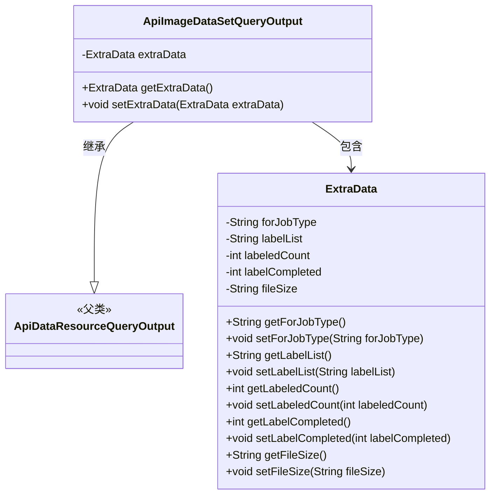
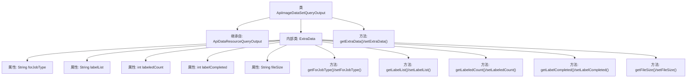

# 基础信息

|      |      |
|------|------|
| 名称 | ApiImageDataSetQueryOutput |
| 编码语言 | .java |
| 代码路径 | WeFe/manager/manager-service/src/main/java/com/welab/wefe/manager/service/dto/dataresource/ApiImageDataSetQueryOutput.java |
| 包名 | com.welab.wefe.manager.service.dto.dataresource |
| 依赖项 | [] |
| 概述说明 | ApiImageDataSetQueryOutput继承ApiDataResourceQueryOutput，包含ExtraData内部类，记录任务类型、标签列表、标注数量、完成状态和文件大小等信息。 |

# 说明

ApiImageDataSetQueryOutput类继承自ApiDataResourceQueryOutput，包含一个嵌套类ExtraData。ExtraData类存储了与图像数据集相关的额外信息，包括任务类型、标签列表、已标注数量、标注完成状态和文件大小。主类提供了对ExtraData对象的获取和设置方法。

# 类列表 Class Summary

| 名称   | 类型  | 说明 |
|-------|------|-------------|
| ApiImageDataSetQueryOutput | class | ApiImageDataSetQueryOutput类继承ApiDataResourceQueryOutput，包含ExtraData内部类，存储任务类型、标签列表、标注数量、完成状态和文件大小等信息。 |

## 类 ApiImageDataSetQueryOutput

|      |      |
|------|------|
| 访问范围 | public |
| 类型 | class |
| 名称 | ApiImageDataSetQueryOutput |
| 说明 | ApiImageDataSetQueryOutput类继承ApiDataResourceQueryOutput，包含ExtraData内部类，存储任务类型、标签列表、标注数量、完成状态和文件大小等信息。 |

### UML类图

该类图展示了ApiImageDataSetQueryOutput继承自ApiDataResourceQueryOutput，并包含一个嵌套类ExtraData。ExtraData类封装了与图像数据集相关的元数据信息，包括任务类型、标签列表、标注计数和文件大小等字段。ApiImageDataSetQueryOutput通过组合方式持有ExtraData实例，提供对额外数据的访问和修改方法。整体结构体现了面向对象的继承和组合关系。

### 内部方法调用关系图

这段代码定义了一个ApiImageDataSetQueryOutput类，继承自ApiDataResourceQueryOutput，包含一个内部类ExtraData用于存储额外的数据信息。ExtraData类封装了与任务类型、标签列表、标注计数和文件大小相关的属性和对应的getter/setter方法。主类通过getExtraData()和setExtraData()方法管理ExtraData实例，整体结构体现了面向对象封装和组合的设计思想。

### 字段列表 Field List

| 名称  | 类型  | 说明 |
|-------|-------|------|
| extraData | ExtraData | 私有变量extraData，类型为ExtraData。 |

### 方法列表

| 名称  | 类型  | 说明 |
|-------|-------|------|
| getExtraData | ExtraData | 方法getExtraData返回extraData对象。 |
| setExtraData | void | 方法setExtraData用于设置对象的extraData属性，参数为ExtraData类型。 |

