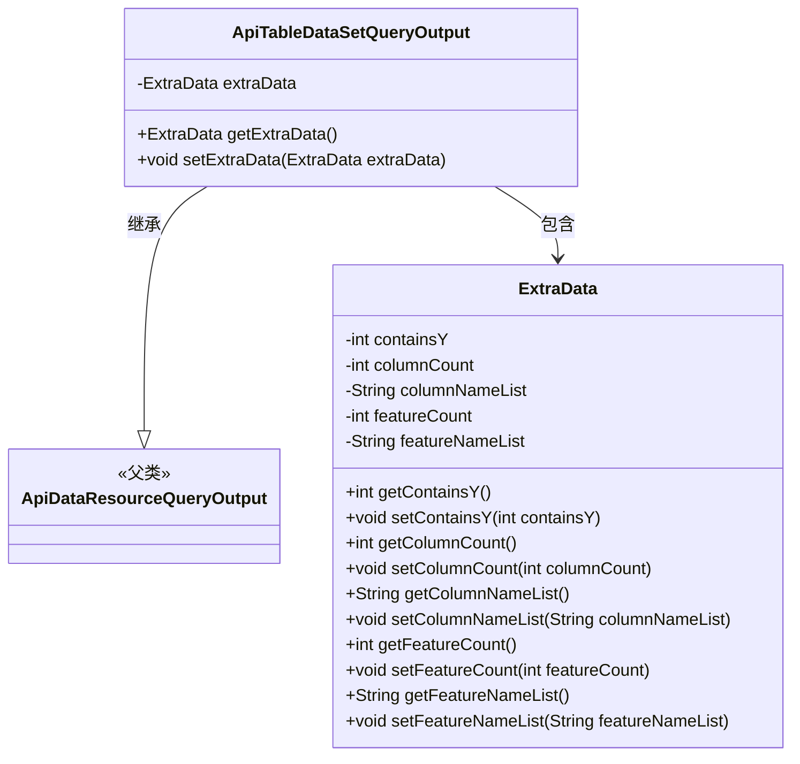
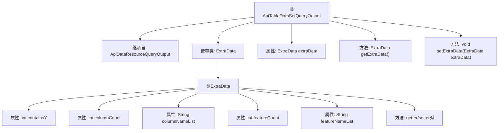

# 基础信息

|      |      |
|------|------|
| 名称 | ApiTableDataSetQueryOutput |
| 编码语言 | .java |
| 代码路径 | WeFe/manager/manager-service/src/main/java/com/welab/wefe/manager/service/dto/dataresource/ApiTableDataSetQueryOutput.java |
| 包名 | com.welab.wefe.manager.service.dto.dataresource |
| 依赖项 | [] |
| 概述说明 | ApiTableDataSetQueryOutput继承ApiDataResourceQueryOutput，包含ExtraData内部类，记录列数、特征数、名称列表及是否含Y。 |

# 说明

ApiTableDataSetQueryOutput类继承自ApiDataResourceQueryOutput，包含一个名为extraData的内部类ExtraData。ExtraData类具有五个私有属性：containsY表示是否包含Y值，columnCount记录列数，columnNameList存储列名列表，featureCount记录特征数量，featureNameList存储特征名列表。每个属性都有对应的getter和setter方法。主类也提供了对extraData的getter和setter方法。

# 类列表 Class Summary

| 名称   | 类型  | 说明 |
|-------|------|-------------|
| ApiTableDataSetQueryOutput | class | ApiTableDataSetQueryOutput类继承ApiDataResourceQueryOutput，包含ExtraData内部类，存储列数、列名列表、特征数、特征名列表等信息。 |

## 类 ApiTableDataSetQueryOutput

|      |      |
|------|------|
| 访问范围 | public |
| 类型 | class |
| 名称 | ApiTableDataSetQueryOutput |
| 说明 | ApiTableDataSetQueryOutput类继承ApiDataResourceQueryOutput，包含ExtraData内部类，存储列数、列名列表、特征数、特征名列表等信息。 |

### UML类图

这段类图展示了ApiTableDataSetQueryOutput继承自ApiDataResourceQueryOutput，并包含一个嵌套类ExtraData的结构。ExtraData类封装了数据集查询的附加信息，包括是否包含Y值、列数、列名列表、特征数和特征名列表等属性，通过getter和setter方法进行访问和修改。ApiTableDataSetQueryOutput通过组合方式持有ExtraData实例，扩展了父类的数据查询输出功能。整体设计体现了面向对象的封装和继承特性，适用于处理结构化数据集的查询结果输出场景。

### 内部方法调用关系图

这段代码定义了一个继承自ApiDataResourceQueryOutput的ApiTableDataSetQueryOutput类，其中包含一个嵌套的ExtraData静态类。ExtraData类封装了5个数据字段（containsY、columnCount等）及其对应的getter/setter方法。主类通过extraData属性和对应的访问方法管理ExtraData实例。该结构用于扩展父类的数据查询输出能力，添加表格数据集特有的元信息。

### 字段列表 Field List

| 名称  | 类型  | 说明 |
|-------|-------|------|
| extraData | ExtraData | 私有成员变量extraData，类型为ExtraData。 |

### 方法列表

| 名称  | 类型  | 说明 |
|-------|-------|------|
| getExtraData | ExtraData | 获取额外数据对象的方法，返回extraData属性值。 |
| setExtraData | void | 方法setExtraData用于设置extraData属性，参数为ExtraData类型对象。 |

