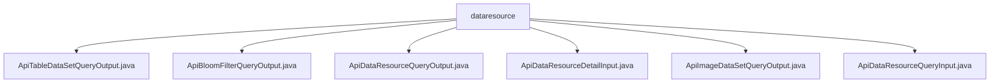

# 基础信息

|      |      |
|------|------|
| 名称 | dataresource |
| 编码语言 | .java |
| 代码路径 | WeFe/manager/manager-service/src/main/java/com/welab/wefe/manager/service/dto/dataresource |
| 包名 | docs.manager.manager-service.src.main.java.com.welab.wefe.manager.service.dto.dataresource |
| 概述说明 | ApiTableDataSetQueryOutput继承ApiDataResourceQueryOutput，含ExtraData类记录列和特征信息。ApiBloomFilterQueryOutput继承同类，ExtraData存储哈希函数。ApiDataResourceQueryOutput包含资源基础信息。ApiDataResourceDetailInput需资源ID和类型。ApiImageDataSetQueryOutput继承同类，ExtraData存图像数据集信息。ApiDataResourceQueryInput继承PageInput，含多查询条件。 |

# 说明

## 概述  
该模块核心职责是提供数据资源查询与管理功能，支持多种数据类型（如表数据、布隆过滤器、图像数据集）的统一接口规范。接口规范包含输入输出类继承体系，例如输入类需继承AbstractApiInput或PageInput，输出类继承AbstractTimedApiOutput。关键数据结构包括ExtraData嵌套类（存储类型特定元数据）和DataResourceType枚举（标识资源类型）。外部依赖为Welab框架基础类（如AbstractApiInput）。例如ApiImageDataSetQueryOutput通过ExtraData存储图像标注状态。

## 主要业务场景  
模块支持数据资源全生命周期管理，典型场景包括分页查询（类似CRUD模式）、详情获取和类型化查询（如表数据列信息）。交互模式为请求-响应式，输入类封装查询条件（例如ApiDataResourceQueryInput包含状态过滤字段），输出类携带资源基础信息及类型扩展数据（如ApiBloomFilterQueryOutput包含哈希函数配置）。集成案例表现为多态输出，例如图像数据集返回标注进度，布隆过滤器返回哈希算法。

### 包内部结构视图

该流程图展示了WeFe项目中manager-service模块下dataresource目录的结构关系。dataresource作为父节点，包含6个DTO类文件，分别处理不同类型的数据资源查询和输出操作。这些文件主要用于定义API接口的输入输出数据结构，涵盖表格数据集、布隆过滤器、图像数据集等多种数据资源类型的交互模型。

# 文件列表

| 名称   | 类型  | 说明 |
|-------|------|-------------|
| [ApiTableDataSetQueryOutput.java](ApiTableDataSetQueryOutput.md) | file | ApiTableDataSetQueryOutput继承ApiDataResourceQueryOutput，包含ExtraData内部类，记录列数、特征数、名称列表及是否含Y。 |
| [ApiBloomFilterQueryOutput.java](ApiBloomFilterQueryOutput.md) | file | ApiBloomFilterQueryOutput继承ApiDataResourceQueryOutput，包含ExtraData内部类，提供hashFunction的getter/setter方法。 |
| [ApiDataResourceQueryOutput.java](ApiDataResourceQueryOutput.md) | file | ApiDataResourceQueryOutput类继承AbstractTimedApiOutput，包含数据资源ID、成员信息、名称、描述、标签、数据量、公开级别、使用统计及状态等属性。 |
| [ApiDataResourceDetailInput.java](ApiDataResourceDetailInput.md) | file | ApiDataResourceDetailInput类继承AbstractApiInput，包含必填字段dataResourceId和dataResourceType，提供getter和setter方法。 |
| [ApiImageDataSetQueryOutput.java](ApiImageDataSetQueryOutput.md) | file | ApiImageDataSetQueryOutput继承ApiDataResourceQueryOutput，包含ExtraData内部类，记录任务类型、标签列表、标注数量、完成状态和文件大小等信息。 |
| [ApiDataResourceQueryInput.java](ApiDataResourceQueryInput.md) | file | ApiDataResourceQueryInput类继承PageInput，包含数据资源ID、成员名、名称、标签、成员ID等字段，支持数据类型列表、深度学习任务类型及状态控制。 |

