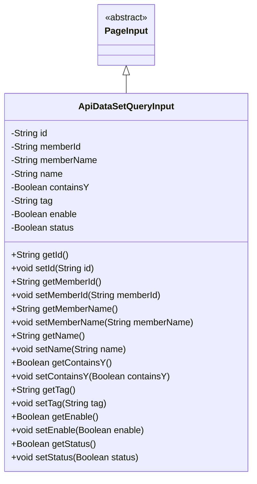

# 基础信息

|      |      |
|------|------|
| 名称 | ApiDataSetQueryInput |
| 编码语言 | .java |
| 代码路径 | WeFe/manager/manager-service/src/main/java/com/welab/wefe/manager/service/dto/dataset/ApiDataSetQueryInput.java |
| 包名 | com.welab.wefe.manager.service.dto.dataset |
| 依赖项 | ['com.welab.wefe.manager.service.dto.base.PageInput'] |
| 概述说明 | ApiDataSetQueryInput类继承PageInput，包含id、memberId、memberName、name、containsY、tag、enable、status字段及对应getter/setter方法。 |

# 说明

ApiDataSetQueryInput类继承自PageInput，包含多个私有字段：id、memberId、memberName、name、containsY、tag、enable和status。每个字段都有对应的getter和setter方法，用于获取和设置字段值。该类主要用于封装API数据集查询的输入参数，支持分页查询功能。

# 类列表 Class Summary

| 名称   | 类型  | 说明 |
|-------|------|-------------|
| ApiDataSetQueryInput | class | ApiDataSetQueryInput类继承PageInput，包含id、memberId、memberName、name、containsY、tag、enable、status字段及其getter/setter方法。 |

## 类 ApiDataSetQueryInput

|      |      |
|------|------|
| 访问范围 | public |
| 类型 | class |
| 名称 | ApiDataSetQueryInput |
| 说明 | ApiDataSetQueryInput类继承PageInput，包含id、memberId、memberName、name、containsY、tag、enable、status字段及其getter/setter方法。 |

### UML类图

这段类图展示了ApiDataSetQueryInput类继承自抽象类PageInput的结构。ApiDataSetQueryInput包含9个私有字段（如id、name等）和对应的getter/setter方法，用于封装API数据集查询的输入参数。作为PageInput的子类，它继承了分页相关的属性和方法，适用于需要分页查询的场景。类图清晰地反映了类的继承关系和成员结构，符合JavaBean规范的设计模式。

### 内部方法调用关系图

```mermaid
graph TD
    A["类ApiDataSetQueryInput"]
    B["继承自: PageInput"]
    C["属性: String id"]
    D["属性: String memberId"]
    E["属性: String memberName"]
    F["属性: String name"]
    G["属性: Boolean containsY"]
    H["属性: String tag"]
    I["属性: Boolean enable"]
    J["属性: Boolean status"]
    K["方法: String getId()"]
    L["方法: void setId(String id)"]
    M["方法: String getMemberId()"]
    N["方法: void setMemberId(String memberId)"]
    O["方法: String getMemberName()"]
    P["方法: void setMemberName(String memberName)"]
    Q["方法: String getName()"]
    R["方法: void setName(String name)"]
    S["方法: Boolean getContainsY()"]
    T["方法: void setContainsY(Boolean containsY)"]
    U["方法: String getTag()"]
    V["方法: void setTag(String tag)"]
    W["方法: Boolean getEnable()"]
    X["方法: void setEnable(Boolean enable)"]
    Y["方法: Boolean getStatus()"]
    Z["方法: void setStatus(Boolean status)"]

    A --> B
    A --> C
    A --> D
    A --> E
    A --> F
    A --> G
    A --> H
    A --> I
    A --> J
    A --> K
    A --> L
    A --> M
    A --> N
    A --> O
    A --> P
    A --> Q
    A --> R
    A --> S
    A --> T
    A --> U
    A --> V
    A --> W
    A --> X
    A --> Y
    A --> Z
```

这段代码定义了一个名为ApiDataSetQueryInput的类，继承自PageInput类，包含多个私有属性和对应的getter/setter方法。该类主要用于封装API数据集查询的输入参数，包括id、memberId、memberName等字符串类型属性，以及containsY、enable、status等布尔类型属性。每个属性都有对应的访问器和修改器方法，用于获取和设置属性值。这种结构典型地用于Java Bean模式，便于数据的封装和传递。

### 字段列表 Field List

| 名称  | 类型  | 说明 |
|-------|-------|------|
| memberId | String | 声明一个私有字符串类型变量memberId。 |
| enable | Boolean | 布尔类型私有变量enable，用于控制功能开关状态。 |
| name | String | 声明一个私有字符串变量name。 |
| tag | String | 声明一个私有字符串变量tag。 |
| id | String | 声明一个私有字符串类型变量id。 |
| memberName | String | 声明一个私有字符串变量memberName。 |
| containsY | Boolean | 私有布尔变量，表示是否包含Y。 |
| status | Boolean | 私有布尔类型状态变量。 |

### 方法列表

| 名称  | 类型  | 说明 |
|-------|-------|------|
| setTag | void | 这是一个Java方法，用于设置对象的tag属性。方法接收一个字符串参数tag，并将其赋值给当前对象的tag成员变量。 |
| getTag | String | 获取标签值的方法，返回字符串类型的tag变量。 |
| setName | void | 设置对象名称的方法，将输入参数name赋值给对象的name属性。 |
| setMemberId | void | 设置成员ID的方法，将输入参数赋值给类的成员变量memberId。 |
| setMemberName | void | 设置成员变量memberName的方法，参数为String类型。 |
| getName | String | 获取对象名称的方法，返回字符串类型的name属性值。 |
| setId | void | 设置对象ID的方法，将参数id赋值给当前对象的id属性。 |
| getEnable | Boolean | 这是一个Java方法，返回布尔类型变量enable的值。 |
| getStatus | Boolean | 获取布尔状态值的方法。 |
| setStatus | void | 设置布尔状态值的方法。 |
| getMemberId | String | 这是一个Java方法，返回成员ID字符串。方法名为getMemberId，无参数，直接返回成员变量memberId的值。 |
| setContainsY | void | 这是一个Java方法，用于设置布尔类型变量containsY的值。方法名为setContainsY，接受一个Boolean参数。 |
| getId | String | 获取对象ID的方法，返回字符串类型的id值。 |
| getContainsY | Boolean | 方法getContainsY返回布尔值containsY，用于检查是否包含Y。 |
| getMemberName | String | 获取成员名称的方法，返回成员变量memberName的值。 |
| setEnable | void | 这是一个Java方法，用于设置布尔类型的enable属性值。方法接受一个Boolean参数，并将其赋值给类的成员变量enable。 |

