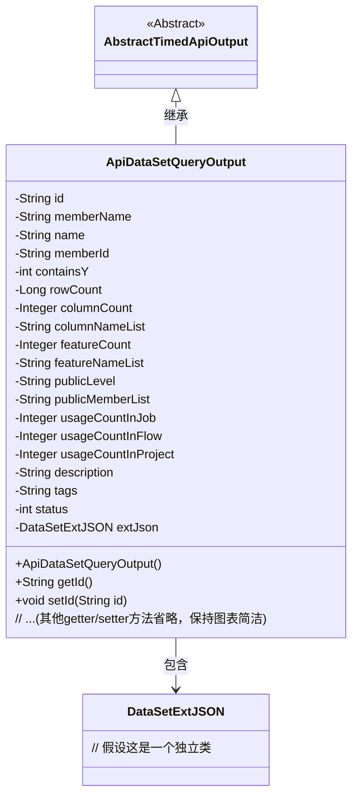

# 基础信息

|      |      |
|------|------|
| 名称 | ApiDataSetQueryOutput |
| 编码语言 | .java |
| 代码路径 | WeFe/manager/manager-service/src/main/java/com/welab/wefe/manager/service/dto/dataset/ApiDataSetQueryOutput.java |
| 包名 | com.welab.wefe.manager.service.dto.dataset |
| 依赖项 | ['com.welab.wefe.common.data.mongodb.entity.union.ext.DataSetExtJSON', 'com.welab.wefe.common.web.dto.AbstractTimedApiOutput'] |
| 概述说明 | ApiDataSetQueryOutput类继承AbstractTimedApiOutput，包含数据集ID、名称、成员信息、行列数、特征列表、公开级别、使用统计、描述、标签、状态及扩展JSON等属性。 |

# 说明

ApiDataSetQueryOutput类继承自AbstractTimedApiOutput，用于表示数据集查询的输出结果。该类包含多个属性，包括数据集ID、成员名称、数据集名称、成员ID、是否包含Y值标志、行数、列数、列名列表、特征数、特征名列表、公开级别、公开成员列表、在作业、流程和项目中的使用次数、描述、标签、状态以及扩展JSON数据。每个属性都有对应的getter和setter方法，用于获取和设置属性值。

# 类列表 Class Summary

| 名称   | 类型  | 说明 |
|-------|------|-------------|
| ApiDataSetQueryOutput | class | ApiDataSetQueryOutput类继承AbstractTimedApiOutput，包含数据集ID、名称、成员信息、行列数、特征列表、公开级别、使用统计、描述、标签、状态及扩展JSON等属性。 |

## 类 ApiDataSetQueryOutput

|      |      |
|------|------|
| 访问范围 | public |
| 类型 | class |
| 名称 | ApiDataSetQueryOutput |
| 说明 | ApiDataSetQueryOutput类继承AbstractTimedApiOutput，包含数据集ID、名称、成员信息、行列数、特征列表、公开级别、使用统计、描述、标签、状态及扩展JSON等属性。 |

### UML类图

类图描述：ApiDataSetQueryOutput继承自抽象类AbstractTimedApiOutput，包含20余个私有字段和对应的getter/setter方法，主要用于封装数据集查询结果。其中extJson字段关联到DataSetExtJSON类，表示扩展的JSON数据。该类的核心功能是管理数据集的元信息，包括基础属性（如名称、行数列数）、使用统计（如项目/作业中的使用次数）和权限信息（如公开级别）。

### 内部方法调用关系图

```mermaid
graph TD
    A["类ApiDataSetQueryOutput"]
    B["继承自: AbstractTimedApiOutput"]
    C["属性: String id"]
    D["属性: String memberName"]
    E["属性: String name"]
    F["属性: String memberId"]
    G["属性: int containsY"]
    H["属性: Long rowCount"]
    I["属性: Integer columnCount"]
    J["属性: String columnNameList"]
    K["属性: Integer featureCount"]
    L["属性: String featureNameList"]
    M["属性: String publicLevel"]
    N["属性: String publicMemberList"]
    O["属性: Integer usageCountInJob"]
    P["属性: Integer usageCountInFlow"]
    Q["属性: Integer usageCountInProject"]
    R["属性: String description"]
    S["属性: String tags"]
    T["属性: int status"]
    U["属性: DataSetExtJSON extJson"]
    V["构造方法: ApiDataSetQueryOutput()"]
    W["Getter/Setter方法组（共18对）"]

    A --> B
    A --> C
    A --> D
    A --> E
    A --> F
    A --> G
    A --> H
    A --> I
    A --> J
    A --> K
    A --> L
    A --> M
    A --> N
    A --> O
    A --> P
    A --> Q
    A --> R
    A --> S
    A --> T
    A --> U
    A --> V
    A -.-> W
```

该流程图展示了ApiDataSetQueryOutput类的完整结构，它是一个继承自AbstractTimedApiOutput的数据传输对象（DTO），包含20个属性和18对Getter/Setter方法。类主要用于封装数据集查询结果，包含基础信息（如ID、名称）、统计信息（如行列数、使用次数）、权限控制字段（如公开级别）和扩展数据（extJson）等结构化数据。所有属性都通过标准JavaBean模式提供访问接口，适合在API层进行序列化传输。

### 字段列表 Field List

| 名称  | 类型  | 说明 |
|-------|-------|------|
| columnCount | Integer | 整型变量，记录列数。 |
| publicMemberList | String | 私有字符串变量，存储公共成员列表。 |
| columnNameList | String | 字段columnNameList用于存储列名列表的字符串。 |
| containsY | int | 私有整型变量，用于存储是否包含Y的标志。 |
| description | String | 私有字符串类型变量description。 |
| usageCountInFlow | Integer | 私有整型变量，记录流程中的使用次数。 |
| status | int | 私有整型变量status，用于表示状态。 |
| memberId | String | 成员ID字符串变量 |
| usageCountInProject | Integer | 项目内使用次数统计 |
| publicLevel | String | 声明一个私有字符串变量publicLevel。 |
| name | String | 私有字符串类型变量name。 |
| rowCount | Long | 私有长整型变量rowCount，用于记录行数。 |
| memberName | String | 成员变量memberName，类型为String，私有访问权限。 |
| extJson | DataSetExtJSON | 私有数据集扩展JSON对象。 |
| featureCount | Integer | 私有整型变量，记录特征数量。 |
| tags | String | 私有字符串变量tags，用于存储标签信息。 |
| id | String | 私有字符串类型变量id。 |
| usageCountInJob | Integer | 私有整型变量，记录作业中的使用次数。 |
| featureNameList | String | 私有字符串变量featureNameList，用于存储特征名称列表。 |

### 方法列表

| 名称  | 类型  | 说明 |
|-------|-------|------|
| getMemberId | String | 这是一个Java方法，返回成员ID字符串。方法名为getMemberId，无参数，直接返回成员变量memberId的值。 |
| getPublicLevel | String | 方法getPublicLevel返回字符串类型的publicLevel变量值。 |
| getContainsY | int | 这是一个Java方法，返回整型变量containsY的值。 |
| getTags | String | 获取tags字符串的方法。 |
| setName | void | 设置对象名称的方法，将参数name赋值给对象的name属性。 |
| setRowCount | void | 设置行数的方法，将输入参数rowCount赋值给类的成员变量rowCount。 |
| getMemberName | String | 获取成员名称的方法，返回成员变量memberName的值。 |
| getFeatureNameList | String | 获取特性名称列表的方法，返回字符串类型的featureNameList。 |
| getFeatureCount | Integer | 获取特征数量方法，返回整型变量featureCount的值。 |
| getId | String | 这是一个Java方法，返回字符串类型的id属性值。 |
| setId | void | 设置对象ID的方法，将参数id赋值给对象的id属性。 |
| getDescription | String | 获取描述信息的方法，返回字符串类型的描述内容。 |
| setPublicMemberList | void | 设置公共成员列表的方法，将输入字符串赋值给类的publicMemberList变量。 |
| setFeatureCount | void | 设置特征数量方法，将输入参数赋给类变量featureCount。 |
| setContainsY | void | 设置containsY属性的方法，参数为int类型。 |
| setFeatureNameList | void | 这是一个Java方法，用于设置featureNameList属性的值。方法接收一个字符串参数，并将其赋值给类的成员变量。 |
| getColumnCount | Integer | 获取列数的方法，返回整型变量columnCount的值。 |
| getUsageCountInJob | Integer | 获取作业中的使用次数。 |
| setUsageCountInFlow | void | 这是一个Java方法，用于设置流程中的使用次数变量。方法接受一个整数参数，并将其赋值给类成员变量usageCountInFlow。 |
| getUsageCountInProject | Integer | 获取项目中的使用次数。 |
| setDescription | void | 设置对象描述的方法，将输入参数赋值给内部变量。 |
| setUsageCountInJob | void | 设置作业中的使用次数。 |
| setColumnCount | void | 设置列数的方法，将参数columnCount赋值给类的成员变量columnCount。 |
| getColumnNameList | String | 该方法返回列名列表字符串。 |
| setTags | void | 这是一个Java方法，用于设置对象的tags属性值为传入的字符串参数tags。 |
| setUsageCountInProject | void | 设置项目内使用次数的方法，参数为整型数值。 |
| getUsageCountInFlow | Integer | 获取流程中的使用次数。 |
| setPublicLevel | void | 设置公共级别的方法，将输入参数publicLevel赋值给类的同名成员变量。 |
| getName | String | 这是一个Java方法，返回字符串类型的name变量值。 |
| getExtJson | DataSetExtJSON | 获取外部JSON数据集的方法。 |
| getPublicMemberList | String | 获取公共成员列表的方法，返回publicMemberList变量。 |
| setMemberName | void | 这是一个Java方法，用于设置成员变量memberName的值。方法接收一个字符串参数memberName，并将其赋值给当前对象的同名成员变量。 |
| setMemberId | void | 设置成员ID的方法，将输入字符串赋值给成员变量memberId。 |
| getRowCount | Long | 获取行数的方法，返回长整型变量rowCount的值。 |
| setColumnNameList | void | 设置列名列表的方法，将输入参数赋值给类的成员变量columnNameList。 |
| setExtJson | void | 方法setExtJson用于设置extJson属性，参数为DataSetExtJSON类型。 |
| getStatus | int | 获取当前状态值的方法，返回整型变量status。 |
| setStatus | void | 设置状态值的方法，将输入参数status赋值给当前对象的status属性。 |

