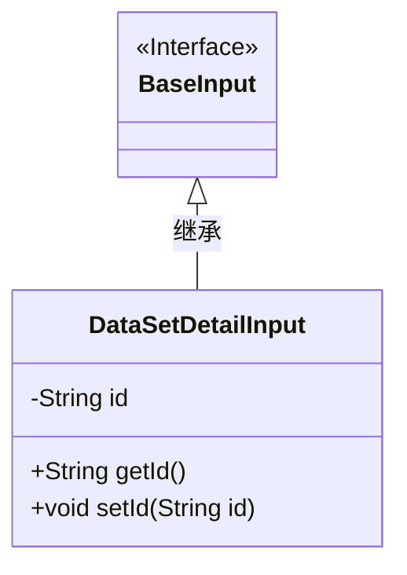
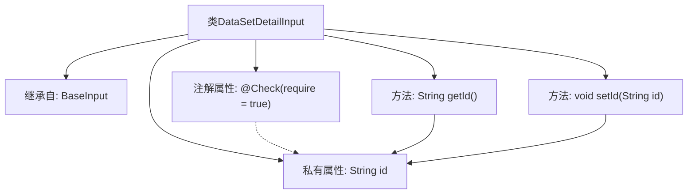

# 基础信息

|      |      |
|------|------|
| 名称 | DataSetDetailInput |
| 编码语言 | .java |
| 代码路径 | WeFe/manager/manager-service/src/main/java/com/welab/wefe/manager/service/dto/dataset/DataSetDetailInput.java |
| 包名 | com.welab.wefe.manager.service.dto.dataset |
| 依赖项 | ['com.welab.wefe.common.fieldvalidate.annotation.Check', 'com.welab.wefe.manager.service.dto.base.BaseInput'] |
| 概述说明 | DataSetDetailInput类继承BaseInput，包含必填字段id及其getter和setter方法。 |

# 说明

这是一个名为DataSetDetailInput的Java类，继承自BaseInput类。该类包含一个私有字符串类型字段id，并通过@Check注解标记该字段为必填项。提供了getId和setId两个公共方法用于获取和设置id字段的值。整个类结构简单，主要用于封装数据集详情查询的输入参数，其中id是必须提供的标识字段。

# 类列表 Class Summary

| 名称   | 类型  | 说明 |
|-------|------|-------------|
| DataSetDetailInput | class | DataSetDetailInput类继承BaseInput，包含必须的字符串类型id属性及其getter和setter方法。 |

## 类 DataSetDetailInput

|      |      |
|------|------|
| 访问范围 | public |
| 类型 | class |
| 名称 | DataSetDetailInput |
| 说明 | DataSetDetailInput类继承BaseInput，包含必须的字符串类型id属性及其getter和setter方法。 |

### UML类图

这段代码展示了一个简单的类继承结构。DataSetDetailInput类继承自BaseInput接口，包含一个私有字符串字段id及其对应的getter和setter方法。类图中清晰地体现了继承关系，其中BaseInput被标记为接口，DataSetDetailInput作为其实现类。id字段遵循JavaBean规范进行封装，通过公有方法提供访问控制。整个设计符合面向对象的基本封装原则。

### 内部方法调用关系图

这段代码定义了一个名为DataSetDetailInput的类，它继承自BaseInput类。类中包含一个带有@Check注解的私有字符串属性id，该注解设置require为true表示id是必需的。类提供了getId()和setId()两个公共方法，分别用于获取和设置id属性的值。流程图清晰地展示了类的继承关系、属性与方法的关联以及注解与属性的绑定关系。

### 字段列表 Field List

| 名称  | 类型  | 说明 |
|-------|-------|------|
| id | String | 必填字段id，类型为String。 |

### 方法列表

| 名称  | 类型  | 说明 |
|-------|-------|------|
| getId | String | 方法getId返回字符串类型的id变量值。 |
| setId | void | 设置对象ID的方法，将参数id赋值给当前对象的id属性。 |

