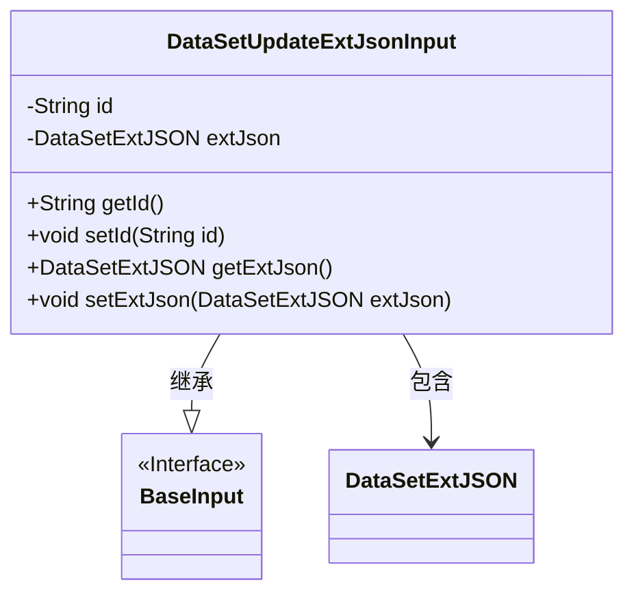
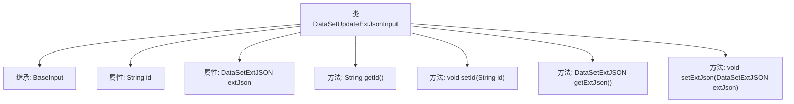

# 基础信息

|      |      |
|------|------|
| 名称 | DataSetUpdateExtJsonInput |
| 编码语言 | .java |
| 代码路径 | WeFe/manager/manager-service/src/main/java/com/welab/wefe/manager/service/dto/dataset/DataSetUpdateExtJsonInput.java |
| 包名 | com.welab.wefe.manager.service.dto.dataset |
| 依赖项 | ['com.welab.wefe.common.data.mongodb.entity.union.ext.DataSetExtJSON', 'com.welab.wefe.common.fieldvalidate.annotation.Check', 'com.welab.wefe.manager.service.dto.base.BaseInput'] |
| 概述说明 | DataSetUpdateExtJsonInput类继承BaseInput，包含必填id字段和可选的extJson字段，提供getter和setter方法。 |

# 说明

这是一个名为DataSetUpdateExtJsonInput的Java类，继承自BaseInput类。该类包含两个私有属性：id和extJson。id属性被标记为必填项，类型为String；extJson属性类型为DataSetExtJSON。类中提供了这两个属性的getter和setter方法，用于获取和设置属性值。

# 类列表 Class Summary

| 名称   | 类型  | 说明 |
|-------|------|-------------|
| DataSetUpdateExtJsonInput | class | 数据集更新扩展JSON输入类，包含必填ID和可选的扩展JSON字段，提供getter和setter方法。 |

## 类 DataSetUpdateExtJsonInput

|      |      |
|------|------|
| 访问范围 | public |
| 类型 | class |
| 名称 | DataSetUpdateExtJsonInput |
| 说明 | 数据集更新扩展JSON输入类，包含必填ID和可选的扩展JSON字段，提供getter和setter方法。 |

### UML类图

类图描述：DataSetUpdateExtJsonInput类继承自BaseInput接口，包含私有属性id和extJson，其中extJson是DataSetExtJSON类型。该类提供了标准的getter和setter方法用于访问和修改这两个属性。BaseInput作为接口标记了基础输入规范，DataSetExtJSON作为独立类存储扩展JSON数据。

### 内部方法调用关系图

这段代码定义了一个`DataSetUpdateExtJsonInput`类，继承自`BaseInput`，包含两个私有属性`id`和`extJson`，分别用于存储数据集ID和扩展JSON数据。类中提供了四个方法：`getId`和`setId`用于获取和设置ID，`getExtJson`和`setExtJson`用于获取和设置扩展JSON数据。`id`属性上标注了`@Check(require = true)`注解，表示该字段在验证时必须存在。整体结构清晰，主要用于封装数据集更新的输入参数。

### 字段列表 Field List

| 名称  | 类型  | 说明 |
|-------|-------|------|
| extJson | DataSetExtJSON | 私有数据集扩展JSON对象。 |
| id | String | 必填字段id，类型为String。 |

### 方法列表

| 名称  | 类型  | 说明 |
|-------|-------|------|
| getExtJson | DataSetExtJSON | 获取外部JSON数据集的方法，返回extJson对象。 |
| setId | void | 设置对象ID的方法，将参数id赋值给对象的id属性。 |
| getId | String | 这是一个Java方法，返回字符串类型的id值。 |
| setExtJson | void | 方法setExtJson用于设置DataSetExtJSON类型的extJson属性值。 |

