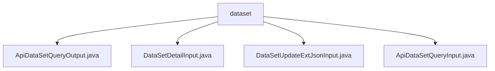

# 基础信息

|      |      |
|------|------|
| 名称 | dataset |
| 编码语言 | .java |
| 代码路径 | WeFe/manager/manager-service/src/main/java/com/welab/wefe/manager/service/dto/dataset |
| 包名 | docs.manager.manager-service.src.main.java.com.welab.wefe.manager.service.dto.dataset |
| 概述说明 | ApiDataSetQueryOutput类表示数据集查询结果，包含ID、名称、行列数等属性。DataSetDetailInput类封装数据集详情查询输入，id必填。DataSetUpdateExtJsonInput类用于更新数据集扩展JSON，含id和extJson属性。ApiDataSetQueryInput类封装数据集查询输入参数，支持分页。 |

# 说明

## 概述  
该模块核心职责是管理数据集元信息，提供数据集查询、详情获取及扩展属性更新功能。接口规范统一采用Java类封装输入输出，输入类继承BaseInput或PageInput，输出类继承AbstractTimedApiOutput。关键数据结构包括DataSetExtJSON（扩展JSON）、分页参数和带时间戳的响应模板。  

外部依赖包括Spring框架的注解校验（如@Check）和基础分页组件。例如ApiDataSetQueryInput使用PageInput实现分页查询，DataSetDetailInput通过@Check强制ID必填。所有交互均通过标准getter/setter访问属性，类似POJO模式的数据封装。  

## 主要业务场景  
主要支持三种业务流：1）分页查询数据集（如带成员过滤和Y值标志），2）通过ID获取详情，3）更新扩展JSON属性。典型应用包括数据看板展示（使用ApiDataSetQueryOutput返回多维统计信息）和流程配置（依赖extJson存储业务参数）。  

API类型涵盖查询类（如ApiDataSetQueryInput）和更新类（如DataSetUpdateExtJsonInput）。集成案例表现为链式调用：先分页查询数据集ID，再获取详情或更新扩展字段。所有交互均采用贫血模型设计，状态通过enable/status字段控制。

### 包内部结构视图

该流程图展示了manager-service项目中dataset目录下的文件结构关系。根节点dataset包含4个DTO类文件，分别处理数据集查询输出、数据集详情输入、数据集扩展JSON更新输入和数据集查询输入功能。所有文件都位于同一层级，没有嵌套的子目录结构。

# 文件列表

| 名称   | 类型  | 说明 |
|-------|------|-------------|
| [ApiDataSetQueryOutput.java](ApiDataSetQueryOutput.md) | file | ApiDataSetQueryOutput类继承AbstractTimedApiOutput，包含数据集ID、名称、成员信息、行列数、特征列表、公开级别、使用统计、描述、标签、状态及扩展JSON等属性。 |
| [DataSetDetailInput.java](DataSetDetailInput.md) | file | DataSetDetailInput类继承BaseInput，包含必填字段id及其getter和setter方法。 |
| [DataSetUpdateExtJsonInput.java](DataSetUpdateExtJsonInput.md) | file | DataSetUpdateExtJsonInput类继承BaseInput，包含必填id字段和可选的extJson字段，提供getter和setter方法。 |
| [ApiDataSetQueryInput.java](ApiDataSetQueryInput.md) | file | ApiDataSetQueryInput类继承PageInput，包含id、memberId、memberName、name、containsY、tag、enable、status字段及对应getter/setter方法。 |

