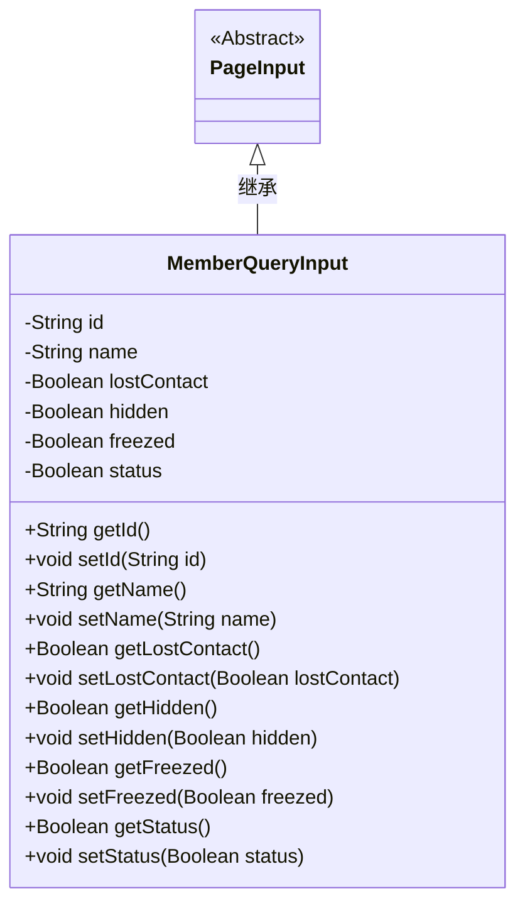

# 基础信息

|      |      |
|------|------|
| 名称 | MemberQueryInput |
| 编码语言 | .java |
| 代码路径 | WeFe/manager/manager-service/src/main/java/com/welab/wefe/manager/service/dto/member/MemberQueryInput.java |
| 包名 | com.welab.wefe.manager.service.dto.member |
| 依赖项 | ['com.welab.wefe.manager.service.dto.base.PageInput'] |
| 概述说明 | 成员查询输入类，包含ID、姓名、失联、隐藏、冻结和状态等字段及其getter和setter方法。 |

# 说明

MemberQueryInput类继承自PageInput，用于封装会员查询的输入参数。包含id和name两个字符串类型字段，以及lostContact、hidden、freezed和status四个布尔类型字段。每个字段都有对应的getter和setter方法用于访问和修改属性值。该类主要用于传递会员查询条件，支持分页查询功能。

# 类列表 Class Summary

| 名称   | 类型  | 说明 |
|-------|------|-------------|
| MemberQueryInput | class | 成员查询输入类，继承分页输入，包含ID、姓名、失联、隐藏、冻结和状态等布尔属性及对应getter/setter方法。 |

## 类 MemberQueryInput

|      |      |
|------|------|
| 访问范围 | public |
| 类型 | class |
| 名称 | MemberQueryInput |
| 说明 | 成员查询输入类，继承分页输入，包含ID、姓名、失联、隐藏、冻结和状态等布尔属性及对应getter/setter方法。 |

### UML类图

类图描述：MemberQueryInput类继承自抽象类PageInput，包含id、name等私有字段及对应的getter/setter方法，用于封装会员查询的输入参数。该类通过布尔类型字段(lostContact/hidden等)表示会员的不同状态，提供灵活的状态查询能力。继承关系表明其复用PageInput的分页功能。

### 内部方法调用关系图

```mermaid
graph TD
    A["类MemberQueryInput"]
    B["继承自: PageInput"]
    C["属性: String id"]
    D["属性: String name"]
    E["属性: Boolean lostContact"]
    F["属性: Boolean hidden"]
    G["属性: Boolean freezed"]
    H["属性: Boolean status"]
    I["方法: String getId()"]
    J["方法: void setId(String id)"]
    K["方法: String getName()"]
    L["方法: void setName(String name)"]
    M["方法: Boolean getLostContact()"]
    N["方法: void setLostContact(Boolean lostContact)"]
    O["方法: Boolean getHidden()"]
    P["方法: void setHidden(Boolean hidden)"]
    Q["方法: Boolean getFreezed()"]
    R["方法: void setFreezed(Boolean freezed)"]
    S["方法: Boolean getStatus()"]
    T["方法: void setStatus(Boolean status)"]

    A --> B
    A --> C
    A --> D
    A --> E
    A --> F
    A --> G
    A --> H
    A --> I
    A --> J
    A --> K
    A --> L
    A --> M
    A --> N
    A --> O
    A --> P
    A --> Q
    A --> R
    A --> S
    A --> T
```

该流程图展示了MemberQueryInput类的结构，它是一个继承自PageInput的Java类，包含6个私有属性和对应的getter/setter方法。属性包括id、name以及4个布尔类型的状态标志(lostContact、hidden、freezed、status)。每个属性都有标准的访问器和修改器方法，用于封装数据访问。类图清晰地反映了该POJO(Plain Old Java Object)的数据封装特性和继承关系。

### 字段列表 Field List

| 名称  | 类型  | 说明 |
|-------|-------|------|
| status | Boolean | 布尔类型状态变量 |
| lostContact | Boolean | 私有布尔类型变量，标记是否失去联系。 |
| id | String | 声明一个私有字符串类型变量id。 |
| freezed | Boolean | 私有布尔类型变量，表示是否冻结。 |
| hidden | Boolean | 布尔类型字段hidden，表示是否隐藏。 |
| name | String | 私有字符串变量name |

### 方法列表

| 名称  | 类型  | 说明 |
|-------|-------|------|
| setName | void | 设置对象名称的方法，将输入参数name赋值给对象的name属性。 |
| getHidden | Boolean | 这是一个Java方法，返回布尔类型的hidden属性值。 |
| setLostContact | void | 设置设备失联状态的布尔值方法。 |
| getId | String | 这是一个Java方法，返回字符串类型的id属性值。 |
| getLostContact | Boolean | 这是一个Java方法，返回布尔类型的lostContact变量值。 |
| setHidden | void | 设置隐藏属性的方法，参数为布尔值hidden，用于控制对象是否隐藏。 |
| getName | String | 方法返回字符串类型的name属性值。 |
| setId | void | 设置对象ID的方法，将参数id赋值给对象的id属性。 |
| getFreezed | Boolean | 方法返回布尔值freezed，表示冻结状态。 |
| setFreezed | void | 定义了一个公共方法setFreezed，用于设置布尔类型的freezed属性值。 |
| getStatus | Boolean | 这是一个Java方法，返回布尔类型的状态值。 |
| setStatus | void | 设置布尔状态值的方法。 |

