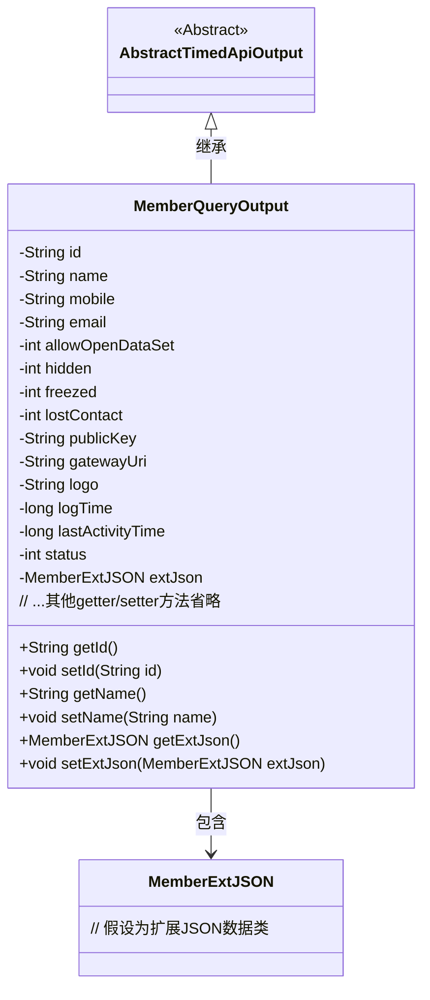

# 基础信息

|      |      |
|------|------|
| 名称 | MemberQueryOutput |
| 编码语言 | .java |
| 代码路径 | WeFe/manager/manager-service/src/main/java/com/welab/wefe/manager/service/dto/member/MemberQueryOutput.java |
| 包名 | com.welab.wefe.manager.service.dto.member |
| 依赖项 | ['com.welab.wefe.common.data.mongodb.entity.union.ext.MemberExtJSON', 'com.welab.wefe.common.web.dto.AbstractTimedApiOutput'] |
| 概述说明 | MemberQueryOutput类继承AbstractTimedApiOutput，包含成员ID、姓名、联系方式、状态标志、公钥、网关URI、LOGO、时间戳及扩展JSON等属性。 |

# 说明

MemberQueryOutput类继承自AbstractTimedApiOutput，包含成员信息查询输出的各项属性。主要字段包括id、name、mobile、email等基本信息，以及allowOpenDataSet、hidden、freezed、lostContact等状态标识。此外还包含publicKey、gatewayUri、logo等扩展信息，logTime和lastActivityTime记录时间戳，status表示状态，extJson存储额外JSON数据。每个字段均有对应的getter和setter方法用于访问和修改属性值。

# 类列表 Class Summary

| 名称   | 类型  | 说明 |
|-------|------|-------------|
| MemberQueryOutput | class | MemberQueryOutput类继承AbstractTimedApiOutput，包含成员ID、姓名、联系方式、状态标志、公钥、网关URI、logo、时间戳及扩展JSON等属性及其getter/setter方法。 |

## 类 MemberQueryOutput

|      |      |
|------|------|
| 访问范围 | public |
| 类型 | class |
| 名称 | MemberQueryOutput |
| 说明 | MemberQueryOutput类继承AbstractTimedApiOutput，包含成员ID、姓名、联系方式、状态标志、公钥、网关URI、logo、时间戳及扩展JSON等属性及其getter/setter方法。 |

### UML类图

类图描述：MemberQueryOutput继承自抽象类AbstractTimedApiOutput，包含会员基础信息字段（如id、name、mobile等）和各种状态标识（如hidden、freezed等），通过MemberExtJSON对象存储扩展JSON数据。所有字段均通过getter/setter方法进行访问控制，体现了标准的JavaBean设计模式。

### 内部方法调用关系图

该流程图展示了MemberQueryOutput类的完整结构，包含从AbstractTimedApiOutput继承的属性和自身定义的14个字段，以及对应的getter/setter方法。这是一个典型的Java数据传输对象（DTO）设计，用于封装成员查询结果数据，包含基础信息（id/name）、联系方式（mobile/email）、状态标识（hidden/freezed）、系统参数（publicKey/gatewayUri）和扩展数据（extJson）等结构化字段。所有属性都通过标准访问器方法暴露，符合JavaBean规范。

### 字段列表 Field List

| 名称  | 类型  | 说明 |
|-------|-------|------|
| extJson | MemberExtJSON | 成员扩展JSON数据对象。 |
| freezed | int | 变量freezed是私有整型，用于存储冻结状态或相关数值。 |
| allowOpenDataSet | int | 私有整型变量，用于控制数据集开放权限。 |
| email | String | 声明一个私有字符串变量email。 |
| gatewayUri | String | 私有字符串变量gatewayUri，用于存储网关URI地址。 |
| name | String | 声明一个私有字符串变量name。 |
| publicKey | String | 私有字符串变量publicKey |
| mobile | String | 私有字符串变量mobile |
| hidden | int | 私有整型变量hidden |
| status | int | 私有整型变量status，用于存储状态信息。 |
| id | String | 私有字符串类型变量id |
| lostContact | int | 私有整型变量lostContact，用于记录失去联系的次数或状态。 |
| logTime | long | 日志时间戳，记录事件发生的具体时间。 |
| lastActivityTime | long | 私有长整型变量，记录最后活动时间。 |
| logo | String | 私有字符串变量logo，用于存储标识信息。 |

### 方法列表

| 名称  | 类型  | 说明 |
|-------|-------|------|
| getId | String | 这是一个Java方法，返回字符串类型的id属性值。 |
| getStatus | int | 获取状态值的方法，返回整型变量status。 |
| getName | String | 方法getName返回字符串name的值。 |
| getPublicKey | String | 获取公钥的方法，返回publicKey变量值。 |
| setPublicKey | void | 设置公钥的方法，将输入的字符串赋值给类的publicKey成员变量。 |
| setHidden | void | 设置隐藏状态的方法，参数为整型hidden，赋值给当前对象的hidden属性。 |
| setLogo | void | 设置logo字符串的方法。 |
| getLostContact | int | 获取丢失联系数的方法，返回lostContact变量值。 |
| getExtJson | MemberExtJSON | 获取成员扩展JSON数据的方法，返回extJson对象。 |
| getLogo | String | 这是一个Java方法，返回字符串类型的logo值。 |
| getHidden | int | 获取隐藏值的方法，返回整型变量hidden。 |
| getGatewayUri | String | 获取网关URI的方法，返回gatewayUri字符串。 |
| setEmail | void | 这是一个Java方法，用于设置对象的email属性。方法接收一个字符串参数email，并将其赋值给当前对象的email字段。 |
| setId | void | 设置对象ID的方法，将参数id赋值给对象的id属性。 |
| setLastActivityTime | void | 设置最后活动时间的方法，将传入的lastActivityTime赋值给类的成员变量。 |
| setName | void | 这是一个Java方法，用于设置对象的名称属性。方法接收一个字符串参数name，并将其赋值给当前对象的name字段。 |
| setGatewayUri | void | 设置网关URI的方法，将参数值赋给类的成员变量gatewayUri。 |
| setExtJson | void | 设置成员扩展JSON数据的方法。 |
| setLostContact | void | 设置失去联系状态的方法，参数为lostContact，赋值给成员变量。 |
| getMobile | String | 获取手机号的方法，返回字符串类型变量mobile。 |
| setLogTime | void | 方法setLogTime用于设置logTime属性值，参数为长整型logTime。 |
| getAllowOpenDataSet | int | 获取允许打开的数据集值。 |
| getLastActivityTime | long | 获取最后活动时间的方法，返回变量lastActivityTime的值。 |
| setMobile | void | 设置手机号的方法，将参数mobile赋值给当前对象的mobile属性。 |
| setAllowOpenDataSet | void | 方法setAllowOpenDataSet用于设置allowOpenDataSet的值，参数为整型。 |
| getFreezed | int | 获取freezed变量的整数值。 |
| getEmail | String | 这是一个Java方法，返回字符串类型的email变量值。 |
| getLogTime | long | 获取日志时间的方法，返回长整型变量logTime的值。 |
| setFreezed | void | 定义方法setFreezed，用于设置freezed变量的值。 |
| setStatus | void | 这是一个Java方法，用于设置对象的状态值。方法名为setStatus，接收一个整型参数status，并将其赋值给当前对象的status属性。 |

