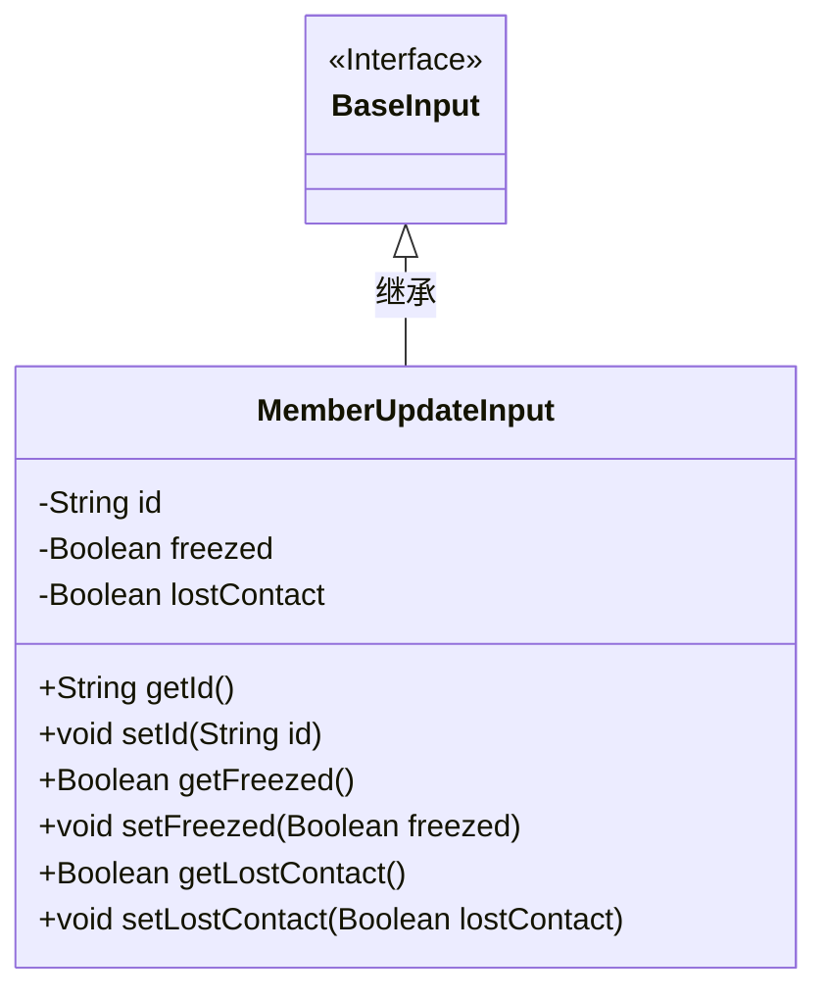
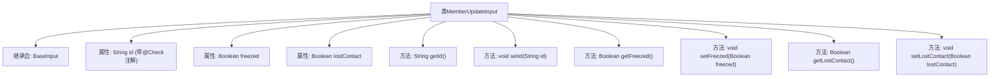

# 基础信息

|      |      |
|------|------|
| 名称 | MemberUpdateInput |
| 编码语言 | .java |
| 代码路径 | WeFe/manager/manager-service/src/main/java/com/welab/wefe/manager/service/dto/member/MemberUpdateInput.java |
| 包名 | com.welab.wefe.manager.service.dto.member |
| 依赖项 | ['com.welab.wefe.common.fieldvalidate.annotation.Check', 'com.welab.wefe.manager.service.dto.base.BaseInput'] |
| 概述说明 | MemberUpdateInput类继承BaseInput，包含必填id和可选freezed、lostContact布尔字段及其getter/setter方法。 |

# 说明

该内容定义了一个名为MemberUpdateInput的Java类，继承自BaseInput类。该类包含三个私有字段：id、freezed和lostContact。其中id字段带有@Check注解标记为必填项。类中为每个字段提供了对应的getter和setter方法，用于访问和修改字段值。该类的功能是封装成员更新操作的输入数据。

# 类列表 Class Summary

| 名称   | 类型  | 说明 |
|-------|------|-------------|
| MemberUpdateInput | class | 成员更新输入类，继承基础输入类，包含必填ID和可选冻结、失联状态字段及其getter/setter方法。 |

## 类 MemberUpdateInput

|      |      |
|------|------|
| 访问范围 | public |
| 类型 | class |
| 名称 | MemberUpdateInput |
| 说明 | 成员更新输入类，继承基础输入类，包含必填ID和可选冻结、失联状态字段及其getter/setter方法。 |

### UML类图

这段代码展示了一个会员信息更新输入类MemberUpdateInput，它继承自基础输入接口BaseInput。该类包含三个私有字段：必填的id字符串、表示是否冻结的freezed布尔值和表示是否失联的lostContact布尔值，并为每个字段提供了标准的getter和setter方法。类图清晰地展示了继承关系和成员结构，体现了Java Bean的设计模式。

### 内部方法调用关系图

这段代码展示了一个MemberUpdateInput类，继承自BaseInput类，包含三个属性：id（带校验注解）、freezed和lostContact，以及对应的getter和setter方法。流程图清晰呈现了类继承关系、属性定义和方法结构，其中id属性特别标注了@Check(require=true)的校验约束，表明该字段在业务逻辑中必须提供有效值。所有方法均为标准JavaBean风格的访问器方法，用于封装对象状态的读取和修改。

### 字段列表 Field List

| 名称  | 类型  | 说明 |
|-------|-------|------|
| lostContact | Boolean | 字段lostContact表示是否失去联系，类型为布尔值。 |
| id | String | 必填字段id，使用@Check注解标记为必须验证。 |
| freezed | Boolean | 布尔类型字段，表示是否被冻结。 |

### 方法列表

| 名称  | 类型  | 说明 |
|-------|-------|------|
| getLostContact | Boolean | 这是一个Java方法，返回布尔类型的lostContact变量值。 |
| setId | void | 设置对象ID的方法，将参数id赋值给对象的id属性。 |
| getFreezed | Boolean | 这是一个Java方法，返回布尔类型变量freezed的值。 |
| setFreezed | void | 这是一个Java方法，用于设置对象的freezed属性值，接受布尔参数freezed并赋值给成员变量。 |
| setLostContact | void | 定义方法设置lostContact布尔值属性。 |
| getId | String | 这是一个Java方法，返回字符串类型的id值。 |

