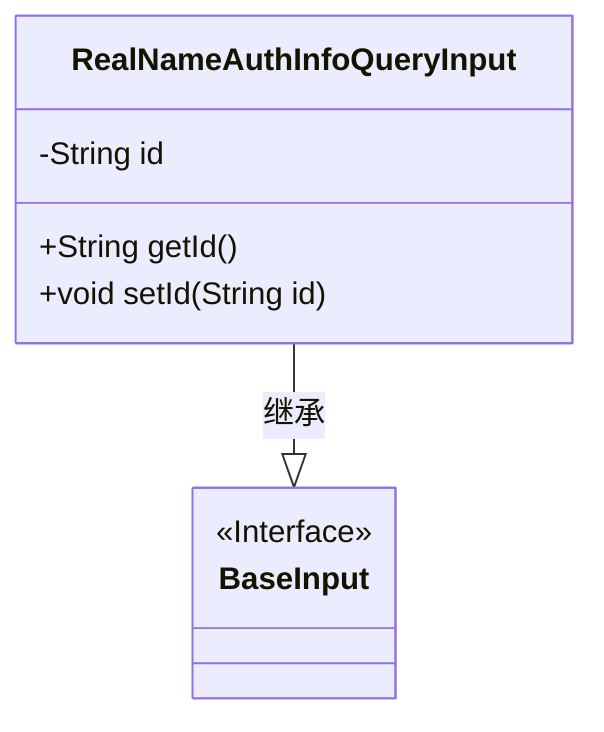
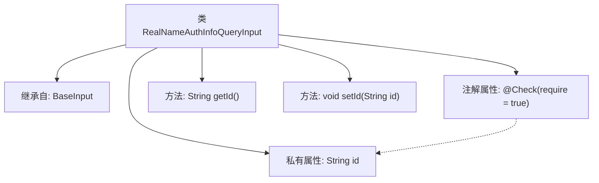

# 基础信息

|      |      |
|------|------|
| 名称 | RealNameAuthInfoQueryInput |
| 编码语言 | .java |
| 代码路径 | WeFe/manager/manager-service/src/main/java/com/welab/wefe/manager/service/dto/member/RealNameAuthInfoQueryInput.java |
| 包名 | com.welab.wefe.manager.service.dto.member |
| 依赖项 | ['com.welab.wefe.common.fieldvalidate.annotation.Check', 'com.welab.wefe.manager.service.dto.base.BaseInput'] |
| 概述说明 | RealNameAuthInfoQueryInput类继承BaseInput，包含必填字段id及其getter和setter方法。 |

# 说明

该内容定义了一个名为RealNameAuthInfoQueryInput的Java类，继承自BaseInput类。该类包含一个私有字符串类型字段id，并通过注解@Check标记该字段为必填项。提供了getId和setId两个公共方法用于获取和设置id字段的值。整个类结构简洁，主要用于处理实名认证信息查询的输入参数。

# 类列表 Class Summary

| 名称   | 类型  | 说明 |
|-------|------|-------------|
| RealNameAuthInfoQueryInput | class | 类RealNameAuthInfoQueryInput继承BaseInput，包含必填字符串属性id及其getter/setter方法。 |

## 类 RealNameAuthInfoQueryInput

|      |      |
|------|------|
| 访问范围 | public |
| 类型 | class |
| 名称 | RealNameAuthInfoQueryInput |
| 说明 | 类RealNameAuthInfoQueryInput继承BaseInput，包含必填字符串属性id及其getter/setter方法。 |

### UML类图

这段类图展示了RealNameAuthInfoQueryInput类继承自BaseInput接口的结构。RealNameAuthInfoQueryInput包含一个私有字符串类型id字段，以及对应的公有getter和setter方法。BaseInput被标记为接口，作为父类提供基础输入规范。该设计实现了简单的数据封装，通过继承关系扩展了基础输入功能，适用于需要身份认证信息查询的场景。类结构清晰体现了JavaBean的标准写法，同时通过注解(@Check)实现了参数校验的声明式编程。

### 内部方法调用关系图

这段代码展示了一个名为RealNameAuthInfoQueryInput的类，它继承自BaseInput类。该类包含一个带有@Check注解的私有字符串属性id，以及对应的getter和setter方法。@Check注解表明该属性是必填项。流程图清晰地展示了类继承关系、属性定义和方法结构，以及注解与属性的关联关系。

### 字段列表 Field List

| 名称  | 类型  | 说明 |
|-------|-------|------|
| id | String | 代码片段定义了一个私有字符串变量id，并添加了非空检查注解@Check(require=true)。 |

### 方法列表

| 名称  | 类型  | 说明 |
|-------|-------|------|
| getId | String | 这是一个Java方法，返回字符串类型的id值。 |
| setId | void | 设置对象ID的方法，将参数id赋值给对象的id属性。 |

