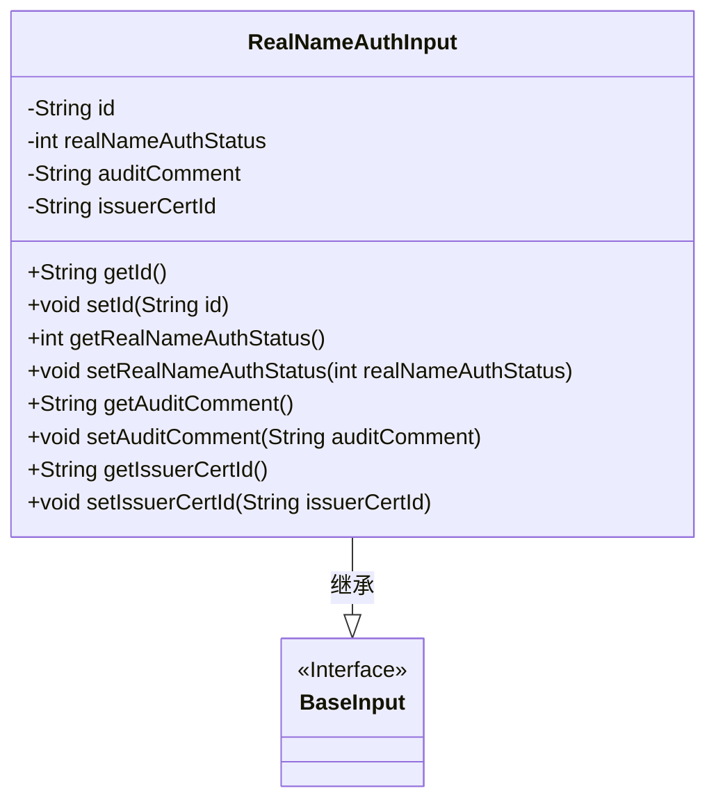

# 基础信息

|      |      |
|------|------|
| 名称 | RealNameAuthInput |
| 编码语言 | .java |
| 代码路径 | WeFe/manager/manager-service/src/main/java/com/welab/wefe/manager/service/dto/member/RealNameAuthInput.java |
| 包名 | com.welab.wefe.manager.service.dto.member |
| 依赖项 | ['com.welab.wefe.common.fieldvalidate.annotation.Check', 'com.welab.wefe.manager.service.dto.base.BaseInput'] |
| 概述说明 | RealNameAuthInput类包含必填ID和实名认证状态，可选审核意见和发证ID，提供各字段的getter和setter方法。 |

# 说明

RealNameAuthInput类继承BaseInput，包含四个属性：必填的id字符串和realNameAuthStatus整型（-1认证失败/0未认证/1认证中/2已认证），以及可选的auditComment字符串和issuerCertId字符串。提供各属性的getter和setter方法。

# 类列表 Class Summary

| 名称   | 类型  | 说明 |
|-------|------|-------------|
| RealNameAuthInput | class | RealNameAuthInput类继承BaseInput，包含必填字段id和realNameAuthStatus（认证状态），以及可选字段auditComment和issuerCertId，提供各字段的getter和setter方法。 |

## 类 RealNameAuthInput

|      |      |
|------|------|
| 访问范围 | public |
| 类型 | class |
| 名称 | RealNameAuthInput |
| 说明 | RealNameAuthInput类继承BaseInput，包含必填字段id和realNameAuthStatus（认证状态），以及可选字段auditComment和issuerCertId，提供各字段的getter和setter方法。 |

### UML类图

类图描述：该图展示了一个实名认证输入类`RealNameAuthInput`继承自基础输入接口`BaseInput`的结构。`RealNameAuthInput`包含四个私有字段：身份证号(id)、认证状态(realNameAuthStatus)、审核意见(auditComment)和发证机构ID(issuerCertId)，其中前两个字段带有`@Check`注解表示必填。类中为每个字段提供了标准的getter和setter方法，用于封装字段访问。

### 内部方法调用关系图

```mermaid
graph TD
    A["类RealNameAuthInput"]
    B["继承自: BaseInput"]
    C["属性: String id (必填)"]
    D["属性: int realNameAuthStatus (必填)"]
    E["属性: String auditComment"]
    F["属性: String issuerCertId"]
    G["方法: String getId()"]
    H["方法: void setId(String id)"]
    I["方法: int getRealNameAuthStatus()"]
    J["方法: void setRealNameAuthStatus(int status)"]
    K["方法: String getAuditComment()"]
    L["方法: void setAuditComment(String comment)"]
    M["方法: String getIssuerCertId()"]
    N["方法: void setIssuerCertId(String certId)"]

    A --> B
    A --> C
    A --> D
    A --> E
    A --> F
    A --> G
    A --> H
    A --> I
    A --> J
    A --> K
    A --> L
    A --> M
    A --> N
```

这段代码定义了一个名为RealNameAuthInput的类，继承自BaseInput类，主要用于处理实名认证相关的输入数据。类中包含四个属性：必填的id和realNameAuthStatus（分别表示用户ID和认证状态），以及可选的auditComment（审核意见）和issuerCertId（发证机构ID）。每个属性都有对应的getter和setter方法，用于获取和设置属性值。realNameAuthStatus属性有明确的注释说明其取值含义：-1表示认证失败，0表示未认证，1表示认证中，2表示已认证。

### 字段列表 Field List

| 名称  | 类型  | 说明 |
|-------|-------|------|
| auditComment | String | 私有字符串变量auditComment，用于存储审核评论。 |
| id | String | 强制校验字段id，不可为空。 |
| realNameAuthStatus | int | 私有整型变量realNameAuthStatus，必须校验且不可为空。 |
| issuerCertId | String | 声明一个私有字符串变量issuerCertId，用于存储证书颁发者ID。 |

### 方法列表

| 名称  | 类型  | 说明 |
|-------|-------|------|
| getRealNameAuthStatus | int | 获取实名认证状态的方法，返回整型状态值。 |
| getId | String | 获取对象ID的方法，返回字符串类型的id值。 |
| setRealNameAuthStatus | void | 设置实名认证状态的方法，参数为认证状态值。 |
| setAuditComment | void | 这是一个Java方法，用于设置auditComment属性的值。方法接受一个字符串参数auditComment，并将其赋值给类的同名成员变量。 |
| getIssuerCertId | String | 获取颁发者证书ID的方法，返回issuerCertId字符串。 |
| setIssuerCertId | void | 设置颁发者证书ID的方法，将参数issuerCertId赋值给类成员变量issuerCertId。 |
| getAuditComment | String | 获取审计评语的方法，返回auditComment字符串。 |
| setId | void | 设置对象ID的方法，将参数id赋值给对象的id属性。 |

