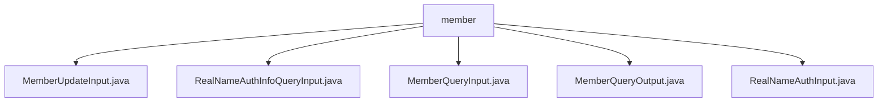

# 基础信息

|      |      |
|------|------|
| 名称 | member |
| 编码语言 | .java |
| 代码路径 | WeFe/manager/manager-service/src/main/java/com/welab/wefe/manager/service/dto/member |
| 包名 | docs.manager.manager-service.src.main.java.com.welab.wefe.manager.service.dto.member |
| 概述说明 | MemberUpdateInput类继承BaseInput，含id、freezed、lostContact字段，id必填。RealNameAuthInfoQueryInput类继承BaseInput，仅含必填id字段。MemberQueryInput类继承PageInput，含id、name等字段，支持分页查询。MemberQueryOutput类继承AbstractTimedApiOutput，含成员基本信息和状态等字段。RealNameAuthInput类继承BaseInput，含id、realNameAuthStatus等字段。 |

# 说明

## 概述  
该模块核心职责是管理成员信息，包括更新、查询和实名认证等操作，类似CRUD服务模式。接口规范统一继承基础类（BaseInput/PageInput），使用@Check注解标记必填字段，通过标准getter/setter访问属性。关键数据结构包含MemberUpdateInput（id/freezed状态）、MemberQueryInput（分页查询条件）、MemberQueryOutput（扩展成员信息）和RealNameAuth系列类（认证状态枚举）。外部依赖仅为Java基础注解库。例如MemberQueryOutput包含gatewayUri等扩展字段，RealNameAuthInput定义-1到2的认证状态码。

## 主要业务场景  
业务流程围绕成员生命周期管理：更新状态（例如freezed字段）、分页查询（继承PageInput）和实名认证（如RealNameAuthInfoQueryInput）。交互模式采用DTO对象传输，支持状态枚举（类似工单状态机）。功能完整性体现在覆盖基础CRUD、条件筛选和认证审核。典型应用包括后台管理系统查询会员列表（使用MemberQueryInput/Output）、更新冻结状态。API类型包含参数封装类（如RealNameAuthInput）和分页响应类。

### 包内部结构视图

该流程图展示了WeFe项目中manager-service模块下member目录的结构关系。所有Java文件都直接隶属于member目录，包括MemberUpdateInput、RealNameAuthInfoQueryInput等5个DTO类文件。这些文件构成了成员管理服务的输入输出数据传输对象，用于处理成员信息更新、实名认证查询等业务场景。

# 文件列表

| 名称   | 类型  | 说明 |
|-------|------|-------------|
| [MemberUpdateInput.java](MemberUpdateInput.md) | file | MemberUpdateInput类继承BaseInput，包含必填id和可选freezed、lostContact布尔字段及其getter/setter方法。 |
| [RealNameAuthInfoQueryInput.java](RealNameAuthInfoQueryInput.md) | file | RealNameAuthInfoQueryInput类继承BaseInput，包含必填字段id及其getter和setter方法。 |
| [MemberQueryInput.java](MemberQueryInput.md) | file | 成员查询输入类，包含ID、姓名、失联、隐藏、冻结和状态等字段及其getter和setter方法。 |
| [MemberQueryOutput.java](MemberQueryOutput.md) | file | MemberQueryOutput类继承AbstractTimedApiOutput，包含成员ID、姓名、联系方式、状态标志、公钥、网关URI、LOGO、时间戳及扩展JSON等属性。 |
| [RealNameAuthInput.java](RealNameAuthInput.md) | file | RealNameAuthInput类包含必填ID和实名认证状态，可选审核意见和发证ID，提供各字段的getter和setter方法。 |

