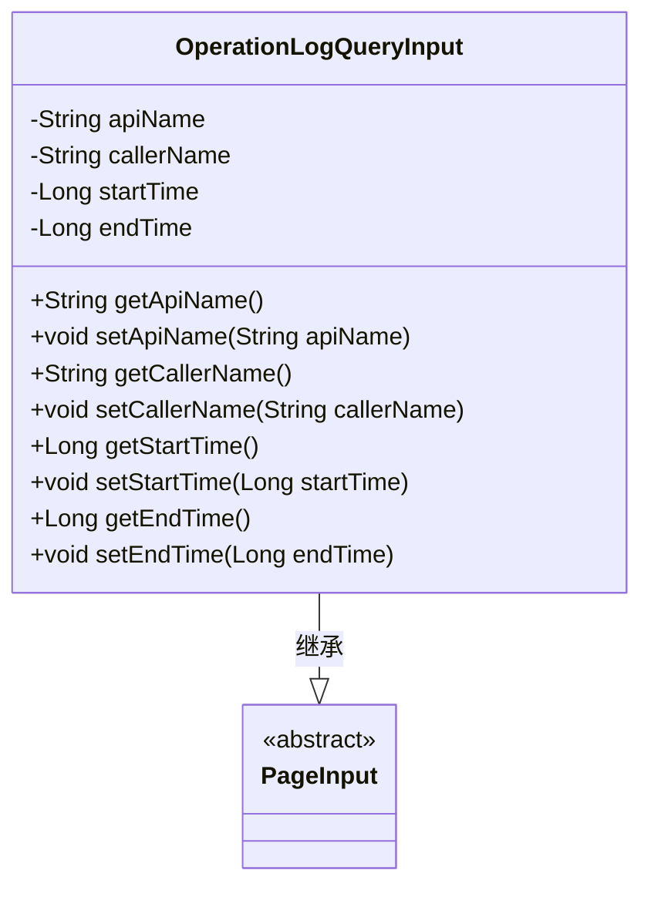

# 基础信息

|      |      |
|------|------|
| 名称 | OperationLogQueryInput |
| 编码语言 | .java |
| 代码路径 | WeFe/manager/manager-service/src/main/java/com/welab/wefe/manager/service/dto/operation/OperationLogQueryInput.java |
| 包名 | com.welab.wefe.manager.service.dto.operation |
| 依赖项 | ['com.welab.wefe.manager.service.dto.base.PageInput'] |
| 概述说明 | OperationLogQueryInput类继承PageInput，包含apiName、callerName、startTime、endTime属性及对应getter/setter方法。 |

# 说明

OperationLogQueryInput类继承自PageInput，用于查询操作日志的输入参数。包含四个私有字段：apiName表示接口名称，callerName表示调用者名称，startTime和endTime表示时间范围。提供各字段的getter和setter方法用于访问和修改这些参数。

# 类列表 Class Summary

| 名称   | 类型  | 说明 |
|-------|------|-------------|
| OperationLogQueryInput | class | 操作日志查询输入类，包含API名称、调用者名称、起止时间等字段及对应getter/setter方法。 |

## 类 OperationLogQueryInput

|      |      |
|------|------|
| 访问范围 | public |
| 类型 | class |
| 名称 | OperationLogQueryInput |
| 说明 | 操作日志查询输入类，包含API名称、调用者名称、起止时间等字段及对应getter/setter方法。 |

### UML类图

这段类图展示了OperationLogQueryInput类继承自抽象类PageInput的结构。OperationLogQueryInput包含四个私有字段（apiName、callerName、startTime和endTime）以及对应的getter和setter方法。该类用于封装操作日志查询的输入参数，通过继承PageInput获得了分页查询的基础功能。类图清晰地反映了类之间的继承关系和OperationLogQueryInput的属性结构。

### 内部方法调用关系图

```mermaid
graph TD
    A["类OperationLogQueryInput"]
    B["继承自: PageInput"]
    C["属性: String apiName"]
    D["属性: String callerName"]
    E["属性: Long startTime"]
    F["属性: Long endTime"]
    G["方法: getApiName()"]
    H["方法: setApiName(String)"]
    I["方法: getCallerName()"]
    J["方法: setCallerName(String)"]
    K["方法: getStartTime()"]
    L["方法: setStartTime(Long)"]
    M["方法: getEndTime()"]
    N["方法: setEndTime(Long)"]

    A --> B
    A --> C
    A --> D
    A --> E
    A --> F
    A --> G
    A --> H
    A --> I
    A --> J
    A --> K
    A --> L
    A --> M
    A --> N
```

这段代码定义了一个名为OperationLogQueryInput的类，它继承自PageInput类。该类包含四个私有属性：apiName、callerName、startTime和endTime，分别表示API名称、调用者名称、开始时间和结束时间。每个属性都有对应的getter和setter方法，用于获取和设置属性的值。这个类可能用于封装查询操作日志时的输入参数，便于进行分页查询和时间范围过滤。

### 字段列表 Field List

| 名称  | 类型  | 说明 |
|-------|-------|------|
| startTime | Long | 声明一个私有长整型变量startTime。 |
| endTime | Long | 私有长整型变量，记录结束时间。 |
| callerName | String | 私有字符串变量callerName |
| apiName | String | 私有字符串变量apiName |

### 方法列表

| 名称  | 类型  | 说明 |
|-------|-------|------|
| getStartTime | Long | 获取开始时间的方法，返回长整型值startTime。 |
| setApiName | void | 这是一个Java方法，用于设置类的apiName属性值。方法接收一个字符串参数，并将其赋值给类的成员变量apiName。 |
| getApiName | String | 这是一个Java方法，返回字符串类型的apiName属性值。 |
| setCallerName | void | 设置调用者名称的方法，将参数callerName赋值给类的成员变量callerName。 |
| getCallerName | String | 获取调用者名称的方法，返回字符串类型的callerName。 |
| setStartTime | void | 设置开始时间的方法，接受长整型参数startTime并赋值给成员变量。 |
| getEndTime | Long | 获取结束时间的方法，返回长整型数值endTime。 |
| setEndTime | void | 方法setEndTime用于设置结束时间，参数为Long类型的endTime。 |

