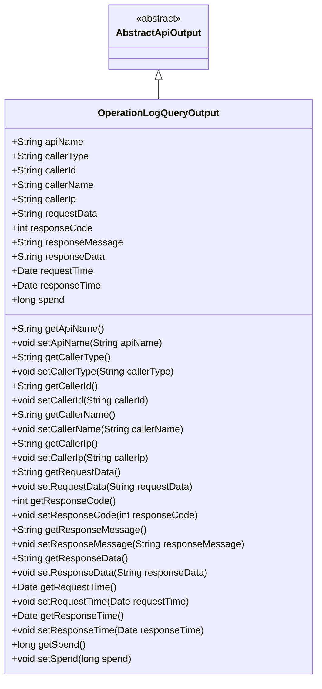

# 基础信息

|      |      |
|------|------|
| 名称 | OperationLogQueryOutput |
| 编码语言 | .java |
| 代码路径 | WeFe/manager/manager-service/src/main/java/com/welab/wefe/manager/service/dto/operation/OperationLogQueryOutput.java |
| 包名 | com.welab.wefe.manager.service.dto.operation |
| 依赖项 | ['com.welab.wefe.common.web.dto.AbstractApiOutput', 'java.util.Date'] |
| 概述说明 | OperationLogQueryOutput类记录API操作日志，包含接口名称、调用者信息、请求响应数据、时间及耗时等字段，提供各属性的getter和setter方法。 |

# 说明

OperationLogQueryOutput类继承自AbstractApiOutput，用于记录API操作日志的查询输出。包含接口名称、调用者类型、ID、名称、IP地址、请求参数、响应码、消息、响应内容、请求时间、响应时间及耗时等字段。每个字段均有对应的getter和setter方法，用于获取和设置属性值。该类全面记录了API调用的关键信息，便于后续分析和监控。

# 类列表 Class Summary

| 名称   | 类型  | 说明 |
|-------|------|-------------|
| OperationLogQueryOutput | class | OperationLogQueryOutput类继承AbstractApiOutput，包含接口名称、调用者信息、请求响应数据及时间、耗时等字段及其getter/setter方法。 |

## 类 OperationLogQueryOutput

|      |      |
|------|------|
| 访问范围 | public |
| 类型 | class |
| 名称 | OperationLogQueryOutput |
| 说明 | OperationLogQueryOutput类继承AbstractApiOutput，包含接口名称、调用者信息、请求响应数据及时间、耗时等字段及其getter/setter方法。 |

### UML类图

这段类图展示了OperationLogQueryOutput类继承自抽象类AbstractApiOutput，主要用于记录API操作日志的查询输出结果。该类包含13个公共字段和对应的getter/setter方法，记录了API名称、调用者信息、请求/响应数据、时间戳和耗时等关键信息。所有字段均为公开属性，通过标准JavaBean模式进行封装，适合作为DTO在系统间传输完整的API调用日志数据。

### 内部方法调用关系图

这段代码定义了一个名为OperationLogQueryOutput的类，该类继承自AbstractApiOutput，主要用于记录API操作日志的查询输出。类中包含13个属性，分别记录API名称、调用者类型、调用者ID、调用者名称、调用者IP、请求参数、响应码、响应消息、响应数据、请求时间、响应时间以及耗时等信息。每个属性都有对应的getter和setter方法，用于获取和设置属性值。该类的主要功能是封装API操作日志的相关信息，便于在系统中传递和处理这些数据。

### 字段列表 Field List

| 名称  | 类型  | 说明 |
|-------|-------|------|
| apiName | String | 定义字符串类型的公共变量apiName。 |
| requestData | String | 声明一个公共字符串变量requestData。 |
| responseMessage | String | 声明了一个名为responseMessage的公共字符串变量。 |
| responseData | String | 声明一个公共字符串变量responseData。 |
| responseTime | Date | 声明一个Date类型的变量responseTime，用于存储响应时间。 |
| requestTime | Date | 声明一个名为requestTime的公共Date类型变量。 |
| callerType | String | 定义字符串类型变量callerType，用于存储调用者类型信息。 |
| callerName | String | 声明一个公共字符串变量callerName。 |
| callerId | String | 声明一个公共字符串变量callerId。 |
| responseCode | int | 定义整型变量responseCode，用于存储响应代码。 |
| spend | long | 变量spend为长整型，用于存储支出金额。 |
| callerIp | String | 声明一个公共字符串变量callerIp，用于存储调用者的IP地址。 |

### 方法列表

| 名称  | 类型  | 说明 |
|-------|-------|------|
| setResponseData | void | 设置响应数据的方法，将输入字符串赋值给类的responseData成员变量。 |
| getApiName | String | 这是一个Java方法，返回字符串类型的apiName属性值。 |
| getCallerIp | String | 获取调用者IP地址的方法，返回字符串类型的callerIp。 |
| getCallerId | String | 获取调用者ID的方法，返回字符串类型的callerId值。 |
| getResponseTime | Date | 获取响应时间的方法，返回Date类型值。 |
| setResponseCode | void | 设置HTTP响应状态码的方法，参数为整型responseCode。 |
| getResponseData | String | 获取响应数据的方法，返回字符串类型变量responseData。 |
| getRequestTime | Date | 获取请求时间的方法，返回Date类型。 |
| setApiName | void | 定义了一个公共方法setApiName，用于设置类成员变量apiName的值。 |
| getResponseMessage | String | 获取响应消息的方法，返回字符串类型的responseMessage。 |
| getRequestData | String | 获取请求数据的方法，返回字符串类型的requestData。 |
| setCallerId | void | 设置调用者ID的方法，将参数callerId赋值给类成员变量callerId。 |
| getSpend | long | 获取消费金额的方法，返回长整型数值spend。 |
| setRequestData | void | 定义公共方法setRequestData，接收字符串参数requestData并赋值给当前对象的同名属性。 |
| getCallerType | String | 获取调用者类型的方法，返回字符串callerType。 |
| getResponseCode | int | 获取HTTP响应状态码的方法。 |
| setCallerIp | void | 设置调用者IP地址的方法。 |
| setRequestTime | void | 设置请求时间的方法，将传入的Date对象赋值给类的requestTime属性。 |
| setResponseMessage | void | 这是一个Java方法，用于设置类的responseMessage属性值。方法接受一个字符串参数responseMessage，并将其赋值给类的同名成员变量。 |
| setResponseTime | void | 定义方法setResponseTime，用于设置响应时间responseTime，参数为Date类型。 |
| setCallerName | void | 设置调用者名称的方法，将输入参数赋值给类的成员变量callerName。 |
| getCallerName | String | 获取调用者名称的方法，返回字符串类型的callerName。 |
| setCallerType | void | 设置调用者类型的方法，将输入参数赋值给类的成员变量callerType。 |
| setSpend | void | 这是一个Java方法，用于设置类成员变量spend的值，参数类型为long。 |

