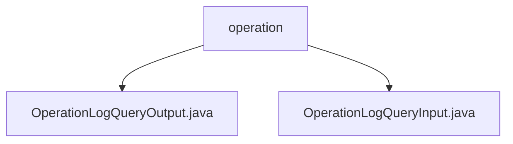

# 基础信息

|      |      |
|------|------|
| 名称 | operation |
| 编码语言 | .java |
| 代码路径 | WeFe/manager/manager-service/src/main/java/com/welab/wefe/manager/service/dto/operation |
| 包名 | docs.manager.manager-service.src.main.java.com.welab.wefe.manager.service.dto.operation |
| 概述说明 | OperationLogQueryOutput类继承AbstractApiOutput，记录API操作日志查询输出，包含接口名、调用者、请求参数、响应信息等字段。OperationLogQueryInput类继承PageInput，用于查询操作日志，含接口名、调用者名、时间范围等字段。 |

# 说明

## 概述  
该模块核心职责是提供操作日志的查询功能，包括输入参数封装和输出结果记录。接口规范遵循标准DTO模式，输入继承PageInput支持分页，输出继承AbstractApiOutput包含完整调用日志。关键数据结构为OperationLogQueryInput（含API名称、调用者、时间范围）和OperationLogQueryOutput（含21个监控字段，类似审计日志模板）。外部依赖仅涉及基础父类AbstractApiOutput和PageInput。例如输出类记录请求参数、响应码、耗时等全链路信息。

## 主要业务场景  
主要支持按条件分页查询API操作日志，典型场景包括故障排查和行为审计。交互模式为前端传入查询条件（例如时间范围+接口名），后端返回带分页的日志明细。功能完整性体现在输入支持模糊查询，输出覆盖调用全生命周期数据。集成案例可通过组合callerName和apiName实现精准日志检索，类似数据库审计系统的查询逻辑。

### 包内部结构视图

该流程图展示了operation目录下的两个Java文件：OperationLogQueryOutput.java和OperationLogQueryInput.java。这两个文件位于manager-service项目的DTO层，用于处理操作日志查询的输入输出数据结构，体现了业务逻辑与数据交互的简单层级关系。

# 文件列表

| 名称   | 类型  | 说明 |
|-------|------|-------------|
| [OperationLogQueryOutput.java](OperationLogQueryOutput.md) | file | OperationLogQueryOutput类记录API操作日志，包含接口名称、调用者信息、请求响应数据、时间及耗时等字段，提供各属性的getter和setter方法。 |
| [OperationLogQueryInput.java](OperationLogQueryInput.md) | file | OperationLogQueryInput类继承PageInput，包含apiName、callerName、startTime、endTime属性及对应getter/setter方法。 |

