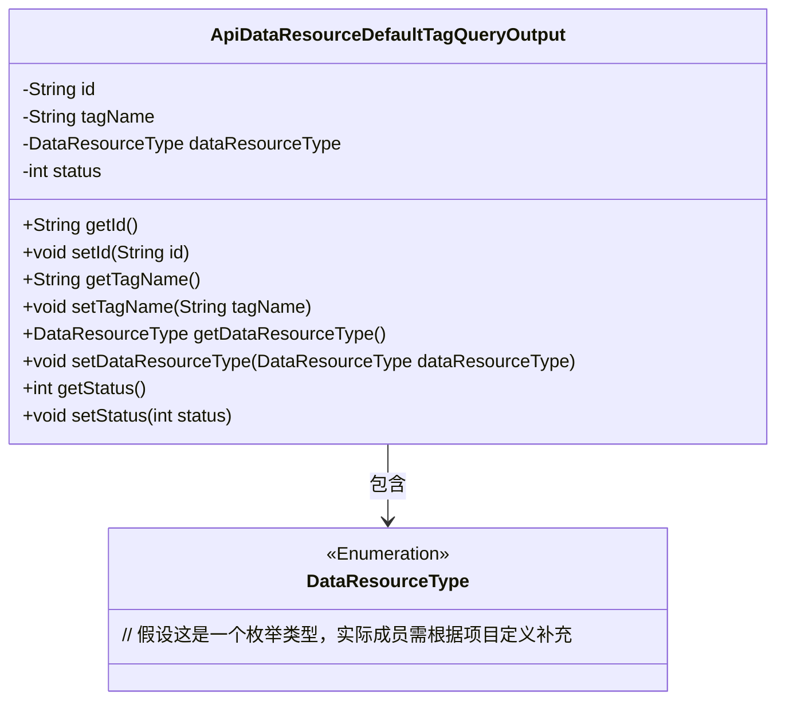
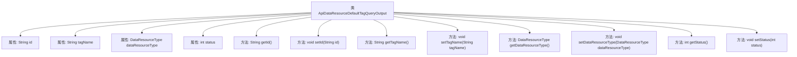

# 基础信息

|      |      |
|------|------|
| 名称 | ApiDataResourceDefaultTagQueryOutput |
| 编码语言 | .java |
| 代码路径 | WeFe/manager/manager-service/src/main/java/com/welab/wefe/manager/service/dto/tag/ApiDataResourceDefaultTagQueryOutput.java |
| 包名 | com.welab.wefe.manager.service.dto.tag |
| 依赖项 | ['com.welab.wefe.common.wefe.enums.DataResourceType'] |
| 概述说明 | ApiDataResourceDefaultTagQueryOutput类包含id、tagName、dataResourceType和status属性，提供对应的getter和setter方法。 |

# 说明

该内容定义了一个名为ApiDataResourceDefaultTagQueryOutput的Java类，包含四个私有属性：id（字符串类型）、tagName（字符串类型）、dataResourceType（DataResourceType类型）和status（整型）。类中为每个属性提供了对应的getter和setter方法，用于获取和设置属性值。这个类可能用于表示API返回的默认标签查询结果数据。

# 类列表 Class Summary

| 名称   | 类型  | 说明 |
|-------|------|-------------|
| ApiDataResourceDefaultTagQueryOutput | class | ApiDataResourceDefaultTagQueryOutput类包含id、tagName、dataResourceType和status属性及其getter和setter方法。 |

## 类 ApiDataResourceDefaultTagQueryOutput

|      |      |
|------|------|
| 访问范围 | public |
| 类型 | class |
| 名称 | ApiDataResourceDefaultTagQueryOutput |
| 说明 | ApiDataResourceDefaultTagQueryOutput类包含id、tagName、dataResourceType和status属性及其getter和setter方法。 |

### UML类图

这段类图描述了`ApiDataResourceDefaultTagQueryOutput`数据实体类的结构，该类包含ID、标签名称、资源类型枚举和状态四个私有字段，并通过公共getter/setter方法暴露属性。其中`DataResourceType`以枚举类型存在，与主类构成组合关系。该设计典型用于API响应数据的结构化封装，符合JavaBean规范，便于序列化传输和状态管理。枚举字段的使用增强了类型安全性。

### 内部方法调用关系图

这段代码定义了一个名为`ApiDataResourceDefaultTagQueryOutput`的类，包含四个私有属性：`id`、`tagName`、`dataResourceType`和`status`，并为每个属性提供了对应的getter和setter方法。该类主要用于封装API数据资源的默认标签查询输出信息，通过getter方法获取属性值，通过setter方法设置属性值。流程图清晰地展示了类与属性、方法之间的层级关系。

### 字段列表 Field List

| 名称  | 类型  | 说明 |
|-------|-------|------|
| dataResourceType | DataResourceType | 私有数据资源类型变量dataResourceType。 |
| tagName | String | 私有字符串变量tagName。 |
| id | String | 私有字符串类型变量id。 |
| status | int | 私有整型变量status，用于存储状态信息。 |

### 方法列表

| 名称  | 类型  | 说明 |
|-------|-------|------|
| setTagName | void | 这是一个Java方法，用于设置对象的tagName属性值。方法接收一个字符串参数tagName，并将其赋值给当前对象的同名属性。 |
| setDataResourceType | void | 设置数据资源类型的方法，将传入参数赋值给类成员变量dataResourceType。 |
| setStatus | void | 设置状态值的方法，将输入参数status赋值给当前对象的status属性。 |
| getDataResourceType | DataResourceType | 获取数据资源类型的方法，返回dataResourceType字段值。 |
| getTagName | String | 获取标签名称的方法，返回字符串类型的tagName。 |
| getId | String | 这是一个Java方法，返回字符串类型的id值。 |
| setId | void | 设置对象ID的方法，将参数id赋值给当前对象的id属性。 |
| getStatus | int | 方法返回状态值。 |

