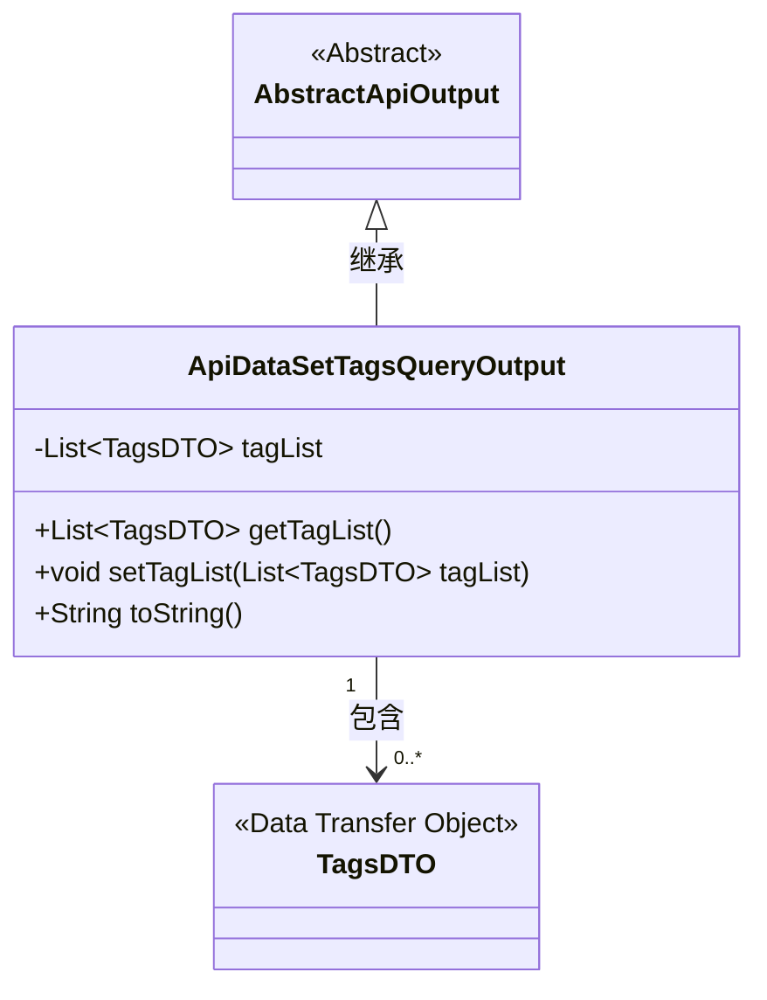
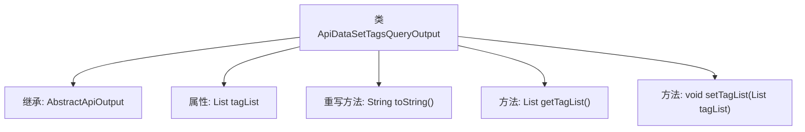

# 基础信息

|      |      |
|------|------|
| 名称 | ApiDataSetTagsQueryOutput |
| 编码语言 | .java |
| 代码路径 | WeFe/manager/manager-service/src/main/java/com/welab/wefe/manager/service/dto/tag/ApiDataSetTagsQueryOutput.java |
| 包名 | com.welab.wefe.manager.service.dto.tag |
| 依赖项 | ['com.welab.wefe.common.web.dto.AbstractApiOutput', 'java.util.List'] |
| 概述说明 | ApiDataSetTagsQueryOutput类继承AbstractApiOutput，包含tagList属性和对应的getter/setter方法，toString方法返回tagList内容。 |

# 说明

这是一个名为ApiDataSetTagsQueryOutput的Java类，继承自AbstractApiOutput。该类包含一个私有成员变量tagList，类型为TagsDTO对象的列表。提供了toString方法用于返回包含tagList的字符串表示。同时提供了getTagList和setTagList方法用于获取和设置tagList的值。该类主要用于处理API数据集标签查询的输出结果。

# 类列表 Class Summary

| 名称   | 类型  | 说明 |
|-------|------|-------------|
| ApiDataSetTagsQueryOutput | class | ApiDataSetTagsQueryOutput类继承AbstractApiOutput，包含tagList属性和对应的getter/setter方法，toString方法返回tagList内容。 |

## 类 ApiDataSetTagsQueryOutput

|      |      |
|------|------|
| 访问范围 | public |
| 类型 | class |
| 名称 | ApiDataSetTagsQueryOutput |
| 说明 | ApiDataSetTagsQueryOutput类继承AbstractApiOutput，包含tagList属性和对应的getter/setter方法，toString方法返回tagList内容。 |

### UML类图

这段类图展示了ApiDataSetTagsQueryOutput继承自抽象类AbstractApiOutput，并包含一个TagsDTO对象列表的结构。ApiDataSetTagsQueryOutput作为数据封装类，通过tagList字段存储多个标签数据对象，提供标准的getter/setter方法和覆写的toString()实现。TagsDTO作为数据传输对象标记，体现了分层架构中数据封装与传输的典型设计模式。

### 内部方法调用关系图

这段代码定义了一个名为ApiDataSetTagsQueryOutput的类，继承自AbstractApiOutput。类中包含一个tagList属性，用于存储TagsDTO类型的列表，以及对应的getter和setter方法。此外，重写了toString方法以返回包含tagList的字符串表示。流程图清晰地展示了类的继承关系、属性和方法之间的关联。

### 字段列表 Field List

| 名称  | 类型  | 说明 |
|-------|-------|------|
| tagList | List<TagsDTO> | 私有标签列表，类型为TagsDTO对象的集合。 |

### 方法列表

| 名称  | 类型  | 说明 |
|-------|-------|------|
| toString | String | Java重写toString方法，返回包含tagList的字符串。 |
| getTagList | List<TagsDTO> | 获取标签列表的方法，返回类型为TagsDTO的列表。 |
| setTagList | void | 设置标签列表方法，将输入的标签列表赋值给当前对象的tagList属性。 |

