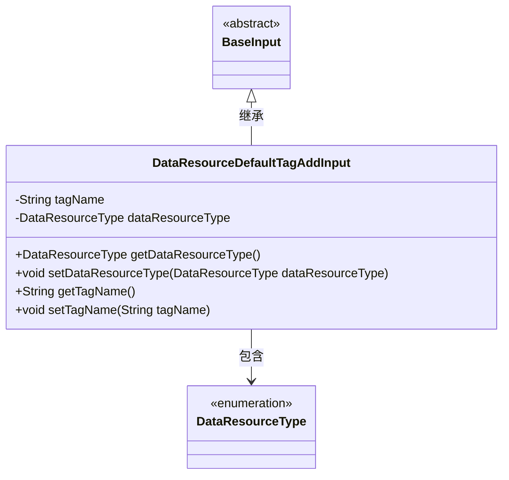
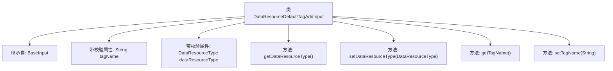

# 基础信息

|      |      |
|------|------|
| 名称 | DataResourceDefaultTagAddInput |
| 编码语言 | .java |
| 代码路径 | WeFe/manager/manager-service/src/main/java/com/welab/wefe/manager/service/dto/tag/DataResourceDefaultTagAddInput.java |
| 包名 | com.welab.wefe.manager.service.dto.tag |
| 依赖项 | ['com.welab.wefe.common.fieldvalidate.annotation.Check', 'com.welab.wefe.common.wefe.enums.DataResourceType', 'com.welab.wefe.manager.service.dto.base.BaseInput'] |
| 概述说明 | DataResourceDefaultTagAddInput类继承BaseInput，包含必填字段tagName和dataResourceType及其getter/setter方法。 |

# 说明

这是一个名为DataResourceDefaultTagAddInput的Java类，继承自BaseInput类。该类包含两个必填字段：tagName（字符串类型）和dataResourceType（DataResourceType枚举类型）。提供了这两个字段的getter和setter方法，用于获取和设置字段值。类使用了@Check注解标记这两个字段为必填项。

# 类列表 Class Summary

| 名称   | 类型  | 说明 |
|-------|------|-------------|
| DataResourceDefaultTagAddInput | class | 输入类DataResourceDefaultTagAddInput继承BaseInput，包含必填字段tagName和dataResourceType及其getter/setter方法。 |

## 类 DataResourceDefaultTagAddInput

|      |      |
|------|------|
| 访问范围 | public |
| 类型 | class |
| 名称 | DataResourceDefaultTagAddInput |
| 说明 | 输入类DataResourceDefaultTagAddInput继承BaseInput，包含必填字段tagName和dataResourceType及其getter/setter方法。 |

### UML类图

这段代码展示了一个数据资源默认标签添加输入类(DataResourceDefaultTagAddInput)的结构，它继承自BaseInput基类。该类包含两个私有字段：tagName(标签名称)和dataResourceType(数据资源类型枚举)，并提供了相应的getter和setter方法。其中字段通过@Check注解标记为必填项，DataResourceType是一个枚举类型，表示不同的数据资源类型。类图清晰地展示了继承关系和类型依赖。

### 内部方法调用关系图

该流程图展示了DataResourceDefaultTagAddInput类的结构，该类继承自BaseInput，包含两个带@Check校验注解的属性（tagName和dataResourceType），以及对应的getter/setter方法。所有方法直接关联到主类节点，继承关系通过箭头明确标识。属性标注了校验要求，方法完整覆盖了字段操作，体现了Java Bean的标准设计模式。

### 字段列表 Field List

| 名称  | 类型  | 说明 |
|-------|-------|------|
| dataResourceType | DataResourceType | 强制校验字段dataResourceType不可为空。 |
| tagName | String | 必填字段tagName的校验声明。 |

### 方法列表

| 名称  | 类型  | 说明 |
|-------|-------|------|
| getDataResourceType | DataResourceType | 获取数据资源类型的方法，返回dataResourceType。 |
| setDataResourceType | void | 设置数据资源类型的方法，将输入参数赋值给类的成员变量dataResourceType。 |
| getTagName | String | 获取标签名称的方法，返回字符串类型的tagName值。 |
| setTagName | void | 这是一个Java方法，用于设置对象的tagName属性值。方法接收一个字符串参数tagName，并将其赋值给当前对象的同名成员变量。 |

