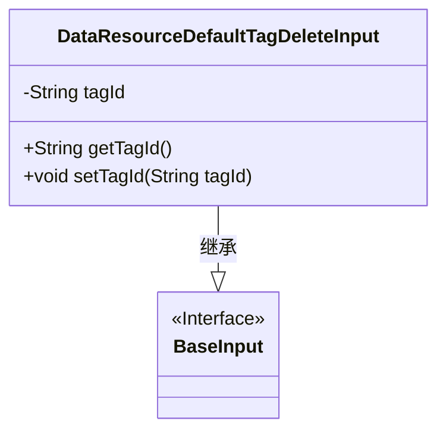
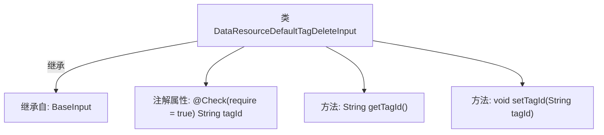

# 基础信息

|      |      |
|------|------|
| 名称 | DataResourceDefaultTagDeleteInput |
| 编码语言 | .java |
| 代码路径 | WeFe/manager/manager-service/src/main/java/com/welab/wefe/manager/service/dto/tag/DataResourceDefaultTagDeleteInput.java |
| 包名 | com.welab.wefe.manager.service.dto.tag |
| 依赖项 | ['com.welab.wefe.common.fieldvalidate.annotation.Check', 'com.welab.wefe.manager.service.dto.base.BaseInput'] |
| 概述说明 | Java类DataResourceDefaultTagDeleteInput继承BaseInput，包含必填字段tagId及其getter/setter方法。 |

# 说明

DataResourceDefaultTagDeleteInput类继承自BaseInput，包含一个必须的tagId字符串属性，通过getter和setter方法进行访问和修改。该类用于处理删除默认标签的输入数据。

# 类列表 Class Summary

| 名称   | 类型  | 说明 |
|-------|------|-------------|
| DataResourceDefaultTagDeleteInput | class | Java类DataResourceDefaultTagDeleteInput继承BaseInput，包含必填字段tagId及其getter和setter方法。 |

## 类 DataResourceDefaultTagDeleteInput

|      |      |
|------|------|
| 访问范围 | public |
| 类型 | class |
| 名称 | DataResourceDefaultTagDeleteInput |
| 说明 | Java类DataResourceDefaultTagDeleteInput继承BaseInput，包含必填字段tagId及其getter和setter方法。 |

### UML类图

这段代码展示了一个简单的类继承关系，其中`DataResourceDefaultTagDeleteInput`继承自`BaseInput`接口。该类包含一个私有字符串属性`tagId`，以及对应的getter和setter方法。通过`@Check`注解标记该字段为必填项，体现了数据验证的设计意图。类图清晰地反映了这种继承关系和属性封装结构。

### 内部方法调用关系图

这段流程图展示了DataResourceDefaultTagDeleteInput类的结构，该类继承自BaseInput。主要包含一个带有@Check注解的tagId属性，以及对应的getter和setter方法。注解表明tagId是必填字段，体现了输入验证的设计意图。类结构简单清晰，符合JavaBean规范，适用于数据传递场景。

### 字段列表 Field List

| 名称  | 类型  | 说明 |
|-------|-------|------|
| tagId | String | 必填字段tagId，类型为String。 |

### 方法列表

| 名称  | 类型  | 说明 |
|-------|-------|------|
| getTagId | String | 获取标签ID的方法，返回字符串类型的tagId。 |
| setTagId | void | 这是一个Java方法，用于设置对象的tagId属性值。方法接收一个字符串参数tagId，并将其赋值给对象的同名成员变量。 |

