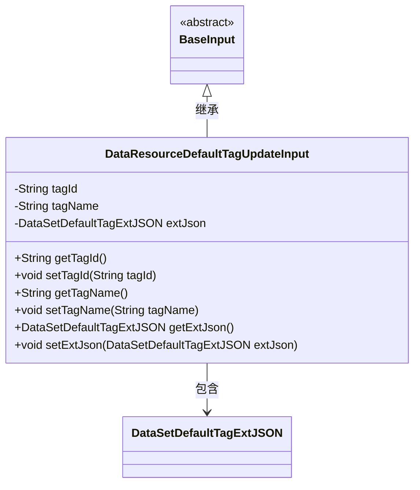
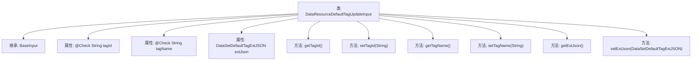

# 基础信息

|      |      |
|------|------|
| 名称 | DataResourceDefaultTagUpdateInput |
| 编码语言 | .java |
| 代码路径 | WeFe/manager/manager-service/src/main/java/com/welab/wefe/manager/service/dto/tag/DataResourceDefaultTagUpdateInput.java |
| 包名 | com.welab.wefe.manager.service.dto.tag |
| 依赖项 | ['com.welab.wefe.common.data.mongodb.entity.union.ext.DataSetDefaultTagExtJSON', 'com.welab.wefe.common.fieldvalidate.annotation.Check', 'com.welab.wefe.manager.service.dto.base.BaseInput'] |
| 概述说明 | DataResourceDefaultTagUpdateInput类继承BaseInput，包含必填字段tagId和tagName，以及可选字段extJson，提供各字段的getter和setter方法。 |

# 说明

该Java类定义了一个用于更新默认数据资源标签的输入模型，继承自BaseInput。包含三个字段：必填的tagId和tagName字符串，以及可选的extJson对象。提供了标准的getter和setter方法用于访问和修改这些字段值。通过注解确保tagId和tagName为必填项。

# 类列表 Class Summary

| 名称   | 类型  | 说明 |
|-------|------|-------------|
| DataResourceDefaultTagUpdateInput | class | DataResourceDefaultTagUpdateInput类继承BaseInput，包含必填的tagId和tagName字段，以及可选的extJson字段，提供各字段的getter和setter方法。 |

## 类 DataResourceDefaultTagUpdateInput

|      |      |
|------|------|
| 访问范围 | public |
| 类型 | class |
| 名称 | DataResourceDefaultTagUpdateInput |
| 说明 | DataResourceDefaultTagUpdateInput类继承BaseInput，包含必填的tagId和tagName字段，以及可选的extJson字段，提供各字段的getter和setter方法。 |

### UML类图

这段类图展示了DataResourceDefaultTagUpdateInput类继承自BaseInput抽象类，并包含三个私有字段：tagId、tagName和extJson。其中tagId和tagName是必填字段（通过@Check注解标记），extJson是可选字段。该类提供了标准的getter和setter方法来访问这些字段。DataSetDefaultTagExtJSON是一个独立的数据类，被DataResourceDefaultTagUpdateInput类引用。整体结构体现了Java Bean的标准设计模式，用于数据传输和验证。

### 内部方法调用关系图

该流程图展示了`DataResourceDefaultTagUpdateInput`类的结构，它是一个继承自`BaseInput`的输入类，包含三个属性（其中两个带有`@Check`注解）和对应的getter/setter方法。类主要用于封装标签更新请求的数据，其中`tagId`和`tagName`为必填字段，`extJson`存储扩展JSON数据。所有方法都围绕这三个属性的读写操作展开，形成标准的JavaBean结构。

### 字段列表 Field List

| 名称  | 类型  | 说明 |
|-------|-------|------|
| tagName | String | 必填字段：字符串类型的tagName。 |
| tagId | String | 代码片段定义了一个私有字符串变量tagId，并使用了@Check注解标记为必填项。 |
| extJson | DataSetDefaultTagExtJSON | 私有数据集默认标签扩展JSON字段。 |

### 方法列表

| 名称  | 类型  | 说明 |
|-------|-------|------|
| getTagName | String | 方法返回字符串类型的tagName值。 |
| setExtJson | void | 方法setExtJson用于设置extJson属性，参数为DataSetDefaultTagExtJSON类型。 |
| setTagName | void | 这是一个Java方法，用于设置对象的tagName属性值。方法接收一个字符串参数tagName，并将其赋值给当前对象的同名成员变量。 |
| setTagId | void | 设置标签ID的方法，将输入参数tagId赋值给当前对象的tagId属性。 |
| getExtJson | DataSetDefaultTagExtJSON | 获取扩展JSON数据的方法，返回DataSetDefaultTagExtJSON对象。 |
| getTagId | String | 获取标签ID的方法，返回字符串类型的tagId。 |

