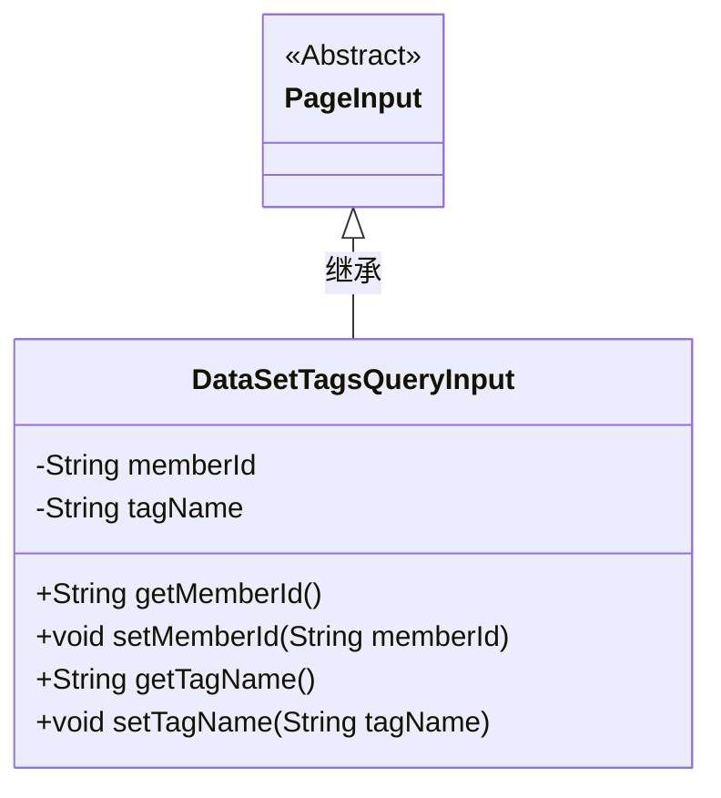
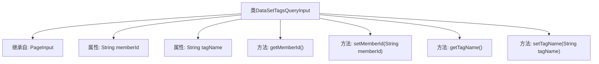

# 基础信息

|      |      |
|------|------|
| 名称 | DataSetTagsQueryInput |
| 编码语言 | .java |
| 代码路径 | WeFe/manager/manager-service/src/main/java/com/welab/wefe/manager/service/dto/tag/DataSetTagsQueryInput.java |
| 包名 | com.welab.wefe.manager.service.dto.tag |
| 依赖项 | ['com.welab.wefe.manager.service.dto.base.PageInput'] |
| 概述说明 | DataSetTagsQueryInput类继承PageInput，包含成员ID和标签名的属性及对应getter/setter方法。 |

# 说明

DataSetTagsQueryInput类继承自PageInput，包含两个私有字符串类型属性memberId和tagName，分别表示成员ID和标签名称。该类提供了这两个属性的getter和setter方法用于访问和修改属性值。

# 类列表 Class Summary

| 名称   | 类型  | 说明 |
|-------|------|-------------|
| DataSetTagsQueryInput | class | 数据集标签查询输入类，继承分页输入，含成员ID和标签名字段及对应getter/setter方法。 |

## 类 DataSetTagsQueryInput

|      |      |
|------|------|
| 访问范围 | public |
| 类型 | class |
| 名称 | DataSetTagsQueryInput |
| 说明 | 数据集标签查询输入类，继承分页输入，含成员ID和标签名字段及对应getter/setter方法。 |

### UML类图

这段类图展示了DataSetTagsQueryInput继承自抽象类PageInput的关系。DataSetTagsQueryInput包含两个私有属性memberId和tagName，以及对应的getter和setter方法。该类用于封装数据集标签查询的输入参数，通过继承PageInput获得了分页功能的基础支持，同时扩展了特定于标签查询的成员ID和标签名称字段，适用于需要分页查询的场景。

### 内部方法调用关系图

这段代码定义了一个名为DataSetTagsQueryInput的类，该类继承自PageInput类。它包含两个私有字符串属性memberId和tagName，以及对应的getter和setter方法。流程图展示了类的继承关系、属性声明和方法定义，清晰地呈现了类的基本结构和成员关系。该类主要用于封装数据集标签查询的输入参数，通过getter和setter方法实现对属性的安全访问和修改。

### 字段列表 Field List

| 名称  | 类型  | 说明 |
|-------|-------|------|
| tagName | String | 私有字符串变量tagName。 |
| memberId | String | 成员ID字符串变量 |

### 方法列表

| 名称  | 类型  | 说明 |
|-------|-------|------|
| getTagName | String | 方法返回字符串类型的tagName值。 |
| getMemberId | String | 这是一个Java方法，返回成员ID字符串。方法名为getMemberId，返回类型为String。 |
| setMemberId | void | 设置成员ID的方法，将输入参数赋值给类的成员变量memberId。 |
| setTagName | void | 这是一个Java方法，用于设置对象的tagName属性值。方法接收一个字符串参数tagName，并将其赋值给当前对象的同名成员变量。 |

