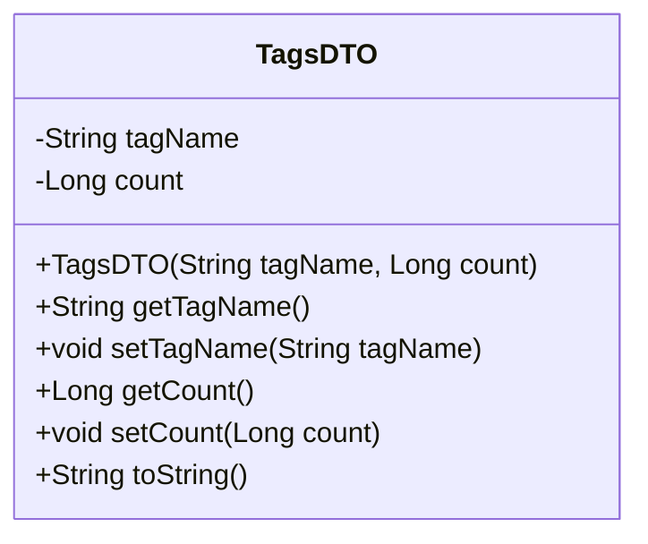
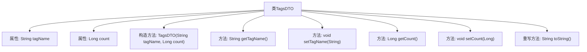

# 基础信息

|      |      |
|------|------|
| 名称 | TagsDTO |
| 编码语言 | .java |
| 代码路径 | WeFe/manager/manager-service/src/main/java/com/welab/wefe/manager/service/dto/tag/TagsDTO.java |
| 包名 | com.welab.wefe.manager.service.dto.tag |
| 依赖项 | [] |
| 概述说明 | TagsDTO类包含tagName和count属性，提供构造方法、getter/setter及toString方法，用于存储和操作标签数据。 |

# 说明

TagsDTO是一个用于存储标签信息的Java类，包含两个私有字段：tagName（字符串类型，表示标签名称）和count（长整型，表示标签计数）。该类提供了带参数的构造函数，用于初始化这两个字段。同时，它还提供了getter和setter方法，用于访问和修改这两个字段的值。此外，该类重写了toString方法，以特定格式返回对象的字符串表示形式，包含标签名称和计数信息。

# 类列表 Class Summary

| 名称   | 类型  | 说明 |
|-------|------|-------------|
| TagsDTO | class | TagsDTO类包含tagName和count属性，提供构造方法、getter/setter及toString方法，用于存储和操作标签数据。 |

## 类 TagsDTO

|      |      |
|------|------|
| 访问范围 | public |
| 类型 | class |
| 名称 | TagsDTO |
| 说明 | TagsDTO类包含tagName和count属性，提供构造方法、getter/setter及toString方法，用于存储和操作标签数据。 |

### UML类图

这段代码定义了一个名为TagsDTO的类，用于表示标签数据对象。该类包含两个私有属性：tagName（字符串类型）和count（长整型），分别表示标签名称和计数。提供了完整的构造方法和getter/setter方法，并重写了toString()方法以格式化输出对象内容。这是一个典型的数据传输对象(Data Transfer Object)设计，用于在不同层之间传递标签及其计数信息。

### 内部方法调用关系图

这段代码定义了一个名为TagsDTO的类，用于封装标签名称和计数的数据。类中包含两个私有属性tagName和count，通过构造方法和setter/getter方法进行初始化和访问控制。重写的toString方法提供了格式化的字符串输出，便于调试和日志记录。流程图清晰地展示了类结构、属性与方法之间的关联关系，符合数据传输对象的设计模式。

### 字段列表 Field List

| 名称  | 类型  | 说明 |
|-------|-------|------|
| tagName | String | 声明一个私有字符串变量tagName。 |
| count | Long | 私有长整型变量count，用于存储计数值。 |

### 方法列表

| 名称  | 类型  | 说明 |
|-------|-------|------|
| getTagName | String | 获取标签名称的方法，返回字符串类型的tagName。 |
| toString | String | Java重写toString方法，返回包含tagName和count的字符串。 |
| setTagName | void | 这是一个Java方法，用于设置对象的标签名称属性。方法接受一个字符串参数tagName，并将其赋值给当前对象的tagName成员变量。 |
| getCount | Long | 获取计数值的方法，返回长整型变量count。 |
| setCount | void | 设置count属性的方法，参数为Long类型。 |

