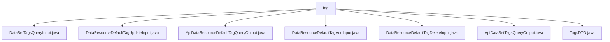

# 基础信息

|      |      |
|------|------|
| 名称 | tag |
| 编码语言 | .java |
| 代码路径 | WeFe/manager/manager-service/src/main/java/com/welab/wefe/manager/service/dto/tag |
| 包名 | docs.manager.manager-service.src.main.java.com.welab.wefe.manager.service.dto.tag |
| 概述说明 | DataSetTagsQueryInput类含memberId和tagName属性。DataResourceDefaultTagUpdateInput类含必填tagId、tagName和可选extJson。ApiDataResourceDefaultTagQueryOutput类含id、tagName等属性。DataResourceDefaultTagAddInput类含必填tagName和dataResourceType。DataResourceDefaultTagDeleteInput类含必填tagId。ApiDataSetTagsQueryOutput类含tagList属性。TagsDTO类存储tagName和count信息。 |

# 说明

## 概述  
该模块核心职责是管理数据资源标签的CRUD操作及查询，类似标签管理系统。接口规范包含分页查询（DataSetTagsQueryInput）、增删改（如DataResourceDefaultTagAddInput）及结果输出（如ApiDataSetTagsQueryOutput）。关键数据结构包括TagsDTO（含tagName和count）和DataResourceType枚举。外部依赖仅为Java基础库。例如通过tagId/tagName必填校验实现标签更新。

## 主要业务场景  
完整流程涵盖标签创建（DataResourceDefaultTagAddInput）、查询（分页/默认标签）、更新（extJson扩展字段）和删除（tagId指定）。交互模式采用标准DTO分层，如ApiDataSetTagsQueryOutput包装TagsDTO列表。典型场景包括：为数据资源打标（类似Git标签）、统计标签使用量（TagsDTO.count）。API类型覆盖增删改查，例如通过DataResourceDefaultTagDeleteInput实现标签移除。

### 包内部结构视图

该流程图展示了WeFe管理服务中标签相关DTO类的层级关系。所有7个Java文件都直接位于tag目录下，包括数据集标签查询输入、数据资源默认标签操作相关的输入输出类以及标签数据传输对象。这些文件共同构成了标签管理功能的数据传输层结构。

# 文件列表

| 名称   | 类型  | 说明 |
|-------|------|-------------|
| [DataSetTagsQueryInput.java](DataSetTagsQueryInput.md) | file | DataSetTagsQueryInput类继承PageInput，包含成员ID和标签名的属性及对应getter/setter方法。 |
| [DataResourceDefaultTagUpdateInput.java](DataResourceDefaultTagUpdateInput.md) | file | DataResourceDefaultTagUpdateInput类继承BaseInput，包含必填字段tagId和tagName，以及可选字段extJson，提供各字段的getter和setter方法。 |
| [ApiDataResourceDefaultTagQueryOutput.java](ApiDataResourceDefaultTagQueryOutput.md) | file | ApiDataResourceDefaultTagQueryOutput类包含id、tagName、dataResourceType和status属性，提供对应的getter和setter方法。 |
| [DataResourceDefaultTagAddInput.java](DataResourceDefaultTagAddInput.md) | file | DataResourceDefaultTagAddInput类继承BaseInput，包含必填字段tagName和dataResourceType及其getter/setter方法。 |
| [DataResourceDefaultTagDeleteInput.java](DataResourceDefaultTagDeleteInput.md) | file | Java类DataResourceDefaultTagDeleteInput继承BaseInput，包含必填字段tagId及其getter/setter方法。 |
| [ApiDataSetTagsQueryOutput.java](ApiDataSetTagsQueryOutput.md) | file | ApiDataSetTagsQueryOutput类继承AbstractApiOutput，包含tagList属性和对应的getter/setter方法，toString方法返回tagList内容。 |
| [TagsDTO.java](TagsDTO.md) | file | TagsDTO类包含tagName和count属性，提供构造方法、getter/setter及toString方法，用于存储和操作标签数据。 |

