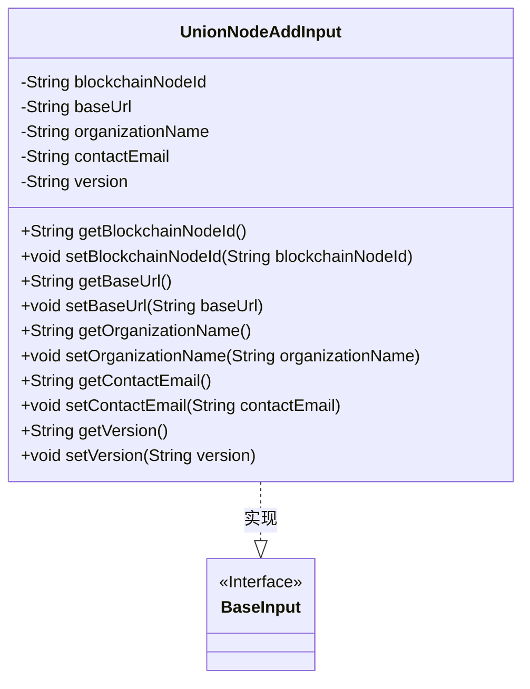

# 基础信息

|      |      |
|------|------|
| 名称 | UnionNodeAddInput |
| 编码语言 | .java |
| 代码路径 | WeFe/manager/manager-service/src/main/java/com/welab/wefe/manager/service/dto/union/UnionNodeAddInput.java |
| 包名 | com.welab.wefe.manager.service.dto.union |
| 依赖项 | ['com.welab.wefe.common.fieldvalidate.annotation.Check', 'com.welab.wefe.manager.service.dto.base.BaseInput'] |
| 概述说明 | UnionNodeAddInput类继承BaseInput，包含必填字段blockchainNodeId和baseUrl，以及可选字段organizationName、contactEmail和version，提供各字段的getter和setter方法。 |

# 说明

UnionNodeAddInput类继承自BaseInput，包含五个字段：必填的区块链节点ID和基础URL，以及可选的机构名称、联系邮箱和版本号。每个字段都有对应的getter和setter方法，用于获取和设置字段值。

# 类列表 Class Summary

| 名称   | 类型  | 说明 |
|-------|------|-------------|
| UnionNodeAddInput | class | UnionNodeAddInput类继承BaseInput，包含必填字段blockchainNodeId和baseUrl，以及可选字段organizationName、contactEmail和version，提供各字段的getter和setter方法。 |

## 类 UnionNodeAddInput

|      |      |
|------|------|
| 访问范围 | public |
| 类型 | class |
| 名称 | UnionNodeAddInput |
| 说明 | UnionNodeAddInput类继承BaseInput，包含必填字段blockchainNodeId和baseUrl，以及可选字段organizationName、contactEmail和version，提供各字段的getter和setter方法。 |

### UML类图

这段代码定义了一个`UnionNodeAddInput`类，继承自`BaseInput`接口。该类包含五个私有字段：`blockchainNodeId`、`baseUrl`、`organizationName`、`contactEmail`和`version`，其中前两个字段通过`@Check`注解标记为必填项。每个字段都有对应的getter和setter方法，用于访问和修改这些属性。该类主要用于封装添加区块链节点时所需的输入参数，包括节点ID、基础URL、组织名称、联系邮箱和版本信息。

### 内部方法调用关系图

```mermaid
graph TD
    A["类UnionNodeAddInput"]
    B["继承: BaseInput"]
    C["带校验属性: String blockchainNodeId"]
    D["带校验属性: String baseUrl"]
    E["属性: String organizationName"]
    F["属性: String contactEmail"]
    G["属性: String version"]
    H["方法: getBlockchainNodeId()"]
    I["方法: setBlockchainNodeId()"]
    J["方法: getBaseUrl()"]
    K["方法: setBaseUrl()"]
    L["方法: getOrganizationName()"]
    M["方法: setOrganizationName()"]
    N["方法: getContactEmail()"]
    O["方法: setContactEmail()"]
    P["方法: getVersion()"]
    Q["方法: setVersion()"]

    A --> B
    A --> C
    A --> D
    A --> E
    A --> F
    A --> G
    A --> H
    A --> I
    A --> J
    A --> K
    A --> L
    A --> M
    A --> N
    A --> O
    A --> P
    A --> Q
```

该流程图展示了UnionNodeAddInput类的完整结构，该类继承自BaseInput，包含5个字符串类型属性（其中blockchainNodeId和baseUrl带有非空校验注解），以及对应的getter/setter方法。所有属性和方法均通过箭头与主类关联，清晰地呈现了数据封装结构和访问控制机制。特别值得注意的是两个@Check标注的必填字段，体现了输入验证的设计意图。

### 字段列表 Field List

| 名称  | 类型  | 说明 |
|-------|-------|------|
| organizationName | String | 定义了一个私有字符串变量organizationName，用于存储组织名称。 |
| blockchainNodeId | String | 代码定义了一个私有字符串变量blockchainNodeId，并通过@Check注解标记该字段为必填项。 |
| version | String | 声明一个私有字符串变量version。 |
| contactEmail | String | 定义私有字符串变量contactEmail。 |
| baseUrl | String | 代码片段定义了一个私有字符串变量baseUrl，并标记为必须检查的强制项。 |

### 方法列表

| 名称  | 类型  | 说明 |
|-------|-------|------|
| getVersion | String | 获取版本号的方法，返回字符串类型的version变量值。 |
| getBaseUrl | String | 获取baseUrl的方法，直接返回baseUrl的值。 |
| setBlockchainNodeId | void | 设置区块链节点ID的方法，将参数值赋给成员变量blockchainNodeId。 |
| getContactEmail | String | 获取联系邮箱的方法，返回contactEmail变量值。 |
| setOrganizationName | void | 设置组织名称的方法，将输入参数赋值给类的成员变量organizationName。 |
| setBaseUrl | void | 设置基础URL的方法，将参数baseUrl赋值给类的成员变量baseUrl。 |
| setContactEmail | void | 设置联系邮箱的方法，将参数contactEmail赋值给类的成员变量contactEmail。 |
| getBlockchainNodeId | String | 获取区块链节点ID的方法，直接返回存储的节点ID字符串。 |
| getOrganizationName | String | 获取组织名称的方法，返回字符串类型的organizationName。 |
| setVersion | void | 设置版本号的方法，将输入参数version赋值给当前对象的version属性。 |

