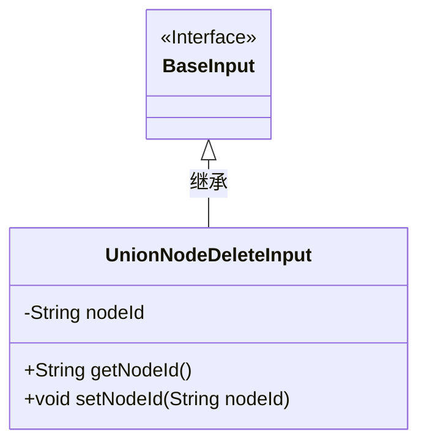
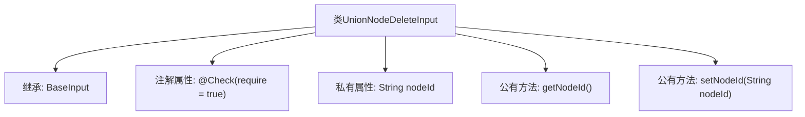

# 基础信息

|      |      |
|------|------|
| 名称 | UnionNodeDeleteInput |
| 编码语言 | .java |
| 代码路径 | WeFe/manager/manager-service/src/main/java/com/welab/wefe/manager/service/dto/union/UnionNodeDeleteInput.java |
| 包名 | com.welab.wefe.manager.service.dto.union |
| 依赖项 | ['com.welab.wefe.common.fieldvalidate.annotation.Check', 'com.welab.wefe.manager.service.dto.base.BaseInput'] |
| 概述说明 | UnionNodeDeleteInput类继承BaseInput，包含必填字段nodeId及其getter和setter方法。 |

# 说明

UnionNodeDeleteInput类继承自BaseInput，包含一个必填的私有字符串属性nodeId，并提供了对应的getter和setter方法。该类用于处理节点删除操作的输入数据。

# 类列表 Class Summary

| 名称   | 类型  | 说明 |
|-------|------|-------------|
| UnionNodeDeleteInput | class | UnionNodeDeleteInput类继承BaseInput，包含必填字段nodeId及其getter/setter方法。 |

## 类 UnionNodeDeleteInput

|      |      |
|------|------|
| 访问范围 | public |
| 类型 | class |
| 名称 | UnionNodeDeleteInput |
| 说明 | UnionNodeDeleteInput类继承BaseInput，包含必填字段nodeId及其getter/setter方法。 |

### UML类图

这段代码展示了一个继承关系，其中`UnionNodeDeleteInput`类继承自`BaseInput`接口。`UnionNodeDeleteInput`包含一个私有字段`nodeId`及其对应的getter和setter方法。类图清晰地反映了这种层级关系，`BaseInput`作为接口用`<<Interface>>`标记，而`UnionNodeDeleteInput`作为实现类通过实线空心箭头指向基类。该设计用于封装节点删除操作的输入参数，通过继承实现类型约束。

### 内部方法调用关系图

这段代码展示了一个继承自BaseInput的UnionNodeDeleteInput类，包含一个带有@Check注解的nodeId属性和对应的getter/setter方法。流程图清晰地呈现了类的继承关系、属性声明和方法定义，其中注解标注了nodeId为必填字段，setter方法用于属性赋值，getter方法用于获取属性值。整个结构体现了Java类的基本封装特性和输入验证机制。

### 字段列表 Field List

| 名称  | 类型  | 说明 |
|-------|-------|------|
| nodeId | String | 必填字段nodeId，类型String，用@Check注解标记为必须。 |

### 方法列表

| 名称  | 类型  | 说明 |
|-------|-------|------|
| getNodeId | String | 获取节点ID的方法，返回nodeId字符串。 |
| setNodeId | void | 设置节点ID的方法，将参数nodeId赋值给当前对象的nodeId属性。 |

