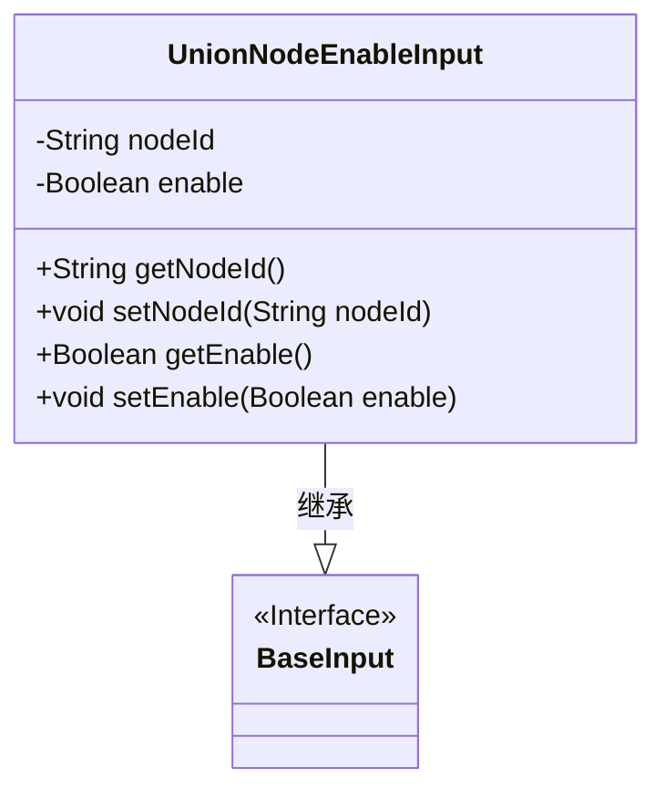
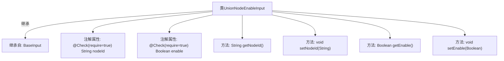

# 基础信息

|      |      |
|------|------|
| 名称 | UnionNodeEnableInput |
| 编码语言 | .java |
| 代码路径 | WeFe/manager/manager-service/src/main/java/com/welab/wefe/manager/service/dto/union/UnionNodeEnableInput.java |
| 包名 | com.welab.wefe.manager.service.dto.union |
| 依赖项 | ['com.welab.wefe.common.fieldvalidate.annotation.Check', 'com.welab.wefe.manager.service.dto.base.BaseInput'] |
| 概述说明 | UnionNodeEnableInput类继承BaseInput，包含必填字段nodeId和enable，提供getter和setter方法。 |

# 说明

UnionNodeEnableInput类继承自BaseInput，包含两个必填字段：nodeId（字符串类型）和enable（布尔类型）。该类提供了这两个字段的getter和setter方法，用于获取和设置节点ID及启用状态。所有字段都通过@Check注解标记为必须校验。

# 类列表 Class Summary

| 名称   | 类型  | 说明 |
|-------|------|-------------|
| UnionNodeEnableInput | class | UnionNodeEnableInput类继承BaseInput，包含必填字段nodeId和enable，提供getter和setter方法。 |

## 类 UnionNodeEnableInput

|      |      |
|------|------|
| 访问范围 | public |
| 类型 | class |
| 名称 | UnionNodeEnableInput |
| 说明 | UnionNodeEnableInput类继承BaseInput，包含必填字段nodeId和enable，提供getter和setter方法。 |

### UML类图

类图描述：该图展示了一个继承关系，UnionNodeEnableInput类继承自BaseInput接口。UnionNodeEnableInput包含私有字段nodeId和enable，以及对应的getter和setter方法。通过@Check注解标记这两个字段为必填项，体现了输入参数的验证需求。这种设计常用于需要严格参数校验的业务场景。

### 内部方法调用关系图

该流程图展示了UnionNodeEnableInput类的结构，它继承自BaseInput类，包含两个带有@Check注解的必填属性nodeId和enable，以及对应的getter和setter方法。图中清晰呈现了类继承关系、属性特征和方法组成，符合JavaBean规范的设计模式，注解标记的必填约束也得到准确体现。

### 字段列表 Field List

| 名称  | 类型  | 说明 |
|-------|-------|------|
| enable | Boolean | 代码片段定义了一个私有布尔变量enable，并使用了@Check注解标记该字段为必填项。 |
| nodeId | String | 代码片段定义了一个私有字符串变量nodeId，并标记为必须检查（@Check(require = true)）。 |

### 方法列表

| 名称  | 类型  | 说明 |
|-------|-------|------|
| getNodeId | String | 获取节点ID的方法，返回nodeId字符串。 |
| setNodeId | void | 设置节点ID的方法，将输入参数nodeId赋值给当前对象的nodeId属性。 |
| getEnable | Boolean | 获取enable布尔值的公共方法。 |
| setEnable | void | 这是一个Java方法，用于设置布尔类型的enable属性值。方法接受一个Boolean参数，并将其赋值给类的成员变量enable。 |

