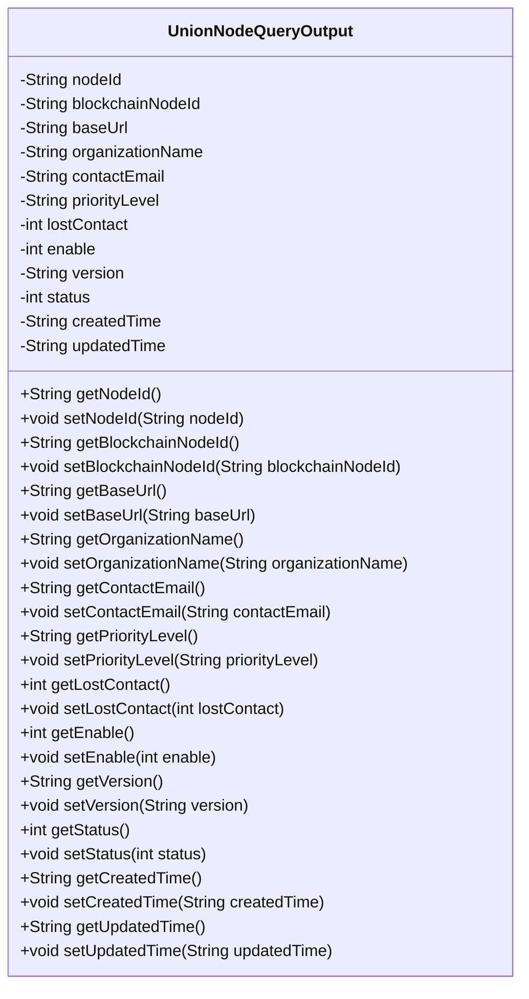

# 基础信息

|      |      |
|------|------|
| 名称 | UnionNodeQueryOutput |
| 编码语言 | .java |
| 代码路径 | WeFe/manager/manager-service/src/main/java/com/welab/wefe/manager/service/dto/union/UnionNodeQueryOutput.java |
| 包名 | com.welab.wefe.manager.service.dto.union |
| 依赖项 | [] |
| 概述说明 | UnionNodeQueryOutput类包含节点ID、区块链节点ID、基础URL、组织名称、联系邮箱、优先级、失联状态、启用状态、版本、状态码、创建和更新时间等属性及其getter和setter方法。 |

# 说明

UnionNodeQueryOutput类是一个用于表示区块链节点查询输出的数据模型。它包含节点标识符、区块链节点ID、基础URL、组织名称、联系邮箱、优先级、失联状态、启用状态、版本号、状态码、创建时间和更新时间等属性。每个属性都有对应的getter和setter方法，用于获取和设置属性值。该类主要用于封装节点查询结果，便于在系统中传递和处理节点信息。

# 类列表 Class Summary

| 名称   | 类型  | 说明 |
|-------|------|-------------|
| UnionNodeQueryOutput | class | UnionNodeQueryOutput类包含节点ID、区块链节点ID、基础URL、组织名称、联系邮箱、优先级、失联状态、启用状态、版本、状态码、创建和更新时间等属性及其getter和setter方法。 |

## 类 UnionNodeQueryOutput

|      |      |
|------|------|
| 访问范围 | public |
| 类型 | class |
| 名称 | UnionNodeQueryOutput |
| 说明 | UnionNodeQueryOutput类包含节点ID、区块链节点ID、基础URL、组织名称、联系邮箱、优先级、失联状态、启用状态、版本、状态码、创建和更新时间等属性及其getter和setter方法。 |

### UML类图

这段代码定义了一个名为UnionNodeQueryOutput的类，它是一个典型的Java Bean类，用于封装区块链节点的查询结果数据。该类包含12个私有字段，分别表示节点ID、区块链节点ID、基础URL、组织名称、联系人邮箱、优先级、失联状态、启用状态、版本号、状态码、创建时间和更新时间，并为每个字段提供了对应的getter和setter方法。这种设计模式常用于数据传输对象（DTO），便于在不同层之间传递结构化数据。

### 内部方法调用关系图

这段代码定义了一个名为`UnionNodeQueryOutput`的Java类，主要用于表示联盟链节点的查询输出结果。该类包含12个私有属性，分别用于存储节点ID、区块链节点ID、基础URL、组织名称、联系人邮箱、优先级、失联状态、启用状态、版本号、状态码、创建时间和更新时间。同时，为每个属性提供了对应的getter和setter方法，用于属性的读取和修改。这个类是一个典型的数据传输对象（DTO），用于在系统中传递节点查询结果。

### 字段列表 Field List

| 名称  | 类型  | 说明 |
|-------|-------|------|
| contactEmail | String | 定义私有字符串变量contactEmail，用于存储联系邮箱。 |
| enable | int | 私有整型变量enable，用于控制功能开关状态。 |
| status | int | 私有整型变量status，用于存储状态信息。 |
| blockchainNodeId | String | 区块链节点ID，私有字符串类型。 |
| lostContact | int | 私有整型变量，记录丢失联系次数。 |
| version | String | 声明一个私有字符串变量version。 |
| organizationName | String | 私有字符串变量，存储组织名称。 |
| baseUrl | String | 定义私有字符串变量baseUrl。 |
| createdTime | String | 声明一个私有字符串变量createdTime，用于存储创建时间。 |
| updatedTime | String | 字符串类型变量updatedTime，用于存储更新时间。 |
| priorityLevel | String | 私有字符串变量priorityLevel，表示优先级等级。 |
| nodeId | String | 私有字符串类型变量nodeId。 |

### 方法列表

| 名称  | 类型  | 说明 |
|-------|-------|------|
| setBaseUrl | void | 设置基础URL的方法，将传入的baseUrl赋值给类的成员变量this.baseUrl。 |
| getPriorityLevel | String | 这是一个Java方法，返回字符串类型的priorityLevel值。 |
| getNodeId | String | 方法返回节点ID字符串。 |
| setPriorityLevel | void | 设置优先级的方法，将输入参数赋值给类的priorityLevel成员变量。 |
| setStatus | void | 这是一个Java方法，用于设置对象的状态值。方法接收一个整数参数status，并将其赋值给对象的status属性。 |
| getBaseUrl | String | 方法返回baseUrl字符串。 |
| setVersion | void | 设置版本号的方法，将传入的字符串参数赋值给对象的version属性。 |
| getUpdatedTime | String | 获取更新时间的方法，返回字符串类型的updatedTime变量值。 |
| setContactEmail | void | 设置联系邮箱的方法，将参数contactEmail赋值给类的成员变量contactEmail。 |
| setOrganizationName | void | 设置组织名称的方法，将输入参数赋值给类的成员变量organizationName。 |
| getVersion | String | 获取版本号的方法，返回字符串类型的version变量值。 |
| setCreatedTime | void | 设置创建时间的方法，将输入字符串赋值给对象的createdTime属性。 |
| setEnable | void | 设置启用状态的函数，参数为整型enable，赋值给成员变量enable。 |
| getStatus | int | 方法返回状态值status。 |
| getLostContact | int | 获取丢失联系次数的方法，返回lostContact变量值。 |
| getEnable | int | 获取enable变量的整型值。 |
| setNodeId | void | 设置节点ID的方法，将输入参数nodeId赋值给当前对象的nodeId属性。 |
| setBlockchainNodeId | void | 设置区块链节点ID的方法，将参数值赋给类的成员变量blockchainNodeId。 |
| getBlockchainNodeId | String | 获取区块链节点ID的方法，返回字符串类型变量blockchainNodeId。 |
| getOrganizationName | String | 方法返回组织名称字符串。 |
| getContactEmail | String | 获取联系邮箱的方法，返回contactEmail变量值。 |
| getCreatedTime | String | 获取创建时间的方法，返回字符串类型的createdTime值。 |
| setLostContact | void | 这是一个Java方法，用于设置lostContact变量的值。方法接受一个整数参数，并将其赋值给类的成员变量lostContact。 |
| setUpdatedTime | void | 方法setUpdatedTime用于设置updatedTime属性的值，参数为字符串类型。 |

