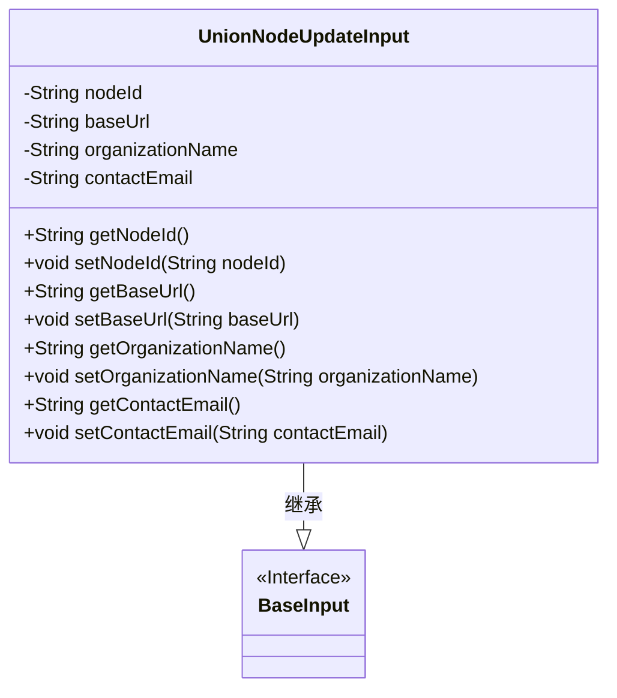

# 基础信息

|      |      |
|------|------|
| 名称 | UnionNodeUpdateInput |
| 编码语言 | .java |
| 代码路径 | WeFe/manager/manager-service/src/main/java/com/welab/wefe/manager/service/dto/union/UnionNodeUpdateInput.java |
| 包名 | com.welab.wefe.manager.service.dto.union |
| 依赖项 | ['com.welab.wefe.common.fieldvalidate.annotation.Check', 'com.welab.wefe.manager.service.dto.base.BaseInput'] |
| 概述说明 | UnionNodeUpdateInput类继承BaseInput，包含必填nodeId及可选baseUrl、organizationName、contactEmail字段，提供各属性的getter和setter方法。 |

# 说明

UnionNodeUpdateInput类继承自BaseInput，包含四个私有字符串属性：nodeId、baseUrl、organizationName和contactEmail。其中nodeId被标记为必填项。类中为每个属性提供了对应的getter和setter方法，用于获取和设置属性值。

# 类列表 Class Summary

| 名称   | 类型  | 说明 |
|-------|------|-------------|
| UnionNodeUpdateInput | class | UnionNodeUpdateInput类继承BaseInput，包含必填nodeId及可选baseUrl、organizationName、contactEmail字段及其getter/setter方法。 |

## 类 UnionNodeUpdateInput

|      |      |
|------|------|
| 访问范围 | public |
| 类型 | class |
| 名称 | UnionNodeUpdateInput |
| 说明 | UnionNodeUpdateInput类继承BaseInput，包含必填nodeId及可选baseUrl、organizationName、contactEmail字段及其getter/setter方法。 |

### UML类图

这段代码展示了一个`UnionNodeUpdateInput`类，它继承自`BaseInput`接口。该类包含四个私有字符串字段：`nodeId`（必填字段）、`baseUrl`、`organizationName`和`contactEmail`，并为每个字段提供了对应的getter和setter方法。通过`@Check`注解标记`nodeId`为必填字段，体现了输入验证的设计。类图清晰地展示了继承关系和类的成员结构，总字符数约100字。

### 内部方法调用关系图

```mermaid
graph TD
    A["类UnionNodeUpdateInput"]
    B["继承自: BaseInput"]
    C["私有属性: String nodeId"]
    D["私有属性: String baseUrl"]
    E["私有属性: String organizationName"]
    F["私有属性: String contactEmail"]
    G["方法: getNodeId()"]
    H["方法: setNodeId(String nodeId)"]
    I["方法: getBaseUrl()"]
    J["方法: setBaseUrl(String baseUrl)"]
    K["方法: getOrganizationName()"]
    L["方法: setOrganizationName(String organizationName)"]
    M["方法: getContactEmail()"]
    N["方法: setContactEmail(String contactEmail)"]

    A --> B
    A --> C
    A --> D
    A --> E
    A --> F
    A --> G
    A --> H
    A --> I
    A --> J
    A --> K
    A --> L
    A --> M
    A --> N
```

这段代码定义了一个名为UnionNodeUpdateInput的类，它继承自BaseInput类。该类包含四个私有字符串属性：nodeId、baseUrl、organizationName和contactEmail，其中nodeId属性带有@Check(require=true)注解，表示该字段在验证时必须存在。类中为每个属性提供了对应的getter和setter方法，用于获取和设置这些属性的值。这是一个典型的Java Bean类，主要用于封装数据并提供对数据的访问和修改方法。

### 字段列表 Field List

| 名称  | 类型  | 说明 |
|-------|-------|------|
| contactEmail | String | 私有字符串变量，用于存储联系邮箱。 |
| baseUrl | String | 声明一个私有字符串变量baseUrl，用于存储基础URL地址。 |
| organizationName | String | 私有字符串变量，存储组织名称。 |
| nodeId | String | 私有字符串类型变量nodeId，必须非空检查。 |

### 方法列表

| 名称  | 类型  | 说明 |
|-------|-------|------|
| getOrganizationName | String | 获取组织名称的方法，返回字符串类型变量organizationName。 |
| setBaseUrl | void | 设置基础URL的方法，将输入参数baseUrl赋值给类的成员变量baseUrl。 |
| getBaseUrl | String | 方法返回baseUrl字符串。 |
| setNodeId | void | 方法设置节点ID，将参数nodeId赋值给当前对象的nodeId属性。 |
| getNodeId | String | 获取节点ID的方法，返回nodeId字符串。 |
| setOrganizationName | void | 设置组织名称的方法，将输入参数赋值给类的成员变量organizationName。 |
| getContactEmail | String | 这是一个Java方法，返回名为contactEmail的字符串变量值。 |
| setContactEmail | void | 设置联系邮箱的方法，将参数contactEmail赋值给类的成员变量contactEmail。 |

