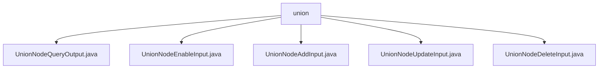

# 基础信息

|      |      |
|------|------|
| 名称 | union |
| 编码语言 | .java |
| 代码路径 | WeFe/manager/manager-service/src/main/java/com/welab/wefe/manager/service/dto/union |
| 包名 | docs.manager.manager-service.src.main.java.com.welab.wefe.manager.service.dto.union |
| 概述说明 | UnionNodeQueryOutput封装节点查询结果，包含ID、URL等属性。UnionNodeEnableInput处理节点启用状态，含nodeId和enable字段。UnionNodeAddInput用于添加节点，含必填ID和URL。UnionNodeUpdateInput更新节点信息，nodeId必填。UnionNodeDeleteInput处理节点删除，需nodeId。 |

# 说明

## 概述  
该模块核心职责是管理区块链节点信息，提供节点查询、启用/禁用、新增、更新和删除等操作的统一数据模型。接口规范遵循BaseInput基类校验机制，通过@Check注解确保必填字段有效性。关键数据结构包括节点标识符、基础URL、组织信息、状态标记等属性，类似微服务的资源管理模型。外部依赖仅为通用的校验框架。例如UnionNodeQueryOutput封装完整节点信息，UnionNodeEnableInput专用于状态切换。

## 主要业务场景  
模块支持全生命周期节点管理：查询返回UnionNodeQueryOutput复合数据，新增使用UnionNodeAddInput校验URL等核心字段，更新通过UnionNodeUpdateInput修改非ID属性。典型流程如禁用节点时，UnionNodeEnableInput确保nodeId和enable状态必传。所有操作均围绕nodeId展开，类似数据库主键约束。例如删除场景仅需UnionNodeDeleteInput传入nodeId即可。

### 包内部结构视图

该流程图展示了WeFe管理服务中union目录下的5个DTO文件结构。所有文件均直接隶属于union节点，包括节点查询输出、启用输入、添加输入、更新输入和删除输入等操作相关的数据传输对象，体现了统一接口参数管理的设计模式。

# 文件列表

| 名称   | 类型  | 说明 |
|-------|------|-------------|
| [UnionNodeQueryOutput.java](UnionNodeQueryOutput.md) | file | UnionNodeQueryOutput类包含节点ID、区块链节点ID、基础URL、组织名称、联系邮箱、优先级、失联状态、启用状态、版本、状态码、创建和更新时间等属性及其getter和setter方法。 |
| [UnionNodeEnableInput.java](UnionNodeEnableInput.md) | file | UnionNodeEnableInput类继承BaseInput，包含必填字段nodeId和enable，提供getter和setter方法。 |
| [UnionNodeAddInput.java](UnionNodeAddInput.md) | file | UnionNodeAddInput类继承BaseInput，包含必填字段blockchainNodeId和baseUrl，以及可选字段organizationName、contactEmail和version，提供各字段的getter和setter方法。 |
| [UnionNodeUpdateInput.java](UnionNodeUpdateInput.md) | file | UnionNodeUpdateInput类继承BaseInput，包含必填nodeId及可选baseUrl、organizationName、contactEmail字段，提供各属性的getter和setter方法。 |
| [UnionNodeDeleteInput.java](UnionNodeDeleteInput.md) | file | UnionNodeDeleteInput类继承BaseInput，包含必填字段nodeId及其getter和setter方法。 |

