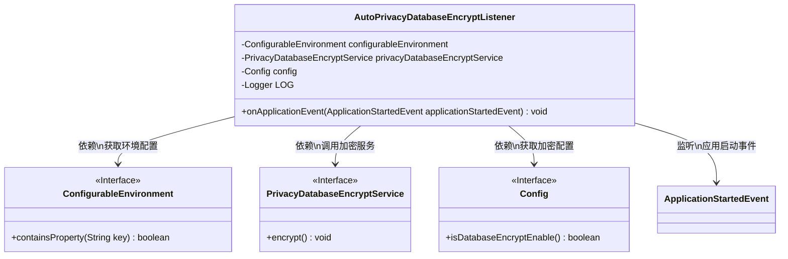
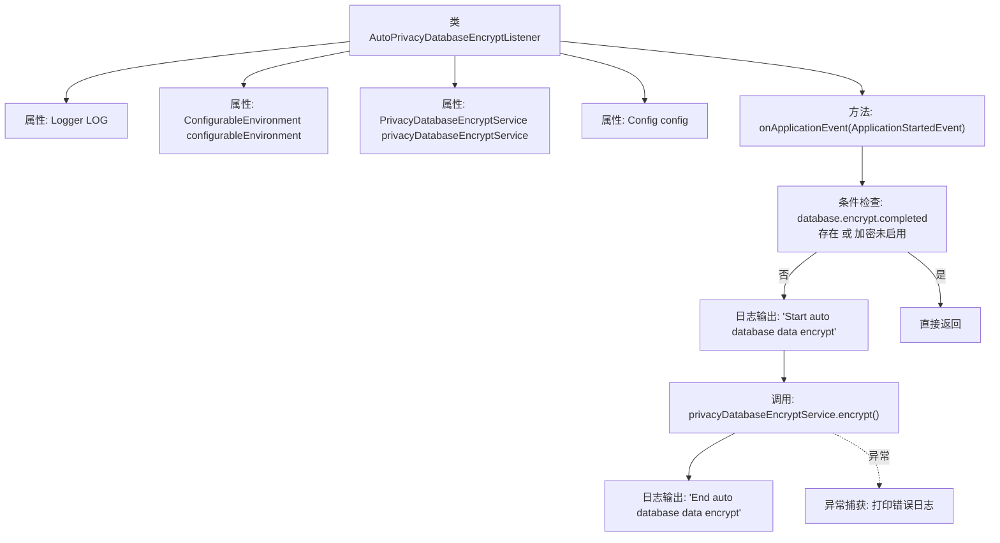
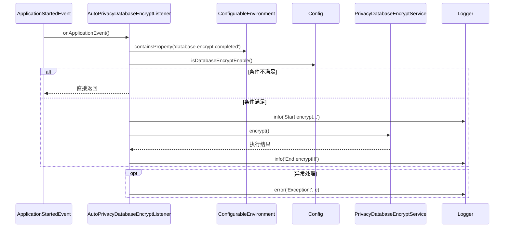

# 基础信息

|      |      |
|------|------|
| 名称 | AutoPrivacyDatabaseEncryptListener |
| 编码语言 | .java |
| 代码路径 | WeFe/manager/manager-service/src/main/java/com/welab/wefe/manager/service/listener/AutoPrivacyDatabaseEncryptListener.java |
| 包名 | com.welab.wefe.manager.service.listener |
| 依赖项 | ['com.welab.wefe.manager.service.config.Config', 'com.welab.wefe.manager.service.service.PrivacyDatabaseEncryptService', 'org.slf4j.Logger', 'org.slf4j.LoggerFactory', 'org.springframework.beans.factory.annotation.Autowired', 'org.springframework.boot.context.event.ApplicationStartedEvent', 'org.springframework.context.ApplicationListener', 'org.springframework.core.env.ConfigurableEnvironment', 'org.springframework.stereotype.Component'] |
| 概述说明 | AutoPrivacyDatabaseEncryptListener监听应用启动事件，检查配置后自动加密数据库数据，记录日志并处理异常。 |

# 说明

这是一个名为AutoPrivacyDatabaseEncryptListener的Spring组件类，实现了ApplicationListener接口用于监听应用启动事件。该类包含三个自动注入的依赖项：ConfigurableEnvironment、PrivacyDatabaseEncryptService和Config。主要逻辑在onApplicationEvent方法中，当应用启动时会检查是否已完成数据库加密或是否启用加密功能，若未完成且启用则调用隐私数据库加密服务执行加密操作，并记录开始和结束日志。若出现异常会记录错误日志。

# 类列表 Class Summary

| 名称   | 类型  | 说明 |
|-------|------|-------------|
| AutoPrivacyDatabaseEncryptListener | class | 这是一个Spring组件类，监听应用启动事件，在数据库加密未完成且配置启用时自动执行隐私数据加密服务，记录操作日志和异常。 |

## 类 AutoPrivacyDatabaseEncryptListener

|      |      |
|------|------|
| 访问范围 | @Component;public |
| 类型 | class |
| 名称 | AutoPrivacyDatabaseEncryptListener |
| 说明 | 这是一个Spring组件类，监听应用启动事件，在数据库加密未完成且配置启用时自动执行隐私数据加密服务，记录操作日志和异常。 |

### UML类图

这段代码展示了一个Spring组件`AutoPrivacyDatabaseEncryptListener`，它实现了`ApplicationListener`接口，用于监听应用启动事件。当应用启动时，该组件会检查环境配置和加密开关，若条件满足则调用加密服务对数据库数据进行加密处理。类图中清晰地展示了该组件与配置环境、加密服务、配置接口以及应用启动事件之间的关系，体现了Spring应用中典型的事件监听和依赖注入模式。

### 内部方法调用关系图

这段代码实现了一个Spring事件监听器，在应用启动时自动执行数据库加密。流程图展示了类结构和方法调用链，时序图详细描述了事件触发后的交互过程。核心逻辑是：检查配置条件→执行加密服务→记录操作日志，包含异常处理和条件短路机制，体现了典型的Spring事件驱动设计模式。

### 字段列表 Field List

| 名称  | 类型  | 说明 |
|-------|-------|------|
| config | Config | 自动注入Config配置实例。 |
| configurableEnvironment | ConfigurableEnvironment | 使用@Autowired自动注入ConfigurableEnvironment对象，用于配置环境相关操作。 |
| LOG = LoggerFactory.getLogger(AutoPrivacyDatabaseEncryptListener.class) | Logger | 类AutoPrivacyDatabaseEncryptListener中定义的私有静态日志常量LOG。 |
| privacyDatabaseEncryptService | PrivacyDatabaseEncryptService | 使用@Autowired自动注入隐私数据库加密服务实例。 |

### 方法列表

| 名称  | 类型  | 说明 |
|-------|-------|------|
| onApplicationEvent | void | 方法处理应用启动事件，检查数据库加密配置。若无需加密则返回，否则执行加密并记录结果，异常时记录错误。 |

