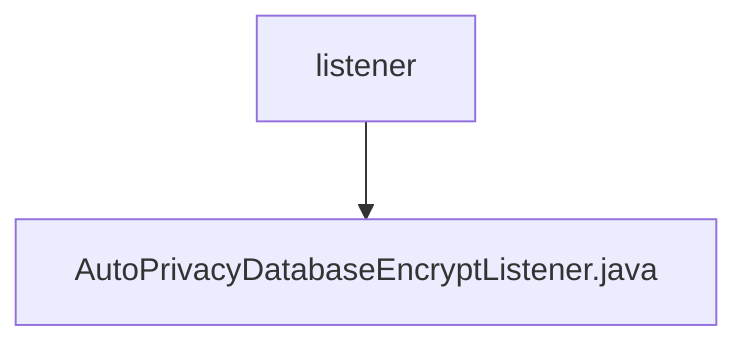

# 基础信息

|      |      |
|------|------|
| 名称 | listener |
| 编码语言 | .java |
| 代码路径 | WeFe/manager/manager-service/src/main/java/com/welab/wefe/manager/service/listener |
| 包名 | docs.manager.manager-service.src.main.java.com.welab.wefe.manager.service.listener |
| 概述说明 | AutoPrivacyDatabaseEncryptListener监听应用启动事件，检查配置后自动加密数据库数据，记录日志并处理异常。 |

# 说明

这是一个名为AutoPrivacyDatabaseEncryptListener的Spring组件类，实现了ApplicationListener接口用于监听应用启动事件。该类包含三个自动注入的依赖项：ConfigurableEnvironment、PrivacyDatabaseEncryptService和Config。主要逻辑在onApplicationEvent方法中，当应用启动时会检查是否已完成数据库加密或是否启用加密功能，若未完成且启用则调用隐私数据库加密服务执行加密操作，并记录开始和结束日志。若出现异常会记录错误日志。

### 包内部结构视图

该流程图展示了manager-service项目中的监听器目录结构。listener作为父节点，包含一个子节点AutoPrivacyDatabaseEncryptListener.java，表示这是一个实现自动隐私数据库加密功能的监听器类文件。整个结构简洁明了，反映了项目中监听器模块的基本组成。

# 文件列表

| 名称   | 类型  | 说明 |
|-------|------|-------------|
| [AutoPrivacyDatabaseEncryptListener.java](AutoPrivacyDatabaseEncryptListener.md) | file | AutoPrivacyDatabaseEncryptListener监听应用启动事件，检查配置后自动加密数据库数据，记录日志并处理异常。 |

