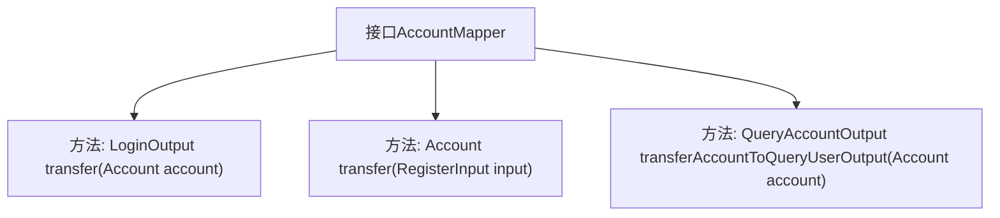

# 基础信息

|      |      |
|------|------|
| 名称 | AccountMapper |
| 编码语言 | .java |
| 代码路径 | WeFe/manager/manager-service/src/main/java/com/welab/wefe/manager/service/mapper/AccountMapper.java |
| 包名 | com.welab.wefe.manager.service.mapper |
| 依赖项 | ['com.welab.wefe.common.data.mongodb.entity.manager.Account', 'com.welab.wefe.manager.service.dto.account.LoginOutput', 'com.welab.wefe.manager.service.dto.account.QueryAccountOutput', 'com.welab.wefe.manager.service.dto.account.RegisterInput', 'org.mapstruct.Mapper'] |
| 概述说明 | Mapper接口定义三个方法：LoginOutput转换Account，Account转换RegisterInput，QueryAccountOutput转换Account。 |

# 说明

这是一个名为AccountMapper的Java接口，使用@Mapper注解标记。接口定义了三个方法：第一个方法transfer接收Account对象参数，返回LoginOutput类型；第二个同名方法transfer接收RegisterInput类型参数，返回Account对象；第三个方法transferAccountToQueryUserOutput接收Account参数，返回QueryAccountOutput类型。该接口主要用于不同类型对象之间的转换映射。

# 类列表 Class Summary

| 名称   | 类型  | 说明 |
|-------|------|-------------|
| AccountMapper | interface | AccountMapper接口定义了三个方法：将Account转为LoginOutput，RegisterInput转为Account，以及Account转为QueryAccountOutput。 |


## 类 AccountMapper

|      |      |
|------|------|
| 访问范围 | @Mapper;public |
| 类型 | interface |
| 名称 | AccountMapper |
| 说明 | AccountMapper接口定义了三个方法：将Account转为LoginOutput，RegisterInput转为Account，以及Account转为QueryAccountOutput。 |


### UML类图

```mermaid
classDiagram
    class Account {
        // Account类属性未在代码中显示
    }
    class RegisterInput {
        // RegisterInput类属性未在代码中显示
    }
    class LoginOutput {
        // LoginOutput类属性未在代码中显示
    }
    class QueryAccountOutput {
        // QueryAccountOutput类属性未在代码中显示
    }
    <<Interface>> AccountMapper {
        +LoginOutput transfer(Account account)
        +Account transfer(RegisterInput input)
        +QueryAccountOutput transferAccountToQueryUserOutput(Account account)
    }
    AccountMapper --> Account : 依赖
    AccountMapper --> RegisterInput : 依赖
    AccountMapper --> LoginOutput : 依赖
    AccountMapper --> QueryAccountOutput : 依赖
```

这段类图展示了AccountMapper接口及其依赖关系。AccountMapper是一个映射接口，使用@Mapper注解标记，包含三个方法：两个重载的transfer()方法分别处理Account到LoginOutput和RegisterInput到Account的转换，以及transferAccountToQueryUserOutput()方法将Account转换为QueryAccountOutput。图中清晰显示了接口与四个数据类之间的单向依赖关系。


### 内部方法调用关系图



这段流程图展示了AccountMapper接口的结构，它是一个MyBatis映射器接口，包含三个核心数据转换方法。第一个方法将Account对象转换为LoginOutput，第二个方法将RegisterInput转换为Account对象，第三个方法则将Account转换为QueryAccountOutput。这些方法主要用于不同DTO（数据传输对象）之间的类型转换，体现了对象映射的核心功能。

### 字段列表 Field List

| 名称  | 类型  | 说明 |
|-------|-------|------|

### 方法列表

| 名称  | 类型  | 说明 |
|-------|-------|------|
| transferAccountToQueryUserOutput | QueryAccountOutput | 将账户信息转换为查询用户输出格式。 |
| transfer | LoginOutput | 方法transfer接收Account对象参数，返回LoginOutput类型结果，用于账户登录后的数据传输处理。 |
| transfer | Account | 注册账户转账功能，输入参数为RegisterInput类型。 |


