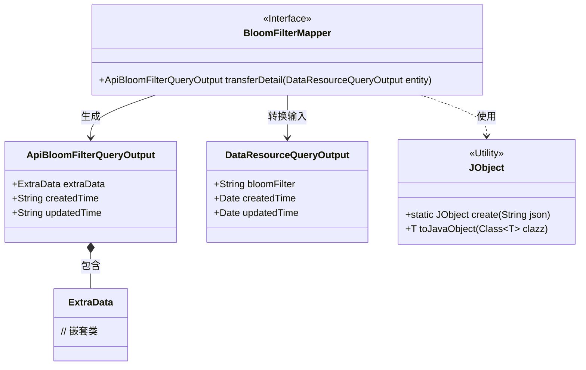
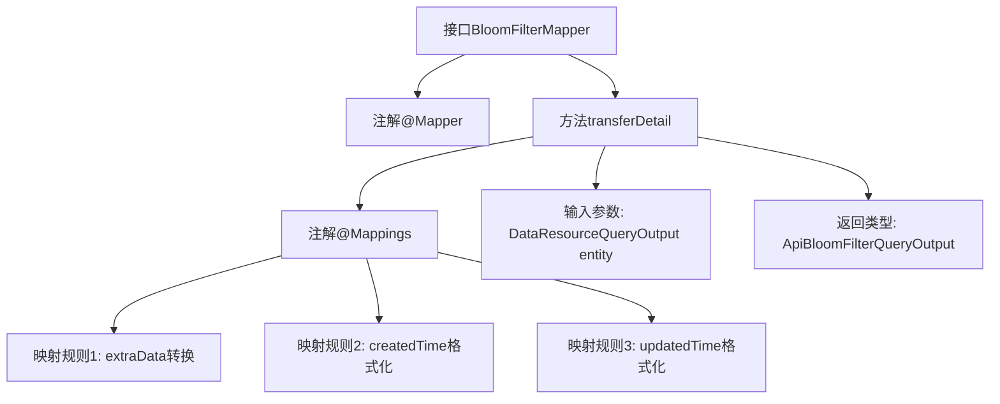

# 基础信息

|      |      |
|------|------|
| 名称 | BloomFilterMapper |
| 编码语言 | .java |
| 代码路径 | WeFe/manager/manager-service/src/main/java/com/welab/wefe/manager/service/mapper/BloomFilterMapper.java |
| 包名 | com.welab.wefe.manager.service.mapper |
| 依赖项 | ['com.welab.wefe.common.data.mongodb.dto.dataresource.DataResourceQueryOutput', 'com.welab.wefe.common.util.DateUtil', 'com.welab.wefe.manager.service.dto.dataresource.ApiBloomFilterQueryOutput', 'org.mapstruct.Mapper', 'org.mapstruct.Mapping', 'org.mapstruct.Mappings'] |
| 概述说明 | BloomFilterMapper接口使用@Mapper注解，通过@Mappings定义字段映射规则，包括extraData的JObject转换和日期格式化，将DataResourceQueryOutput转换为ApiBloomFilterQueryOutput。 |

# 说明

这是一个名为BloomFilterMapper的Java接口，使用@Mapper注解标记。接口中定义了一个transferDetail方法，通过@Mappings注解配置了三个字段映射规则：1)将entity对象的BloomFilter字段转换为JObject后映射到extraData字段；2)将createdTime字段按指定日期格式映射；3)将updatedTime字段按相同日期格式映射。方法接收DataResourceQueryOutput类型参数，返回ApiBloomFilterQueryOutput类型结果。

# 类列表 Class Summary

| 名称   | 类型  | 说明 |
|-------|------|-------------|
| BloomFilterMapper | interface | BloomFilterMapper接口使用@Mapper注解，通过@Mappings定义字段映射规则，包括extraData的JObject转换和日期格式化，将DataResourceQueryOutput转换为ApiBloomFilterQueryOutput。 |

## 类 BloomFilterMapper

|      |      |
|------|------|
| 访问范围 | @Mapper;public |
| 类型 | interface |
| 名称 | BloomFilterMapper |
| 说明 | BloomFilterMapper接口使用@Mapper注解，通过@Mappings定义字段映射规则，包括extraData的JObject转换和日期格式化，将DataResourceQueryOutput转换为ApiBloomFilterQueryOutput。 |

### UML类图

这段代码描述了一个使用MapStruct进行对象映射的接口BloomFilterMapper，主要功能是将DataResourceQueryOutput对象转换为ApiBloomFilterQueryOutput对象。转换过程中涉及日期格式化和JSON解析，其中JObject工具类用于将bloomFilter字符串转换为ExtraData对象。类图清晰地展示了接口与数据对象之间的关系，以及工具类的使用方式。

### 内部方法调用关系图

该流程图描述了BloomFilterMapper接口的结构，重点展示了带有多重映射规则的transferDetail方法。通过@Mappings注解定义了三个字段转换逻辑：extraData通过JObject进行类型转换，两个时间字段按指定格式进行格式化。整个映射过程将DataResourceQueryOutput对象转换为ApiBloomFilterQueryOutput对象，体现了MyBatis映射器的典型注解配置方式。

### 字段列表 Field List

| 名称  | 类型  | 说明 |
|-------|-------|------|

### 方法列表

| 名称  | 类型  | 说明 |
|-------|-------|------|
| transferDetail | ApiBloomFilterQueryOutput | 映射配置：将DataResourceQueryOutput转换为ApiBloomFilterQueryOutput，包含extraData的JObject转换，以及createdTime和updatedTime的日期格式化。 |

