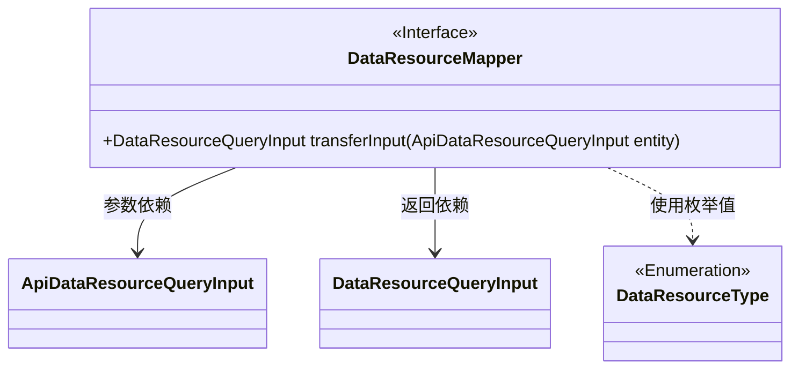
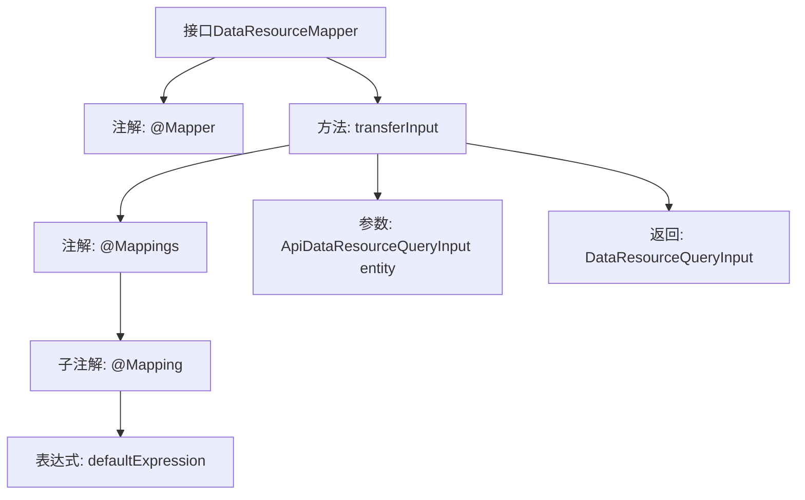

# 基础信息

|      |      |
|------|------|
| 名称 | DataResourceMapper |
| 编码语言 | .java |
| 代码路径 | WeFe/manager/manager-service/src/main/java/com/welab/wefe/manager/service/mapper/DataResourceMapper.java |
| 包名 | com.welab.wefe.manager.service.mapper |
| 依赖项 | ['com.welab.wefe.common.data.mongodb.dto.dataresource.DataResourceQueryInput', 'com.welab.wefe.manager.service.dto.dataresource.ApiDataResourceQueryInput', 'org.mapstruct.Mapper', 'org.mapstruct.Mapping', 'org.mapstruct.Mappings'] |
| 概述说明 | Mapper接口将ApiDataResourceQueryInput转换为DataResourceQueryInput，默认映射dataResourceType为DataResourceType枚举列表。 |

# 说明

这是一个使用MapStruct框架的Java接口类，名为DataResourceMapper。它定义了一个映射方法transferInput，用于将ApiDataResourceQueryInput对象转换为DataResourceQueryInput对象。方法使用了@Mappings和@Mapping注解，其中dataResourceType字段的映射使用了默认表达式，通过Java流操作将DataResourceType枚举的所有值转换为列表。整个映射过程不包含任何显式代码实现，完全依赖注解配置完成。

# 类列表 Class Summary

| 名称   | 类型  | 说明 |
|-------|------|-------------|
| DataResourceMapper | interface | Mapper接口DataResourceMapper，使用@Mappings注解将ApiDataResourceQueryInput转换为DataResourceQueryInput，默认映射dataResourceType字段为DataResourceType枚举列表。 |

## 类 DataResourceMapper

|      |      |
|------|------|
| 访问范围 | @Mapper;public |
| 类型 | interface |
| 名称 | DataResourceMapper |
| 说明 | Mapper接口DataResourceMapper，使用@Mappings注解将ApiDataResourceQueryInput转换为DataResourceQueryInput，默认映射dataResourceType字段为DataResourceType枚举列表。 |

### UML类图

该类图展示了一个Mapper接口及其关联的数据传输对象。DataResourceMapper是一个Spring映射接口，通过@Mapper标记，定义了将ApiDataResourceQueryInput转换为DataResourceQueryInput的方法。转换过程中使用了DataResourceType枚举类作为数据源类型的默认值映射。接口与输入输出DTO之间形成明确的依赖关系，体现了数据转换层的典型设计模式。

### 内部方法调用关系图

该流程图展示了DataResourceMapper接口的结构，重点描述了transferInput方法的注解层级关系。接口通过@Mapper标记为映射器，方法使用@Mappings包裹@Mapping注解，其中包含一个使用Java Stream处理枚举的默认表达式defaultExpression。方法接收ApiDataResourceQueryInput参数并返回DataResourceQueryInput类型，完整呈现了MyBatis映射接口的典型注解配置方式。

### 字段列表 Field List

| 名称  | 类型  | 说明 |
|-------|-------|------|

### 方法列表

| 名称  | 类型  | 说明 |
|-------|-------|------|
| transferInput | DataResourceQueryInput | 映射方法将ApiDataResourceQueryInput转换为DataResourceQueryInput，其中dataResourceType字段默认值为DataResourceType枚举的所有值列表。 |

