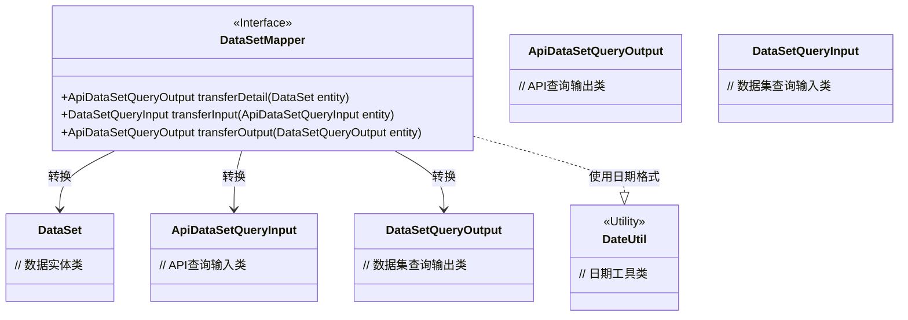
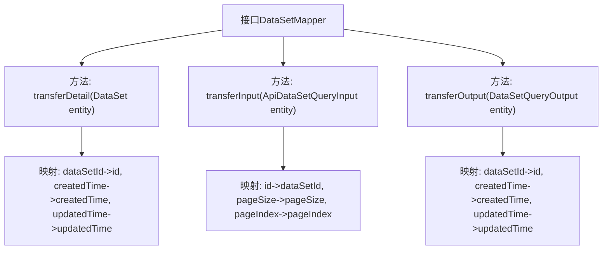

# 基础信息

|      |      |
|------|------|
| 名称 | DataSetMapper |
| 编码语言 | .java |
| 代码路径 | WeFe/manager/manager-service/src/main/java/com/welab/wefe/manager/service/mapper/DataSetMapper.java |
| 包名 | com.welab.wefe.manager.service.mapper |
| 依赖项 | ['com.welab.wefe.common.data.mongodb.dto.dataset.DataSetQueryInput', 'com.welab.wefe.common.data.mongodb.dto.dataset.DataSetQueryOutput', 'com.welab.wefe.common.data.mongodb.entity.union.DataSet', 'com.welab.wefe.common.util.DateUtil', 'com.welab.wefe.manager.service.dto.dataset.ApiDataSetQueryInput', 'com.welab.wefe.manager.service.dto.dataset.ApiDataSetQueryOutput', 'org.mapstruct.Mapper', 'org.mapstruct.Mapping', 'org.mapstruct.Mappings'] |
| 概述说明 | DataSetMapper接口定义了三个数据转换方法：transferDetail将DataSet转为ApiDataSetQueryOutput，transferInput将ApiDataSetQueryInput转为DataSetQueryInput，transferOutput将DataSetQueryOutput转为ApiDataSetQueryOutput，包含字段映射和日期格式化。 |

# 说明

这是一个使用MapStruct的Mapper接口，定义了三个数据转换方法。transferDetail方法将DataSet实体转换为ApiDataSetQueryOutput，映射dataSetId到id，并对时间字段进行格式化。transferInput方法将ApiDataSetQueryInput转换为DataSetQueryInput，映射id到dataSetId，并为分页参数设置默认值。transferOutput方法将DataSetQueryOutput转换为ApiDataSetQueryOutput，同样映射dataSetId到id并格式化时间字段。所有方法都通过@Mappings注解定义字段映射规则。

# 类列表 Class Summary

| 名称   | 类型  | 说明 |
|-------|------|-------------|
| DataSetMapper | interface | DataSetMapper接口定义了三个数据转换方法：transferDetail将DataSet转为ApiDataSetQueryOutput，transferInput将ApiDataSetQueryInput转为DataSetQueryInput，transferOutput将DataSetQueryOutput转为ApiDataSetQueryOutput，均包含字段映射和日期格式化。 |

## 类 DataSetMapper

|      |      |
|------|------|
| 访问范围 | @Mapper;public |
| 类型 | interface |
| 名称 | DataSetMapper |
| 说明 | DataSetMapper接口定义了三个数据转换方法：transferDetail将DataSet转为ApiDataSetQueryOutput，transferInput将ApiDataSetQueryInput转为DataSetQueryInput，transferOutput将DataSetQueryOutput转为ApiDataSetQueryOutput，均包含字段映射和日期格式化。 |

### UML类图

该代码定义了一个MapStruct映射接口`DataSetMapper`，包含三个数据转换方法：将`DataSet`转为`ApiDataSetQueryOutput`，将`ApiDataSetQueryInput`转为`DataSetQueryInput`，以及将`DataSetQueryOutput`转为`ApiDataSetQueryOutput`。接口使用了`@Mapper`注解和`@Mapping`注解来定义字段映射规则，包括日期格式转换和默认值设置。类图展示了该接口与六个相关数据类之间的转换关系，其中`DateUtil`作为工具类提供日期格式常量。

### 内部方法调用关系图

这段代码展示了一个使用MapStruct注解的Mapper接口，主要实现三种对象转换功能：将DataSet转为ApiDataSetQueryOutput、ApiDataSetQueryInput转为DataSetQueryInput、DataSetQueryOutput转为ApiDataSetQueryOutput。每个转换方法都通过@Mappings注解定义了字段映射规则，包括字段重命名、日期格式化和默认值设置。流程图清晰地展示了接口的三个核心方法及其对应的字段映射关系，体现了数据转换层的典型设计模式。

### 字段列表 Field List

| 名称  | 类型  | 说明 |
|-------|-------|------|

### 方法列表

| 名称  | 类型  | 说明 |
|-------|-------|------|
| transferDetail | ApiDataSetQueryOutput | 将DataSet实体映射为ApiDataSetQueryOutput，字段包括id（原dataSetId）、createdTime和updatedTime（日期格式化为YYYY-MM-DD HH:MM:SS）。 |
| transferInput | DataSetQueryInput | 将ApiDataSetQueryInput转换为DataSetQueryInput，字段映射包括id转dataSetId，pageSize和pageIndex默认值为10和0。 |
| transferOutput | ApiDataSetQueryOutput | 将DataSetQueryOutput转换为ApiDataSetQueryOutput，映射字段包括dataSetId到id，createdTime和updatedTime按指定日期格式转换。 |

