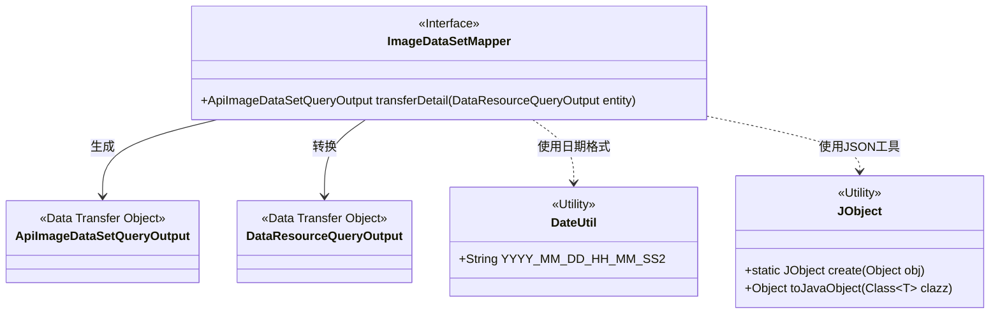
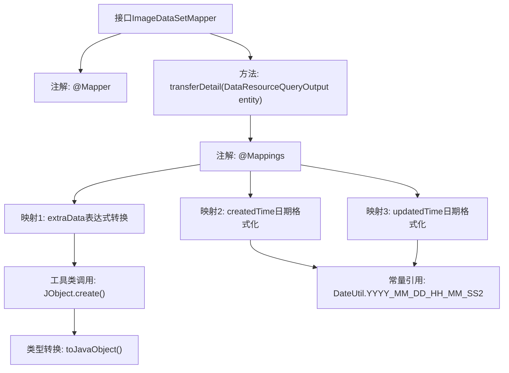

# 基础信息

|      |      |
|------|------|
| 名称 | ImageDataSetMapper |
| 编码语言 | .java |
| 代码路径 | WeFe/manager/manager-service/src/main/java/com/welab/wefe/manager/service/mapper/ImageDataSetMapper.java |
| 包名 | com.welab.wefe.manager.service.mapper |
| 依赖项 | ['com.welab.wefe.common.data.mongodb.dto.dataresource.DataResourceQueryOutput', 'com.welab.wefe.common.util.DateUtil', 'com.welab.wefe.manager.service.dto.dataresource.ApiImageDataSetQueryOutput', 'org.mapstruct.Mapper', 'org.mapstruct.Mapping', 'org.mapstruct.Mappings'] |
| 概述说明 | ImageDataSetMapper接口使用@Mapper注解，通过@Mappings定义字段映射规则，包括extraData的JObject转换和createdTime、updatedTime的日期格式化，将DataResourceQueryOutput转换为ApiImageDataSetQueryOutput。 |

# 说明

这是一个使用MapStruct框架的Java接口ImageDataSetMapper，用于对象属性映射转换。接口包含一个transferDetail方法，将DataResourceQueryOutput类型转换为ApiImageDataSetQueryOutput类型。通过@Mappings注解定义了三个映射规则：将entity.getImageDataSet()转换为JObject后再转为ExtraData对象；将createdTime和updatedTime字段按指定日期格式进行转换。该接口主要用于处理图像数据集查询结果的转换工作。

# 类列表 Class Summary

| 名称   | 类型  | 说明 |
|-------|------|-------------|
| ImageDataSetMapper | interface | ImageDataSetMapper接口使用@Mapper注解，通过@Mappings定义字段映射规则，包括extraData的JSON转换和日期格式转换，将DataResourceQueryOutput转换为ApiImageDataSetQueryOutput。 |

## 类 ImageDataSetMapper

|      |      |
|------|------|
| 访问范围 | @Mapper;public |
| 类型 | interface |
| 名称 | ImageDataSetMapper |
| 说明 | ImageDataSetMapper接口使用@Mapper注解，通过@Mappings定义字段映射规则，包括extraData的JSON转换和日期格式转换，将DataResourceQueryOutput转换为ApiImageDataSetQueryOutput。 |

### UML类图

这段代码描述了一个MapStruct映射接口`ImageDataSetMapper`，用于将`DataResourceQueryOutput`实体转换为`ApiImageDataSetQueryOutput`数据传输对象。接口通过注解配置字段映射规则，包括JSON数据转换和日期格式化，依赖了`DateUtil`日期工具类和`JObject`JSON处理工具类。该设计实现了数据层到API层的解耦转换，支持复杂字段的类型转换和格式化需求。

### 内部方法调用关系图

该流程图展示了ImageDataSetMapper接口的结构和映射关系。作为MapStruct映射接口，它通过@Mappings注解定义了三个转换规则：将entity.getImageDataSet()转换为JObject后再转为ExtraData对象，以及对createdTime和updatedTime字段进行日期格式化。流程清晰呈现了从接口定义到具体转换逻辑的完整路径，包括工具方法调用和常量引用关系。

### 字段列表 Field List

| 名称  | 类型  | 说明 |
|-------|-------|------|

### 方法列表

| 名称  | 类型  | 说明 |
|-------|-------|------|
| transferDetail | ApiImageDataSetQueryOutput | 该代码使用@Mappings注解定义对象属性映射规则，包括将entity的imageDataSet转换为extraData对象，以及格式化createdTime和updatedTime字段。最终将DataResourceQueryOutput转换为ApiImageDataSetQueryOutput。 |

