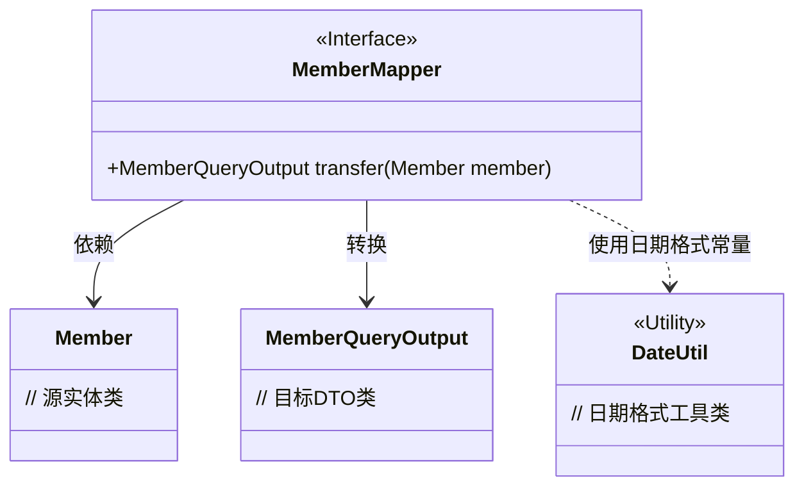
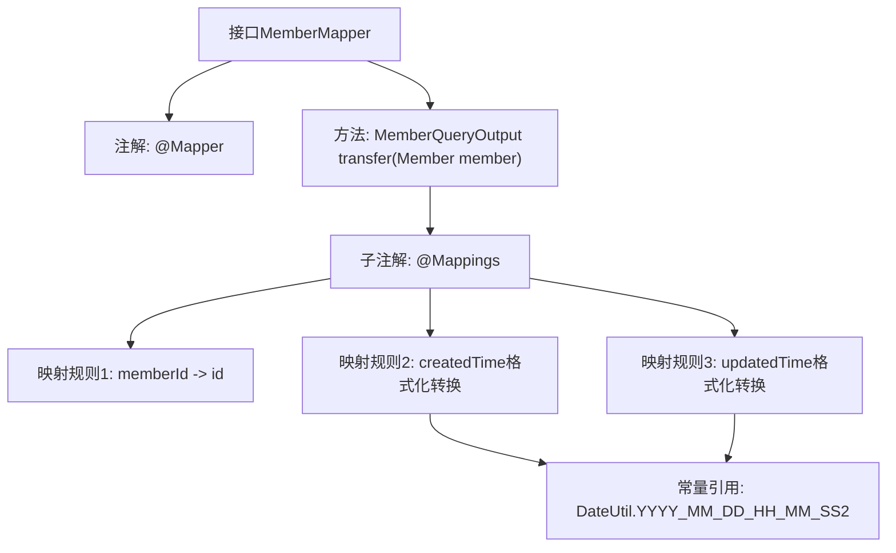

# 基础信息

|      |      |
|------|------|
| 名称 | MemberMapper |
| 编码语言 | .java |
| 代码路径 | WeFe/manager/manager-service/src/main/java/com/welab/wefe/manager/service/mapper/MemberMapper.java |
| 包名 | com.welab.wefe.manager.service.mapper |
| 依赖项 | ['com.welab.wefe.common.data.mongodb.entity.union.Member', 'com.welab.wefe.common.util.DateUtil', 'com.welab.wefe.manager.service.dto.member.MemberQueryOutput', 'org.mapstruct.Mapper', 'org.mapstruct.Mapping', 'org.mapstruct.Mappings'] |
| 概述说明 | Mapper接口MemberMapper定义了一个transfer方法，将Member对象转换为MemberQueryOutput对象，映射memberId到id，并格式化createdTime和updatedTime字段。 |

# 说明

该代码定义了一个名为MemberMapper的接口，使用@Mapper注解标记。接口包含一个transfer方法，用于将Member对象转换为MemberQueryOutput对象。方法通过@Mappings注解配置了三个字段映射规则：将memberId映射为id，将createdTime和updatedTime分别映射为相同名称的字段，并指定日期格式为YYYY_MM_DD_HH_MM_SS2。

# 类列表 Class Summary

| 名称   | 类型  | 说明 |
|-------|------|-------------|
| MemberMapper | interface | Mapper接口将Member对象转换为MemberQueryOutput，映射memberId到id，createdTime和updatedTime按指定格式转换。 |

## 类 MemberMapper

|      |      |
|------|------|
| 访问范围 | @Mapper;public |
| 类型 | interface |
| 名称 | MemberMapper |
| 说明 | Mapper接口将Member对象转换为MemberQueryOutput，映射memberId到id，createdTime和updatedTime按指定格式转换。 |

### UML类图

这段代码展示了一个使用MapStruct进行对象映射的接口MemberMapper，它定义了从Member实体到MemberQueryOutput DTO的转换方法。接口通过@Mapper注解标记，使用@Mapping注解指定字段映射规则，特别是对日期字段进行格式化处理。类图中清晰地展示了接口与相关实体类、DTO类以及工具类DateUtil之间的关系，体现了对象转换过程中各组件之间的协作方式。

### 内部方法调用关系图

该流程图展示了MapStruct映射接口的结构，核心是通过@Mappings注解定义对象属性转换规则。接口使用@Mapper标记为映射器，transfer方法实现Member到MemberQueryOutput的转换，包含三个字段映射：直接复制memberId到id，以及对createdTime/updatedTime进行日期格式化转换，均使用统一的日期格式常量。

### 字段列表 Field List

| 名称  | 类型  | 说明 |
|-------|-------|------|

### 方法列表

| 名称  | 类型  | 说明 |
|-------|-------|------|
| transfer | MemberQueryOutput | 将Member对象转换为MemberQueryOutput对象，映射memberId到id，createdTime和updatedTime按指定格式转换。 |

