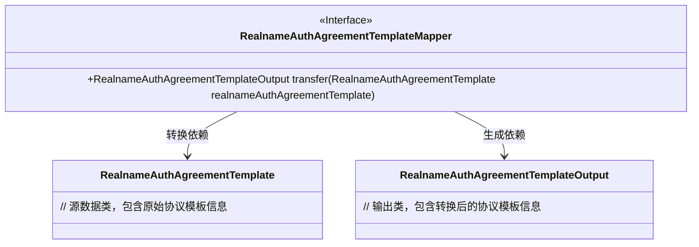
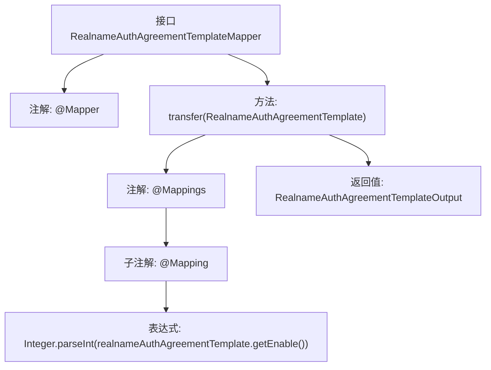

# 基础信息

|      |      |
|------|------|
| 名称 | RealnameAuthAgreementTemplateMapper |
| 编码语言 | .java |
| 代码路径 | WeFe/manager/manager-service/src/main/java/com/welab/wefe/manager/service/mapper/RealnameAuthAgreementTemplateMapper.java |
| 包名 | com.welab.wefe.manager.service.mapper |
| 依赖项 | ['com.welab.wefe.common.data.mongodb.entity.union.RealnameAuthAgreementTemplate', 'com.welab.wefe.manager.service.dto.agreement.RealnameAuthAgreementTemplateOutput', 'org.mapstruct.Mapper', 'org.mapstruct.Mapping', 'org.mapstruct.Mappings'] |
| 概述说明 | 这是一个使用MapStruct的Mapper接口，将RealnameAuthAgreementTemplate对象转换为RealnameAuthAgreementTemplateOutput对象，其中enable字段通过表达式转换为整数类型。 |

# 说明

该代码片段定义了一个名为RealnameAuthAgreementTemplateMapper的接口，使用@Mapper注解标记。接口中包含一个transfer方法，通过@Mappings和@Mapping注解将RealnameAuthAgreementTemplate对象转换为RealnameAuthAgreementTemplateOutput对象。在转换过程中，将源对象的enable字段从字符串类型转换为整数类型。

# 类列表 Class Summary

| 名称   | 类型  | 说明 |
|-------|------|-------------|
| RealnameAuthAgreementTemplateMapper | interface | Mapper接口将RealnameAuthAgreementTemplate转换为RealnameAuthAgreementTemplateOutput，其中enable字段通过解析字符串转为整数。 |

## 类 RealnameAuthAgreementTemplateMapper

|      |      |
|------|------|
| 访问范围 | @Mapper;public |
| 类型 | interface |
| 名称 | RealnameAuthAgreementTemplateMapper |
| 说明 | Mapper接口将RealnameAuthAgreementTemplate转换为RealnameAuthAgreementTemplateOutput，其中enable字段通过解析字符串转为整数。 |

### UML类图

这段代码展示了一个MapStruct映射接口，用于将RealnameAuthAgreementTemplate实体转换为RealnameAuthAgreementTemplateOutput输出对象。接口通过@Mapper注解标记，并使用@Mapping注解实现字段类型转换（String到Integer）。类图清晰地呈现了Mapper接口与输入输出类之间的转换关系，体现了数据转换层的典型设计模式。

### 内部方法调用关系图

这段代码是一个使用MapStruct框架的Mapper接口，主要用于对象属性转换。通过@Mappings和@Mapping注解定义了从RealnameAuthAgreementTemplate到RealnameAuthAgreementTemplateOutput的转换规则，特别处理了enable字段的字符串到整型的转换。流程图展示了接口结构、方法调用链和注解的层级关系。

### 字段列表 Field List

| 名称  | 类型  | 说明 |
|-------|-------|------|

### 方法列表

| 名称  | 类型  | 说明 |
|-------|-------|------|
| transfer | RealnameAuthAgreementTemplateOutput | 将RealnameAuthAgreementTemplate转换为RealnameAuthAgreementTemplateOutput，其中enable字段通过解析字符串为整数赋值。 |

