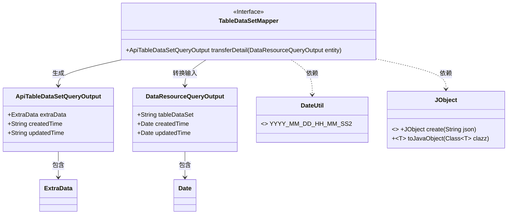
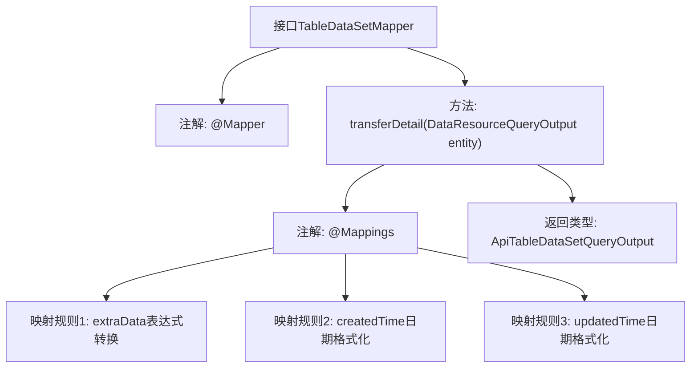

# 基础信息

|      |      |
|------|------|
| 名称 | TableDataSetMapper |
| 编码语言 | .java |
| 代码路径 | WeFe/manager/manager-service/src/main/java/com/welab/wefe/manager/service/mapper/TableDataSetMapper.java |
| 包名 | com.welab.wefe.manager.service.mapper |
| 依赖项 | ['com.welab.wefe.common.data.mongodb.dto.dataresource.DataResourceQueryOutput', 'com.welab.wefe.common.util.DateUtil', 'com.welab.wefe.manager.service.dto.dataresource.ApiTableDataSetQueryOutput', 'org.mapstruct.Mapper', 'org.mapstruct.Mapping', 'org.mapstruct.Mappings'] |
| 概述说明 | Mapper接口TableDataSetMapper，通过@Mappings注解将DataResourceQueryOutput转换为ApiTableDataSetQueryOutput，包含extraData转换及日期格式化。 |

# 说明

这是一个使用MapStruct框架的Mapper接口，用于将DataResourceQueryOutput对象转换为ApiTableDataSetQueryOutput对象。接口通过@Mappings注解定义了三个映射规则：将entity.getTableDataSet()转换为JObject后再转为ExtraData对象；将createdTime和updatedTime字段按指定日期格式进行转换。该接口提供了对象属性转换的标准化处理。

# 类列表 Class Summary

| 名称   | 类型  | 说明 |
|-------|------|-------------|
| TableDataSetMapper | interface | Mapper接口将DataResourceQueryOutput转换为ApiTableDataSetQueryOutput，处理extraData的JSON转换及日期格式化。 |

## 类 TableDataSetMapper

|      |      |
|------|------|
| 访问范围 | @Mapper;public |
| 类型 | interface |
| 名称 | TableDataSetMapper |
| 说明 | Mapper接口将DataResourceQueryOutput转换为ApiTableDataSetQueryOutput，处理extraData的JSON转换及日期格式化。 |

### UML类图

这段代码展示了一个使用MapStruct的Mapper接口，主要功能是将DataResourceQueryOutput对象转换为ApiTableDataSetQueryOutput对象。通过@Mapping注解实现了字段映射和格式转换，其中extraData字段通过JObject进行JSON反序列化，时间字段使用DateUtil常量进行格式化。类图清晰地展示了接口与数据类之间的转换关系，以及工具类的依赖关系。

### 内部方法调用关系图

该流程图展示了TableDataSetMapper接口的结构，重点描述了transferDetail方法的映射逻辑。通过@Mappings注解配置了三个字段转换规则：将entity.getTableDataSet()转为ExtraData对象，以及对createdTime和updatedTime字段进行日期格式化。最终方法返回ApiTableDataSetQueryOutput类型对象，体现了MyBatis映射器的典型注解配置方式。

### 字段列表 Field List

| 名称  | 类型  | 说明 |
|-------|-------|------|

### 方法列表

| 名称  | 类型  | 说明 |
|-------|-------|------|
| transferDetail | ApiTableDataSetQueryOutput | 代码使用MapStruct映射，将DataResourceQueryOutput转为ApiTableDataSetQueryOutput。extraData通过JObject转换，createdTime和updatedTime格式化为YYYY-MM-DD HH:MM:SS。 |

