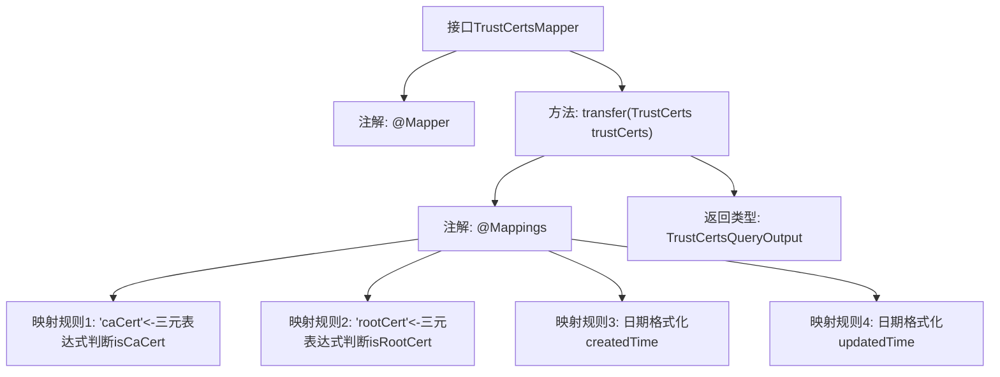

# 基础信息

|      |      |
|------|------|
| 名称 | TrustCertsMapper |
| 编码语言 | .java |
| 代码路径 | WeFe/manager/manager-service/src/main/java/com/welab/wefe/manager/service/mapper/TrustCertsMapper.java |
| 包名 | com.welab.wefe.manager.service.mapper |
| 依赖项 | ['com.welab.wefe.common.data.mongodb.entity.union.TrustCerts', 'com.welab.wefe.common.util.DateUtil', 'com.welab.wefe.manager.service.dto.cert.TrustCertsQueryOutput', 'org.mapstruct.Mapper', 'org.mapstruct.Mapping', 'org.mapstruct.Mappings'] |
| 概述说明 | Mapper接口TrustCertsMapper将TrustCerts对象转换为TrustCertsQueryOutput，包含布尔值转换和日期格式化。 |

# 说明

这是一个名为TrustCertsMapper的Mapper接口，用于将TrustCerts对象转换为TrustCertsQueryOutput对象。接口使用@Mapper注解标注，表明它是一个映射器。方法transfer通过@Mappings注解定义了多个字段映射规则：将isCaCert字段的字符串"1"转换为布尔值true/false赋给caCert字段；将isRootCert字段的字符串"1"转换为布尔值true/false赋给rootCert字段；将createdTime和updatedTime字段按照指定日期格式进行转换。

# 类列表 Class Summary

| 名称   | 类型  | 说明 |
|-------|------|-------------|
| TrustCertsMapper | interface | Mapper接口TrustCertsMapper，将TrustCerts转换为TrustCertsQueryOutput，包含caCert、rootCert布尔转换及日期格式化。 |


## 类 TrustCertsMapper

|      |      |
|------|------|
| 访问范围 | @Mapper;public |
| 类型 | interface |
| 名称 | TrustCertsMapper |
| 说明 | Mapper接口TrustCertsMapper，将TrustCerts转换为TrustCertsQueryOutput，包含caCert、rootCert布尔转换及日期格式化。 |


### UML类图

```mermaid
classDiagram
    class TrustCertsMapper {
        <<Interface>>
        +TrustCertsQueryOutput transfer(TrustCerts trustCerts)
    }
    // TrustCertsMapper接口使用MapStruct注解实现对象转换
    class TrustCerts {
        // 原始证书数据类
    }
    class TrustCertsQueryOutput {
        // 转换后的证书输出类
    }
    class DateUtil {
        <<Utility>>
        // 日期格式工具类
    }

    TrustCertsMapper --> TrustCerts : 依赖
    TrustCertsMapper --> TrustCertsQueryOutput : 依赖
    TrustCertsMapper ..> DateUtil : 使用日期格式常量
```

这段代码展示了一个使用MapStruct框架的接口TrustCertsMapper，主要功能是将TrustCerts对象转换为TrustCertsQueryOutput对象。接口通过@Mapping注解实现字段映射逻辑，包括布尔值转换和日期格式化。其中DateUtil提供标准日期格式常量，体现了对象转换过程中对数据格式的精确控制。类图清晰地展示了接口与数据类之间的依赖关系，以及工具类的引用关系。


### 内部方法调用关系图



这段代码展示了一个使用MapStruct框架的Mapper接口，主要功能是将TrustCerts对象转换为TrustCertsQueryOutput对象。通过@Mappings注解定义了四个字段映射规则：两个布尔值转换（根据字符串"1"判断CA证书和根证书状态），以及两个日期字段的格式化转换。流程图清晰地呈现了接口结构、核心转换方法及其内部映射规则的层级关系，体现了对象转换时的重要数据处理逻辑。

### 字段列表 Field List

| 名称  | 类型  | 说明 |
|-------|-------|------|

### 方法列表

| 名称  | 类型  | 说明 |
|-------|-------|------|
| transfer | TrustCertsQueryOutput | 映射配置：将TrustCerts对象转换为TrustCertsQueryOutput，包含caCert、rootCert布尔值转换及createdTime、updatedTime日期格式化。 |


