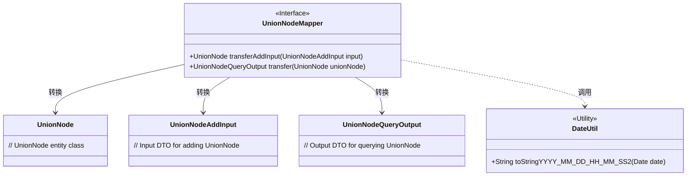
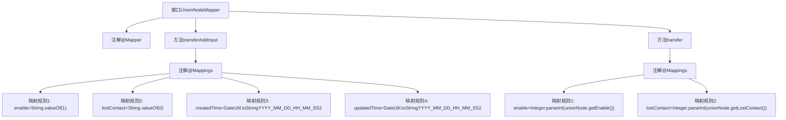

# 基础信息

|      |      |
|------|------|
| 名称 | UnionNodeMapper |
| 编码语言 | .java |
| 代码路径 | WeFe/manager/manager-service/src/main/java/com/welab/wefe/manager/service/mapper/UnionNodeMapper.java |
| 包名 | com.welab.wefe.manager.service.mapper |
| 依赖项 | ['com.welab.wefe.common.data.mongodb.entity.union.UnionNode', 'com.welab.wefe.manager.service.dto.union.UnionNodeAddInput', 'com.welab.wefe.manager.service.dto.union.UnionNodeQueryOutput', 'org.mapstruct.Mapper', 'org.mapstruct.Mapping', 'org.mapstruct.Mappings'] |
| 概述说明 | UnionNodeMapper接口包含两个方法：transferAddInput将UnionNodeAddInput转换为UnionNode，设置默认值和当前时间；transfer将UnionNode转换为UnionNodeQueryOutput，转换enable和lostContact为整数类型。 |

# 说明

UnionNodeMapper是一个使用@Mapper注解的接口，包含两个映射方法。第一个方法transferAddInput将UnionNodeAddInput转换为UnionNode，通过@Mappings注解设置默认值：enable设为字符串"1"，lostContact设为字符串"0"，createdTime和updatedTime设为当前时间的格式化字符串。第二个方法transfer将UnionNode转换为UnionNodeQueryOutput，将enable和lostContact从字符串转换为整数类型。两个方法均使用表达式进行类型转换和值处理。

# 类列表 Class Summary

| 名称   | 类型  | 说明 |
|-------|------|-------------|
| UnionNodeMapper | interface | UnionNodeMapper接口定义了两个方法：transferAddInput将UnionNodeAddInput转换为UnionNode并设置默认值；transfer将UnionNode转换为UnionNodeQueryOutput并转换字段类型。 |

## 类 UnionNodeMapper

|      |      |
|------|------|
| 访问范围 | @Mapper;public |
| 类型 | interface |
| 名称 | UnionNodeMapper |
| 说明 | UnionNodeMapper接口定义了两个方法：transferAddInput将UnionNodeAddInput转换为UnionNode并设置默认值；transfer将UnionNode转换为UnionNodeQueryOutput并转换字段类型。 |

### UML类图

这段代码展示了一个使用MapStruct进行对象映射的接口UnionNodeMapper，主要功能是在UnionNode、UnionNodeAddInput和UnionNodeQueryOutput之间进行数据转换。接口通过@Mapping注解实现了字段的特殊处理，包括enable/lostContact的字符串数字转换，以及createdTime/updatedTime的日期格式化。其中日期格式化依赖于外部的DateUtil工具类。该设计实现了DTO与实体间的解耦，同时保证了类型安全和格式统一。

### 内部方法调用关系图

该流程图展示了UnionNodeMapper接口的结构和映射关系。接口包含两个核心方法：transferAddInput将UnionNodeAddInput转换为UnionNode，设置默认值和当前时间；transfer将UnionNode转换为UnionNodeQueryOutput，进行字符串到整型的转换。每个方法都通过@Mappings注解定义多个字段转换规则，涉及类型转换和日期格式化操作，体现了对象属性映射的典型模式。

### 字段列表 Field List

| 名称  | 类型  | 说明 |
|-------|-------|------|

### 方法列表

| 名称  | 类型  | 说明 |
|-------|-------|------|
| transfer | UnionNodeQueryOutput | 将UnionNode对象转换为UnionNodeQueryOutput对象，通过映射将enable和lostContact字段从字符串转换为整数类型。 |
| transferAddInput | UnionNode | 映射配置：将UnionNodeAddInput转换为UnionNode，设置enable为1，lostContact为0，createdTime和updatedTime为当前时间。 |

