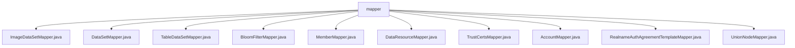

# 基础信息

|      |      |
|------|------|
| 名称 | mapper |
| 编码语言 | .java |
| 代码路径 | WeFe/manager/manager-service/src/main/java/com/welab/wefe/manager/service/mapper |
| 包名 | docs.manager.manager-service.src.main.java.com.welab.wefe.manager.service.mapper |
| 概述说明 | 多个MapStruct映射接口，用于不同类型对象转换，包含字段映射、时间格式化和类型转换等功能。 |

# 说明

## 概述  
该模块是使用MapStruct框架实现的Java对象映射转换器集合，核心职责是标准化处理不同业务对象间的属性转换（类似适配器模式）。接口规范统一采用@Mapper注解声明，通过@Mappings定义字段映射规则，支持类型转换（如字符串转布尔值）、日期格式化和嵌套对象处理。关键数据结构包括各类Input/Output DTO（如ApiDataSetQueryOutput）和实体类（如UnionNode）。外部依赖仅为MapStruct框架。例如，BloomFilterMapper将JObject转为ExtraData，MemberMapper处理YYYY_MM_DD_HH_MM_SS2格式时间转换。

## 主要业务场景  
模块主要服务于数据查询结果的标准化输出，涵盖图像/表格数据集、布隆过滤器、成员信息等10+业务场景。典型交互模式为将数据库实体转换为API响应对象，例如DataSetMapper实现DataSet到ApiDataSetQueryOutput的三段式转换（ID映射、时间格式化、分页默认值）。所有Mapper遵循相同范式：1) 字段名映射；2) 类型转换；3) 默认值处理。例如UnionNodeMapper通过表达式将字符串"1"转为整型，RealnameAuthAgreementTemplateMapper处理enable字段的类型转换，形成完整的对象转换解决方案。

### 包内部结构视图

该流程图展示了manager-service项目中mapper目录下的文件结构关系。根节点为mapper文件夹，其下包含11个Mapper接口文件，包括ImageDataSetMapper、DataSetMapper等数据访问层组件，这些文件共同构成了项目的数据持久化层，用于处理不同类型的数据集和系统实体的数据库操作。

# 文件列表

| 名称   | 类型  | 说明 |
|-------|------|-------------|
| [ImageDataSetMapper.java](ImageDataSetMapper.md) | file | ImageDataSetMapper接口使用@Mapper注解，通过@Mappings定义字段映射规则，包括extraData的JObject转换和createdTime、updatedTime的日期格式化，将DataResourceQueryOutput转换为ApiImageDataSetQueryOutput。 |
| [DataSetMapper.java](DataSetMapper.md) | file | DataSetMapper接口定义了三个数据转换方法：transferDetail将DataSet转为ApiDataSetQueryOutput，transferInput将ApiDataSetQueryInput转为DataSetQueryInput，transferOutput将DataSetQueryOutput转为ApiDataSetQueryOutput，包含字段映射和日期格式化。 |
| [TableDataSetMapper.java](TableDataSetMapper.md) | file | Mapper接口TableDataSetMapper，通过@Mappings注解将DataResourceQueryOutput转换为ApiTableDataSetQueryOutput，包含extraData转换及日期格式化。 |
| [BloomFilterMapper.java](BloomFilterMapper.md) | file | BloomFilterMapper接口使用@Mapper注解，通过@Mappings定义字段映射规则，包括extraData的JObject转换和日期格式化，将DataResourceQueryOutput转换为ApiBloomFilterQueryOutput。 |
| [MemberMapper.java](MemberMapper.md) | file | Mapper接口MemberMapper定义了一个transfer方法，将Member对象转换为MemberQueryOutput对象，映射memberId到id，并格式化createdTime和updatedTime字段。 |
| [DataResourceMapper.java](DataResourceMapper.md) | file | Mapper接口将ApiDataResourceQueryInput转换为DataResourceQueryInput，默认映射dataResourceType为DataResourceType枚举列表。 |
| [TrustCertsMapper.java](TrustCertsMapper.md) | file | Mapper接口TrustCertsMapper将TrustCerts对象转换为TrustCertsQueryOutput，包含布尔值转换和日期格式化。 |
| [AccountMapper.java](AccountMapper.md) | file | Mapper接口定义三个方法：LoginOutput转换Account，Account转换RegisterInput，QueryAccountOutput转换Account。 |
| [RealnameAuthAgreementTemplateMapper.java](RealnameAuthAgreementTemplateMapper.md) | file | 这是一个使用MapStruct的Mapper接口，将RealnameAuthAgreementTemplate对象转换为RealnameAuthAgreementTemplateOutput对象，其中enable字段通过表达式转换为整数类型。 |
| [UnionNodeMapper.java](UnionNodeMapper.md) | file | UnionNodeMapper接口包含两个方法：transferAddInput将UnionNodeAddInput转换为UnionNode，设置默认值和当前时间；transfer将UnionNode转换为UnionNodeQueryOutput，转换enable和lostContact为整数类型。 |

